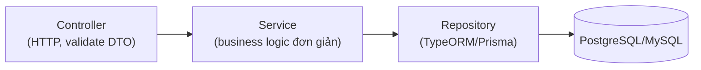

# Backend Architecture Guide — Level 1: CRUD Application (NestJS)

**Version:** v1.0 · **Tài liệu độc lập** — không cần đọc thêm tài liệu nào khác để áp dụng.

## Khi nào dùng tài liệu này

Chủ yếu CRUD, business logic rất đơn giản hoặc gần như không có, không workflow nhiều bước, gần như không tích hợp bên ngoài, không cần queue/cache/search engine. Ví dụ: admin CRUD lịch hẹn, CMS nội dung, blog admin, todo/note app, inventory nội bộ đơn giản. Thường 1-3 domain, dưới 20-30 endpoint, 1 database (Postgres/MySQL), monolith, không cần Redis/Queue.

Nếu xuất hiện workflow trạng thái, transaction logic nhiều bước, hoặc tích hợp payment/notification là 1 phần luồng chính → đã vượt Level 1, cần kiến trúc lớn hơn tài liệu này cung cấp.

---

## 1. Triết lý

- **Kiến trúc phục vụ thay đổi, không phục vụ đẹp.** Với hệ thống nhỏ, setup Clean Architecture/DDD đầy đủ thường đắt hơn lợi ích — mục tiêu là đơn giản nhất có thể mà vẫn sửa dễ.
- **Không over-engineering.** Không tách Domain/Application/Infrastructure 3 lớp cho CRUD thuần.
- **1 rule không bỏ dù hệ thống nhỏ:** Controller không tự viết SQL/query ORM trực tiếp — luôn qua 1 Service trung gian. Đây là chi phí gần như bằng 0 để giữ khả năng test và thay đổi sau này.

## 2. Kiến trúc — Controller → Service → Repository (NestJS module chuẩn)



Không tách `domain/`/`application/`/`infrastructure/` như hệ thống lớn — dùng đúng cấu trúc module mặc định của NestJS (Controller/Service/Module), Entity ORM dùng luôn làm object nghiệp vụ.

## 3. Cấu trúc thư mục

```
src/
├── modules/
│   └── appointment/
│       ├── appointment.controller.ts
│       ├── appointment.service.ts
│       ├── appointment.entity.ts          → TypeORM entity, dùng luôn làm domain object
│       ├── dto/
│       │   ├── create-appointment.dto.ts
│       │   └── update-appointment.dto.ts
│       └── appointment.module.ts
├── common/
│   ├── filters/http-exception.filter.ts    → format lỗi thống nhất toàn app
│   └── pipes/validation.pipe.ts
└── main.ts
```

Mỗi domain 1 module NestJS gồm 4-5 file, không cần thư mục con `domain/`, `application/`.

## 4. Entity — dùng luôn làm object nghiệp vụ

```typescript
// appointment.entity.ts
@Entity('appointments')
export class Appointment {
  @PrimaryGeneratedColumn('uuid')
  id: string;

  @Column()
  customerName: string;

  @Column()
  scheduledAt: Date;

  @CreateDateColumn()
  createdAt: Date;
}
```

Không tách Domain Entity riêng khỏi ORM Entity (khác hệ thống lớn) — CRUD thuần không có business rule cần cô lập khỏi ORM.

## 5. Service — business logic đơn giản, validate cơ bản

```typescript
@Injectable()
export class AppointmentService {
  constructor(
    @InjectRepository(Appointment) private readonly repo: Repository<Appointment>,
  ) {}

  async create(dto: CreateAppointmentDto): Promise<Appointment> {
    const appointment = this.repo.create(dto);
    return this.repo.save(appointment);
  }

  async findAll(): Promise<Appointment[]> {
    return this.repo.find({ order: { scheduledAt: 'ASC' } });
  }

  async findOne(id: string): Promise<Appointment> {
    const appointment = await this.repo.findOneBy({ id });
    if (!appointment) throw new NotFoundException('Appointment not found');
    return appointment;
  }
}
```

Service gọi trực tiếp Repository (TypeORM `Repository<T>` có sẵn) — không cần thêm interface Repository riêng, vì không có nhu cầu đổi ORM hay mock phức tạp ở quy mô này.

## 6. Controller & DTO Validation

```typescript
@Controller('appointments')
export class AppointmentController {
  constructor(private readonly service: AppointmentService) {}

  @Post()
  create(@Body() dto: CreateAppointmentDto) {
    return this.service.create(dto);
  }

  @Get()
  findAll() {
    return this.service.findAll();
  }
}

// dto/create-appointment.dto.ts
export class CreateAppointmentDto {
  @IsString()
  @IsNotEmpty()
  customerName: string;

  @IsDateString()
  scheduledAt: string;
}
```

`class-validator` validate input ngay ở DTO — vẫn giữ dù hệ thống nhỏ, vì đây là lớp bảo vệ rẻ nhất chống input sai định dạng.

## 7. Error Handling — 1 filter thống nhất

```typescript
@Catch(HttpException)
export class HttpExceptionFilter implements ExceptionFilter {
  catch(exception: HttpException, host: ArgumentsHost) {
    const response = host.switchToHttp().getResponse();
    const status = exception.getStatus();
    response.status(status).json({
      error: { code: status, message: exception.message },
    });
  }
}
```

Đăng ký global filter trong `main.ts` — không để mỗi controller tự try/catch và format lỗi khác nhau.

## 8. Testing — chỉ nơi có logic thật

Với Level 1, phần lớn là CRUD thuần — không đặt mục tiêu coverage. Chỉ test:
- Service có validate/tính toán thật (không chỉ gọi `repo.save()` rồi trả kết quả).
- 1 test e2e cơ bản (Supertest) cho luồng chính, đảm bảo API không vỡ khi refactor.

## 9. Khi nào chuyển sang kiến trúc lớn hơn (Level 2)

```
□ Xuất hiện workflow nhiều bước có trạng thái
□ Cần transaction logic (2 thao tác phải cùng thành công/thất bại)
□ Notification/upload file/payload đơn giản trở thành 1 phần luồng chính
□ Domain tăng vượt 3, mỗi domain bắt đầu có rule riêng đáng kể
```

Khi ≥ 2 dấu hiệu xuất hiện, tách Entity thành Domain Entity + ORM Entity riêng, thêm Repository interface, và cân nhắc thêm Redis/queue nhẹ.

---

## Checklist tổng hợp

```
□ Controller có tự query DB trực tiếp thay vì qua Service không?
□ DTO có validate đủ input bằng class-validator không?
□ Lỗi có format thống nhất qua global exception filter không?
□ Service có logic thật thì có test không?
□ Đã có ≥ 2 dấu hiệu cần chuyển Level 2 nhưng vẫn giữ cấu trúc CRUD đơn giản không?
```
