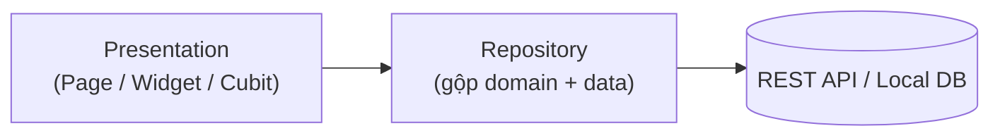

# Flutter Architecture Guide — Level 1: CRUD Application

**Version:** v1.0 · **Tài liệu độc lập** — không cần đọc thêm tài liệu nào khác để áp dụng.

## Khi nào dùng tài liệu này

Hệ thống chủ yếu là Create/Read/Update/Delete, business logic gần như không có ngoài validate cơ bản, không có workflow nhiều bước, không tích hợp hệ thống ngoài. Ví dụ: admin CRUD lịch hẹn, CMS nội dung, blog admin, todo/note app, inventory nội bộ đơn giản. Thường 1-3 domain, dưới 20-30 API endpoint, 1 database, không cần Redis/Queue.

Nếu hệ thống có workflow trạng thái (pending → confirmed → done) hoặc transaction logic (2 thao tác phải cùng thành công/thất bại) → đây không còn là Level 1, cần kiến trúc đầy đủ hơn tài liệu này cung cấp.

---

## 1. Triết lý

- **Kiến trúc phục vụ thay đổi, không phục vụ đẹp.** Với hệ thống nhỏ, thời gian setup kiến trúc phức tạp thường đắt hơn lợi ích nó mang lại — mục tiêu là đơn giản nhất có thể mà vẫn sửa được dễ dàng khi cần.
- **Không over-engineering.** Không thêm layer/abstraction cho vấn đề chưa xảy ra.
- **1 rule không bao giờ bỏ dù hệ thống nhỏ tới đâu:** code hiển thị (UI) không được gọi trực tiếp code gọi API/database — luôn đi qua 1 lớp trung gian. Đây là điều kiện duy nhất giữ khả năng test và sửa đổi sau này, chi phí áp dụng gần như bằng 0 ngay từ đầu, nhưng rất tốn công thêm vào sau nếu bỏ qua.

## 2. Kiến trúc 2 lớp



Khác với hệ thống lớn (3 lớp: presentation/domain/data tách riêng), Level 1 dùng **2 lớp**: Presentation và Repository (gộp domain + data). Lý do gộp: với business logic gần như không có, tách domain riêng chỉ thêm file mà không thêm giá trị thực tế.

**Rule duy nhất bắt buộc:** `presentation/` chỉ gọi qua `Repository`, không tự tạo Dio/HTTP client hay query database trực tiếp trong widget/bloc.

## 3. Cấu trúc thư mục

```
lib/
├── core/
│   ├── di/injection.dart              → đăng ký GetIt tập trung, 1 file là đủ ở quy mô này
│   ├── network/dio_client.dart
│   └── error/
│       ├── failures.dart              → 1-2 loại Failure là đủ (NetworkFailure, ServerFailure)
│       └── failure_messages.dart
├── features/
│   └── appointment/
│       ├── data/
│       │   ├── appointment_model.dart      → dùng luôn làm object nghiệp vụ, có fromJson/toJson
│       │   └── appointment_repository.dart  → 1 class, không tách interface/impl
│       └── presentation/
│           ├── cubit/
│           │   ├── appointment_cubit.dart
│           │   └── appointment_state.dart
│           ├── pages/
│           └── widgets/
├── shared/
│   ├── widgets/
│   └── theme/
└── app.dart
```

Mỗi feature chỉ 5-6 file, không có `domain/` riêng, không có `injection_container.dart` riêng từng feature.

## 4. Model — dùng luôn làm object nghiệp vụ

```dart
class Appointment {
  final String id;
  final String customerName;
  final DateTime scheduledAt;

  Appointment({required this.id, required this.customerName, required this.scheduledAt});

  factory Appointment.fromJson(Map<String, dynamic> json) => Appointment(
        id: json['id'] as String,
        customerName: json['customer_name'] as String,
        scheduledAt: DateTime.parse(json['scheduled_at'] as String),
      );

  Map<String, dynamic> toJson() => {
        'id': id,
        'customer_name': customerName,
        'scheduled_at': scheduledAt.toIso8601String(),
      };
}
```

Không tách `AppointmentModel` (data) và `Appointment` (domain) thành 2 class — chỉ tách khi API trả dữ liệu khác cấu trúc hiển thị (hiếm gặp ở CRUD thuần).

## 5. Repository — 1 class, không cần interface

```dart
class AppointmentRepository {
  final Dio dio;
  AppointmentRepository(this.dio);

  Future<Either<Failure, List<Appointment>>> getAppointments() async {
    try {
      final response = await dio.get('/appointments');
      final list = (response.data as List).map((e) => Appointment.fromJson(e)).toList();
      return Right(list);
    } on DioException {
      return const Left(NetworkFailure());
    }
  }

  Future<Either<Failure, Appointment>> createAppointment(Appointment appointment) async {
    try {
      final response = await dio.post('/appointments', data: appointment.toJson());
      return Right(Appointment.fromJson(response.data));
    } on DioException {
      return const Left(NetworkFailure());
    }
  }
}
```

Vẫn trả `Either<Failure, T>` (không throw thẳng Exception ra UI) — đây là phần rẻ nhất trong toàn bộ kiến trúc để giữ lại, không nên cắt bỏ dù hệ thống nhỏ.

Interface (`abstract class AppointmentRepository`) chỉ cần thêm khi thực sự có nhu cầu mock trong test phức tạp hoặc đổi nguồn dữ liệu — không thêm sẵn "phòng khi cần".

## 6. State Management — Cubit là mặc định

```dart
enum LoadStatus { initial, loading, loaded, error }

class AppointmentState extends Equatable {
  final LoadStatus status;
  final List<Appointment> appointments;
  final String? errorMessage;

  const AppointmentState({this.status = LoadStatus.initial, this.appointments = const [], this.errorMessage});

  AppointmentState copyWith({LoadStatus? status, List<Appointment>? appointments, String? errorMessage}) =>
      AppointmentState(
        status: status ?? this.status,
        appointments: appointments ?? this.appointments,
        errorMessage: errorMessage,
      );

  @override
  List<Object?> get props => [status, appointments, errorMessage];
}

class AppointmentCubit extends Cubit<AppointmentState> {
  final AppointmentRepository repository;
  AppointmentCubit(this.repository) : super(const AppointmentState());

  Future<void> load() async {
    emit(state.copyWith(status: LoadStatus.loading));
    final result = await repository.getAppointments();
    result.fold(
      (failure) => emit(state.copyWith(status: LoadStatus.error, errorMessage: failure.message)),
      (list) => emit(state.copyWith(status: LoadStatus.loaded, appointments: list)),
    );
  }
}
```

Dùng `Cubit`, không dùng `Bloc` (không cần file Event riêng) — CRUD hiếm khi có nhiều loại sự kiện phức tạp cần trace. Nếu team đã quen `Provider`/`ChangeNotifier` hơn và ưu tiên tốc độ viết cho dự án ngắn hạn, thay thế được — không bắt buộc `flutter_bloc` ở mức Level 1.

Giữ pattern "1 state class + enum status" (như ví dụ trên) thay vì nhiều class con — để pull-to-refresh không làm mất dữ liệu cũ đang hiển thị.

## 7. UI — Page tối giản

```dart
class AppointmentListPage extends StatelessWidget {
  const AppointmentListPage({super.key});

  @override
  Widget build(BuildContext context) {
    return BlocProvider(
      create: (_) => getIt<AppointmentCubit>()..load(),
      child: Scaffold(
        appBar: AppBar(title: const Text('Lịch hẹn')),
        body: BlocBuilder<AppointmentCubit, AppointmentState>(
          builder: (context, state) => switch (state.status) {
            LoadStatus.initial || LoadStatus.loading => const Center(child: CircularProgressIndicator()),
            LoadStatus.error => Center(child: Text(state.errorMessage ?? 'Có lỗi xảy ra')),
            LoadStatus.loaded => state.appointments.isEmpty
                ? const Center(child: Text('Chưa có lịch hẹn nào'))
                : ListView.builder(
                    itemCount: state.appointments.length,
                    itemBuilder: (_, i) => AppointmentTile(appointment: state.appointments[i]),
                  ),
          },
        ),
      ),
    );
  }
}
```

Vẫn xử lý đủ loading/empty/error/success (4 trạng thái) — đây cũng là phần rẻ để làm đúng ngay từ đầu, không phải chỗ cần cắt giảm.

## 8. Testing — chỉ test nơi có logic thật

Với Level 1, phần lớn code là CRUD map JSON thuần — test toàn bộ tốn công hơn lợi ích thực tế. Chỉ viết test cho:

- Bất kỳ hàm nào có tính toán/validate thật (không phải chỉ gọi API rồi trả kết quả).
- `Cubit` cho ít nhất 1 luồng chính (happy path + error path) bằng `bloc_test`, để đảm bảo state transition không bị lỗi khi refactor.

Không đặt mục tiêu coverage %.

## 9. Naming Convention

| Thành phần | Convention |
|---|---|
| Model (dùng luôn làm domain object) | Tên trần (`appointment.dart`), không suffix `_model` |
| Repository | `xxx_repository.dart`, 1 class |
| Cubit | `xxx_cubit.dart` + `xxx_state.dart` |

## 10. Khi nào chuyển sang kiến trúc lớn hơn (Level 2)

```
□ Xuất hiện workflow nhiều bước có trạng thái (không chỉ CRUD 1 bước)
□ Cần transaction logic (2 thao tác phải cùng thành công/thất bại)
□ Notification/upload file trở thành 1 phần luồng chính, không phải phụ
□ Domain tăng vượt 3, mỗi domain bắt đầu có rule riêng đáng kể
```

Khi ≥ 2 dấu hiệu trên xuất hiện, tách `Repository` gộp hiện tại thành `domain/` (entity, usecase, interface) + `data/` (model, datasource, impl) riêng, và cân nhắc đổi `Cubit` đơn giản sang `Bloc` cho luồng có nhiều sự kiện.

---

## Checklist tổng hợp

```
□ presentation/ có tự tạo Dio/query DB trực tiếp thay vì qua Repository không?
□ Repository có trả Either<Failure, T>, không throw Exception thẳng ra UI không?
□ Page có xử lý đủ loading/empty/error/success không?
□ Cubit chính có ít nhất 1 test happy-path + error-path không?
□ Đã có ≥ 2 dấu hiệu cần chuyển Level 2 nhưng vẫn giữ kiến trúc CRUD đơn giản không?
```
