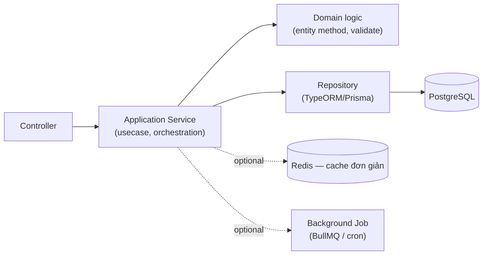
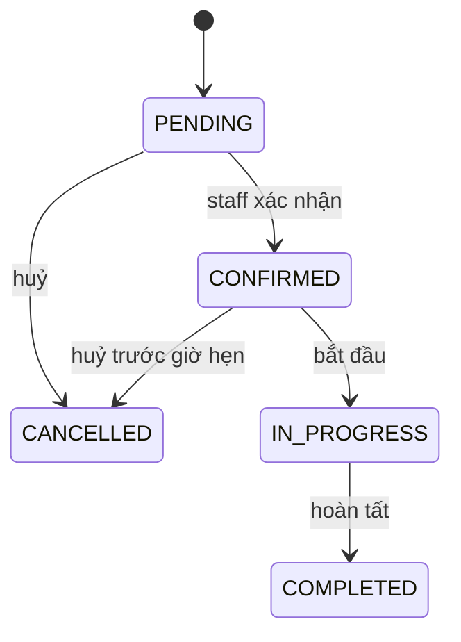

# Backend Architecture Guide — Level 2: Business Application (NestJS)

**Version:** v1.0 · **Tài liệu độc lập** — không cần đọc thêm tài liệu nào khác để áp dụng.

## Khi nào dùng tài liệu này

Business logic rõ ràng, workflow nhiều bước (state transition), validate nghiệp vụ phức tạp hơn CRUD, có transaction logic, auth/role đơn giản, notification/upload file/email, có thể tích hợp nhẹ bên ngoài (Firebase, email, payment đơn giản). Ví dụ: app đặt lịch (spa/gym/clinic), expense tracker recurring transaction, booking hệ thống nhỏ, CRM SME, internal management system. Thường 3-8 domain, 30-80 endpoint.

Nếu cần message queue thực sự, event-driven đầy đủ, search engine, hoặc ≥ 8-10 domain phối hợp chặt → đã vượt phạm vi tài liệu này. Nếu chỉ CRUD thuần không workflow → tài liệu này over-kill.

---

## 1. Triết lý

| Nguyên tắc | Ý nghĩa |
|---|---|
| Kiến trúc phục vụ thay đổi | Mục tiêu giảm chi phí sửa đổi tương lai |
| Không over-engineering | Chưa cần Kafka/microservices ở mức này |
| Make illegal state impossible | Đặc biệt quan trọng cho workflow (mục 5) |
| Explicit > Implicit | Transaction/side-effect phải tường minh trong code |

## 2. Kiến trúc — Modular Monolith nhẹ, bắt đầu tách Domain/Service



Khác Level 1 (Entity = ORM Entity), Level 2 bắt đầu tách nhẹ: business rule (transition trạng thái, validate nghiệp vụ) đặt trong method của domain entity hoặc 1 domain service riêng, không lẫn vào Application Service — nhưng chưa cần tách hẳn `domain/`/`application/`/`infrastructure/` 3 thư mục riêng như Level 3.

## 3. Cấu trúc thư mục

```
src/
├── modules/
│   └── booking/
│       ├── booking.entity.ts              → có method nghiệp vụ (vd canTransitionTo)
│       ├── booking.service.ts              → application service, orchestration
│       ├── booking.repository.ts           → wrap TypeORM repository, có thể thêm query phức tạp
│       ├── booking.controller.ts
│       ├── dto/{create,confirm}-booking.dto.ts
│       └── booking.module.ts
├── common/
│   ├── filters/http-exception.filter.ts
│   ├── cache/redis.service.ts             → nếu cần cache
│   └── queue/notification.processor.ts    → nếu cần background job
└── main.ts
```

## 4. Entity với Business Rule

```typescript
@Entity('bookings')
export class Booking {
  @PrimaryGeneratedColumn('uuid') id: string;
  @Column() customerName: string;
  @Column() scheduledAt: Date;
  @Column({ type: 'enum', enum: BookingStatus, default: BookingStatus.PENDING })
  status: BookingStatus;

  canTransitionTo(target: BookingStatus): boolean {
    const rules: Record<BookingStatus, BookingStatus[]> = {
      [BookingStatus.PENDING]: [BookingStatus.CONFIRMED, BookingStatus.CANCELLED],
      [BookingStatus.CONFIRMED]: [BookingStatus.IN_PROGRESS, BookingStatus.CANCELLED],
      [BookingStatus.IN_PROGRESS]: [BookingStatus.COMPLETED],
      [BookingStatus.COMPLETED]: [],
      [BookingStatus.CANCELLED]: [],
    };
    return rules[this.status].includes(target);
  }
}
```

Bảng chuyển trạng thái hợp lệ nằm ngay trong entity — service gọi qua `canTransitionTo()`, không tự so sánh `if (status === 'pending')` rải rác trong nhiều nơi.

## 5. Workflow / State Machine



```typescript
async confirmBooking(id: string): Promise<Booking> {
  const booking = await this.repo.findOneOrFail(id);
  if (!booking.canTransitionTo(BookingStatus.CONFIRMED)) {
    throw new BadRequestException(`Không thể chuyển từ ${booking.status} sang CONFIRMED`);
  }
  booking.status = BookingStatus.CONFIRMED;
  return this.repo.save(booking);
}
```

## 6. Transaction Logic

### 6.1 Transaction DB cho chuỗi thao tác cùng thành công/thất bại

```typescript
async confirmBookingWithPayment(id: string, amount: number): Promise<Booking> {
  return this.dataSource.transaction(async (manager) => {
    const wallet = await manager.findOneOrFail(Wallet, { where: { userId } });
    if (wallet.balance < amount) throw new BadRequestException('Số dư không đủ');
    wallet.balance -= amount;
    await manager.save(wallet);

    const booking = await manager.findOneOrFail(Booking, { where: { id } });
    booking.status = BookingStatus.CONFIRMED;
    return manager.save(booking);
  }); // rollback tự động nếu bất kỳ bước nào throw
}
```

Dùng `DataSource.transaction()` (TypeORM) cho chuỗi thao tác trong cùng 1 database — đơn giản hơn nhiều so với Saga pattern (chỉ cần khi thao tác xuyên nhiều service độc lập, chưa cần ở Level 2 vì vẫn 1 monolith 1 database).

### 6.2 Idempotency cho endpoint submit quan trọng

```typescript
@Post('confirm')
async confirm(@Body() dto: ConfirmBookingDto, @Headers('idempotency-key') key: string) {
  const existing = await this.idempotencyStore.get(key);
  if (existing) return existing; // trả kết quả cũ, không xử lý lại
  const result = await this.service.confirmBooking(dto.bookingId);
  await this.idempotencyStore.set(key, result, ttl = 3600);
  return result;
}
```

Client gửi kèm `idempotency-key` (UUID sinh khi bấm lần đầu) — chống double-submit do mạng chậm/double-tap, lưu key tạm ở Redis nếu có, hoặc bảng DB riêng nếu chưa dùng Redis.

## 7. RBAC đơn giản

```typescript
export enum UserRole { ADMIN = 'admin', STAFF = 'staff', CUSTOMER = 'customer' }

@Injectable()
export class RolesGuard implements CanActivate {
  constructor(private reflector: Reflector) {}
  canActivate(context: ExecutionContext): boolean {
    const required = this.reflector.get<UserRole[]>('roles', context.getHandler());
    if (!required) return true;
    const { user } = context.switchToHttp().getRequest();
    return required.includes(user.role);
  }
}

// Dùng: @Roles(UserRole.ADMIN, UserRole.STAFF) @UseGuards(RolesGuard)
```

Role tĩnh lưu trực tiếp trên `User` entity, check qua Guard — không cần hệ thống permission động phức tạp (đó là dấu hiệu hệ thống đã vượt Level 2).

## 8. Notification & Background Job nhẹ

### 8.1 Cron/Queue đơn giản (BullMQ)

```typescript
@Processor('notifications')
export class NotificationProcessor {
  @Process('booking-confirmed')
  async handleBookingConfirmed(job: Job<{ bookingId: string }>) {
    await this.emailService.send(job.data.bookingId);
  }
}

// Nơi trigger: await this.notificationQueue.add('booking-confirmed', { bookingId });
```

Dùng BullMQ (dựa trên Redis) cho job không cần xử lý ngay lập tức trong request (gửi email, push notification) — tách khỏi request/response cycle để API trả lời nhanh, không chờ gửi email xong mới response.

### 8.2 Upload File

```typescript
@Post('upload')
@UseInterceptors(FileInterceptor('file'))
async upload(@UploadedFile() file: Express.Multer.File) {
  const url = await this.storageService.upload(file); // lên S3/Cloud Storage
  return { url };
}
```

Với Level 2, upload qua backend (không cần presigned URL trực tiếp như hệ thống lớn) là chấp nhận được vì khối lượng file thường không lớn — nhưng vẫn giới hạn kích thước (`MulterModule` config `limits`) và validate loại file trước khi lưu.

## 9. Cache (Redis) — optional, dùng khi thật cần

Chỉ thêm Redis khi có ít nhất 1 trong: query lặp lại nhiều tốn tài nguyên (danh sách dịch vụ ít đổi), cần idempotency store (mục 6.2), cần session/queue cho background job (mục 8.1). Không thêm Redis "phòng khi cần" nếu chưa có nhu cầu cụ thể — đúng nguyên tắc không over-engineering.

## 10. Testing

| Layer | Loại test |
|---|---|
| Entity method (`canTransitionTo`) | Unit test cho mọi cặp trạng thái hợp lệ/không hợp lệ |
| Service (business logic + transaction) | Unit test, mock repository |
| Transaction rollback | Integration test với DB thật (đảm bảo rollback đúng khi có lỗi giữa chừng) |
| API | E2E test (Supertest) cho luồng chính |

## 11. Khi nào tiến lên Level 3

```
□ Số domain vượt 8, cần phối hợp phức tạp giữa các domain
□ Transaction cần xuyên nhiều service độc lập (không còn 1 DB transaction đơn giản đủ)
□ Cần search engine, cache layer thực sự đa tầng
□ Tích hợp nhiều hệ thống ngoài cùng lúc (payment + shipping + search)
□ Cần event-driven architecture thực sự (nhiều consumer độc lập, cần replay)
```

---

## Checklist tổng hợp

```
□ Business rule (transition trạng thái) có nằm trong entity/domain, không rải rác ở controller không?
□ Chuỗi thao tác nhiều bước có dùng DB transaction, đảm bảo rollback đúng không?
□ Endpoint submit quan trọng có idempotency key không?
□ Role check có qua Guard tập trung, không if-else rải rác trong từng controller không?
□ Background job (email, notification) có tách khỏi request/response cycle không?
□ Redis có được thêm vì nhu cầu cụ thể, không phải "phòng khi cần" không?
```
