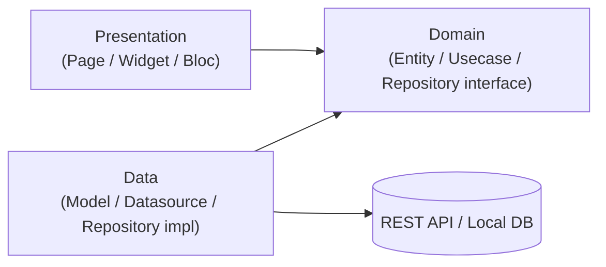
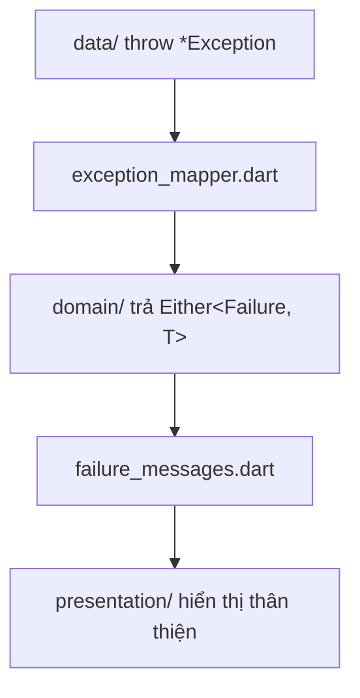
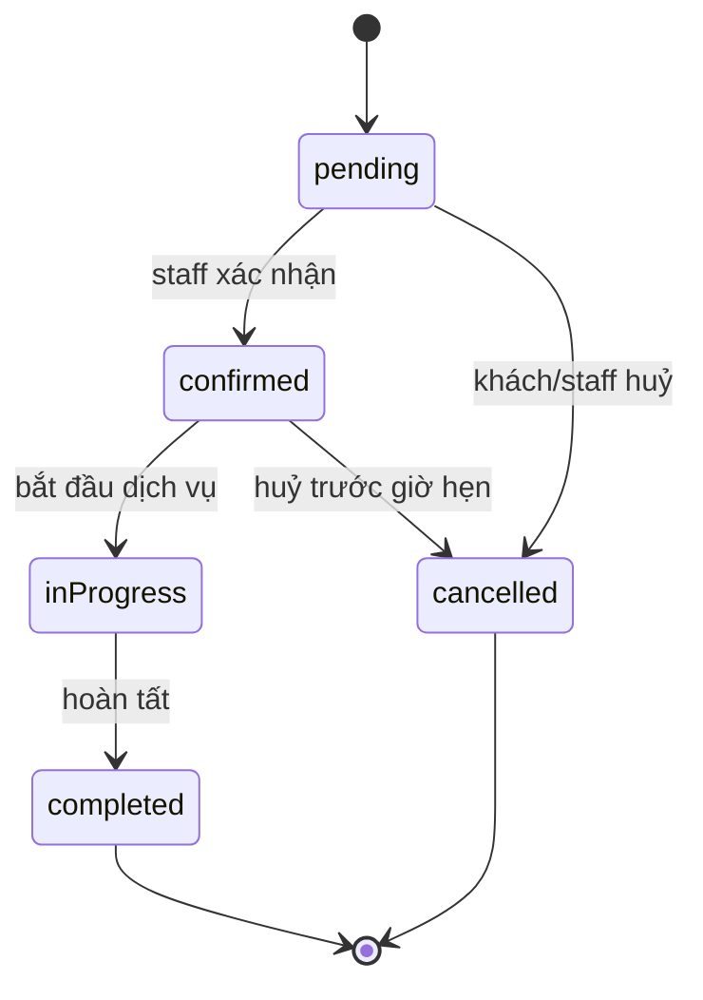
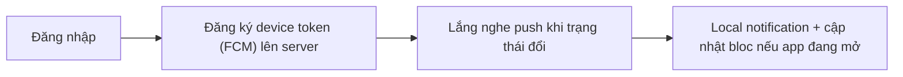

# Flutter Architecture Guide — Level 2: Business Application (Workflow-based)

**Version:** v1.0 · **Tài liệu độc lập** — không cần đọc thêm tài liệu nào khác để áp dụng.

## Khi nào dùng tài liệu này

Hệ thống có business logic rõ ràng, workflow nhiều bước (state transition), validate nghiệp vụ phức tạp hơn CRUD, có transaction logic, có auth/role đơn giản, có notification/upload file, có thể tích hợp nhẹ bên ngoài (Firebase, email, payment đơn giản). Ví dụ: app đặt lịch (spa/gym/clinic), expense tracker có recurring transaction, booking hệ thống nhỏ, CRM đơn giản cho SME, internal management system. Thường 3-8 domain, 30-80 API endpoint.

Nếu hệ thống cần message queue, event-driven architecture, search engine, hoặc có ≥ 8-10 domain phối hợp chặt chẽ với nhau → đã vượt phạm vi tài liệu này, cần kiến trúc cho hệ thống lớn hơn.

Nếu hệ thống chỉ là CRUD thuần không có workflow/transaction → tài liệu này over-kill, dùng kiến trúc CRUD đơn giản hơn.

---

## 1. Triết lý

- **Kiến trúc phục vụ thay đổi, không phục vụ đẹp.** Mọi rule dưới đây phải trả lời được: "nếu bỏ rule này, cái gì sẽ đau khi hệ thống lớn lên?"
- **Không over-engineering.** Không thêm abstraction cho vấn đề chưa xảy ra.
- **Optimize for maintenance.** Code được đọc và sửa nhiều lần hơn số lần được viết.
- **Make illegal state impossible.** Thiết kế type/state sao cho trạng thái sai không tồn tại được ở compile-time — quan trọng đặc biệt với hệ thống có workflow (mục 6).
- **Explicit > Implicit.** Dependency, luồng dữ liệu phải nhìn thấy qua code, không dựa vào quy ước ngầm.

Ngưỡng số lượng xuất hiện trong tài liệu (số dòng, số file...) là **heuristic tham khảo**, không phải luật cứng — ưu tiên đánh giá theo độ phức tạp thực tế.

## 2. Kiến trúc 3 lớp — Clean Architecture



**Dependency Rule — bất biến, không ngoại lệ:**

- `domain/` không phụ thuộc Flutter SDK, không phụ thuộc `data/` hay `presentation/`.
- `data/` implement interface do `domain/` định nghĩa.
- `presentation/` chỉ gọi `domain/usecases/`, không bao giờ import `data/` trực tiếp.

Lý do: đây là điều kiện duy nhất giúp business logic test được mà không cần mock UI/network thật, và cho phép đổi nguồn dữ liệu mà không đụng domain/presentation.

**Feature-First:** tổ chức theo `features/tên_nghiệp_vụ/`, không theo `models/`, `blocs/` dùng chung toàn app — cho phép 1 feature là 1 đơn vị hiểu/sửa/xoá trọn vẹn.

## 3. Cấu trúc thư mục

```
lib/
├── core/
│   ├── di/injection.dart                  → gọi initXxxDependencies() từng feature
│   ├── network/
│   │   ├── dio_client.dart
│   │   └── interceptors/{auth,error}_interceptor.dart
│   ├── error/
│   │   ├── exceptions.dart
│   │   ├── failures.dart
│   │   ├── exception_mapper.dart
│   │   └── failure_messages.dart
│   ├── usecase/usecase.dart               → base class UseCase<T, Params>
│   └── services/firebase_messaging_service.dart
├── features/
│   └── booking/
│       ├── data/
│       │   ├── datasources/booking_remote_data_source.dart
│       │   ├── models/booking_model.dart
│       │   └── repositories/booking_repository_impl.dart
│       ├── domain/
│       │   ├── entities/{booking, booking_status}.dart
│       │   ├── repositories/booking_repository.dart
│       │   └── usecases/{create_booking, confirm_booking, cancel_booking}_usecase.dart
│       ├── injection_container.dart
│       └── presentation/
│           ├── bloc/{booking_bloc, booking_event, booking_state}.dart
│           ├── pages/booking_page.dart
│           └── widgets/
├── shared/
│   ├── theme/
│   ├── utils/form_validators.dart
│   └── widgets/{buttons, cards, feedback, inputs, loaders}/
└── app.dart
```

## 4. Domain Layer

**Entity** — object nghiệp vụ thuần, immutable, không có `fromJson`:

```dart
class Booking extends Equatable {
  final String id;
  final String customerName;
  final DateTime scheduledAt;
  final BookingStatus status;

  const Booking({required this.id, required this.customerName, required this.scheduledAt, required this.status});

  @override
  List<Object?> get props => [id, customerName, scheduledAt, status];
}
```

**Usecase** — 1 class, 1 hành động nghiệp vụ, functor pattern:

```dart
class ConfirmBookingUseCase implements UseCase<Booking, ConfirmBookingParams> {
  final BookingRepository repository;
  ConfirmBookingUseCase(this.repository);

  @override
  Future<Either<Failure, Booking>> call(ConfirmBookingParams params) =>
      repository.confirmBooking(params.bookingId);
}

class ConfirmBookingParams extends Equatable {
  final String bookingId;
  const ConfirmBookingParams({required this.bookingId});
  @override
  List<Object?> get props => [bookingId];
}
```

Params object bắt buộc khi usecase có ≥ 2 tham số — tránh phá signature khi cần thêm tham số sau này.

**Repository interface** — abstract, sống ở domain, không biết gì về network/DB:

```dart
abstract class BookingRepository {
  Future<Either<Failure, List<Booking>>> getBookings();
  Future<Either<Failure, Booking>> confirmBooking(String bookingId);
}
```

## 5. Data Layer

**Model** — ánh xạ JSON ↔ object, có `toEntity()`:

```dart
class BookingModel {
  final String id;
  final String customerName;
  final String scheduledAt;
  final String status;

  BookingModel({required this.id, required this.customerName, required this.scheduledAt, required this.status});

  factory BookingModel.fromJson(Map<String, dynamic> json) => BookingModel(
        id: json['id'], customerName: json['customer_name'], scheduledAt: json['scheduled_at'], status: json['status'],
      );

  Booking toEntity() => Booking(
        id: id, customerName: customerName,
        scheduledAt: DateTime.parse(scheduledAt),
        status: BookingStatus.values.byName(status),
      );
}
```

**Repository impl** — implement interface domain, xử lý lỗi qua `exception_mapper`:

```dart
class BookingRepositoryImpl implements BookingRepository {
  final BookingRemoteDataSource remote;
  BookingRepositoryImpl(this.remote);

  @override
  Future<Either<Failure, Booking>> confirmBooking(String bookingId) async {
    try {
      final model = await remote.confirmBooking(bookingId);
      return Right(model.toEntity());
    } on DioException catch (e) {
      return Left(mapExceptionToFailure(e));
    }
  }
}
```

**Error handling 2 tầng:**



Mọi usecase trả `Future<Either<Failure, T>>`, không throw thẳng ra ngoài. `presentation/` không hiển thị message kỹ thuật thô.

## 6. Presentation — Bloc/Cubit

**Bloc hay Cubit?** State đơn giản, transition ngắn → Cubit. Nhiều loại event khác nhau, cần async transformer → Bloc.

**Thiết kế State — mặc định "Single state + enum status"** (giữ dữ liệu cũ khi loading lại, tránh flash empty khi refresh):

```dart
enum LoadStatus { initial, loading, loaded, error }

class BookingState extends Equatable {
  final LoadStatus status;
  final List<Booking> bookings;
  final Failure? failure;

  const BookingState({this.status = LoadStatus.initial, this.bookings = const [], this.failure});

  BookingState copyWith({LoadStatus? status, List<Booking>? bookings, Failure? failure}) =>
      BookingState(status: status ?? this.status, bookings: bookings ?? this.bookings, failure: failure);

  @override
  List<Object?> get props => [status, bookings, failure];
}
```

**Async safety:** không `emit()` sau `await` dài mà không kiểm tra bloc đã đóng. Event bắn liên tục nhanh dùng `EventTransformer` (package `bloc_concurrency`): `restartable()` cho search-as-you-type, `droppable()` chống double-submit (dùng nhiều ở mục 8).

**Side-effect 1 lần** (navigation, snackbar): dùng `BlocListener` với `listenWhen`, không dùng field boolean sống mãi trong State — dễ bị trigger lại khi widget rebuild.

## 7. UI — Page & Widget

**Page chỉ wiring**: lấy bloc qua DI, bố cục widget qua `BlocBuilder`, xử lý side-effect qua `BlocListener`. Không viết logic tính toán trong `build()`.

**4 trạng thái bắt buộc cho page có gọi dữ liệu:** loading (ưu tiên skeleton), empty (có message/action), error (theo Failure, có retry), success. Đây là Definition of Done, không phải nice-to-have.

**Design token:** màu/spacing/radius lấy từ `shared/theme/`, không hard-code trong widget.

## 8. Workflow / State Machine

### 8.1 Trạng thái là dữ liệu có luật, không phải string tự do

```dart
enum BookingStatus { pending, confirmed, inProgress, completed, cancelled }
```

### 8.2 Bảng chuyển trạng thái hợp lệ — 1 chỗ duy nhất



```dart
extension BookingStatusTransition on BookingStatus {
  bool canTransitionTo(BookingStatus target) => switch (this) {
    BookingStatus.pending => [BookingStatus.confirmed, BookingStatus.cancelled].contains(target),
    BookingStatus.confirmed => [BookingStatus.inProgress, BookingStatus.cancelled].contains(target),
    BookingStatus.inProgress => target == BookingStatus.completed,
    _ => false,
  };
}
```

UI hiển thị hành động khả dụng (nút "Xác nhận"/"Huỷ") dựa trên `canTransitionTo()`, không hard-code `if (status == 'pending')` rải rác nhiều nơi — thêm 1 trạng thái mới chỉ sửa 1 chỗ.

## 9. Transaction Logic

### 9.1 Idempotency cho hành động submit quan trọng

Hành động có thể bị bấm nhiều lần do mạng chậm/double-tap (xác nhận đặt lịch, submit giao dịch) gửi kèm `idempotencyKey` (UUID sinh khi user bấm lần đầu, giữ nguyên nếu retry) — server dùng key này để không tạo bản ghi trùng.

### 9.2 Chống double-submit ở Bloc

Mọi event submit/xác nhận trạng thái dùng `droppable()` transformer (mục 6) — bỏ qua event mới nếu event trước đang xử lý.

### 9.3 Chuỗi bước nhiều thao tác — gói trong 1 usecase

Khi 1 hành động cần 2-3 bước tuần tự có rollback rõ ràng (vd trừ ví → tạo booking, nếu tạo booking lỗi phải hoàn ví), xử lý trọn trong **1 usecase duy nhất**, không để bloc tự gọi tuần tự nhiều usecase rồi tự xử lý rollback:

```dart
class ConfirmBookingWithPaymentUseCase implements UseCase<Booking, ConfirmBookingParams> {
  // Gói trọn: trừ ví → tạo booking → nếu lỗi, hoàn ví → trả Failure rõ ràng
}
```

## 10. RBAC đơn giản

Chỉ cần role tĩnh (`admin`, `staff`, `customer`), dùng `enum UserRole` trong entity `User`, kiểm tra qua `context.select` hoặc field trong bloc state:

```dart
enum UserRole { admin, staff, customer }
```

Không cần hệ thống permission tải động từ server — đó là dấu hiệu hệ thống đã tiến gần mức phức tạp cao hơn phạm vi tài liệu này.

## 11. Notification & Upload File

**Push Notification:**



Đặt ở `core/services/firebase_messaging_service.dart` — cần thiết ở mức này vì workflow cần thông báo real-time cho người dùng.

**Upload file:** qua usecase riêng (`UploadAvatarUseCase`), không xử lý trực tiếp trong widget. Nén ảnh phía client trước khi upload để giảm băng thông.

## 12. Testing

| Layer | Loại test | Mock |
|---|---|---|
| `domain/usecases/` | Unit test | Mock repository interface |
| `data/repositories/` | Unit test | Mock datasource |
| `presentation/bloc/` | `bloc_test` | Mock usecase |
| Workflow transition | Unit test `canTransitionTo()` cho mọi cặp trạng thái hợp lệ/không hợp lệ | — |

## 13. Naming Convention

| Thành phần | Convention |
|---|---|
| Entity | Tên trần (`booking.dart`) hoặc suffix `_entity.dart` — chọn 1 style, dùng nhất quán |
| Model | Luôn suffix `_model.dart` |
| Usecase | `*_usecase.dart`, verb-first |
| Datasource | `*_remote_data_source.dart` (gạch dưới đầy đủ) |

## 14. Khi nào tiến lên hệ thống lớn hơn

```
□ Số domain vượt 8, các domain bắt đầu cần phối hợp phức tạp
□ Cần cache layer thực sự, search engine, hoặc message queue
□ Có ≥ 2 luồng nghiệp vụ dài nhiều bước async cần retry thực sự
□ Tích hợp nhiều hệ thống ngoài cùng lúc (payment + shipping + search)
□ Xuất hiện nhiều actor khác biệt về nghiệp vụ (buyer/seller...)
```

---

## Checklist tổng hợp

```
□ presentation/ có import data/ trực tiếp không?
□ Trạng thái workflow có dùng enum + bảng transition tường minh không?
□ Hành động submit quan trọng có idempotencyKey + droppable() không?
□ Chuỗi bước nhiều thao tác có gói trong 1 usecase, không rải rác ở bloc không?
□ Page có xử lý đủ 4 trạng thái loading/empty/error/success không?
□ Usecase chính có test không?
```
