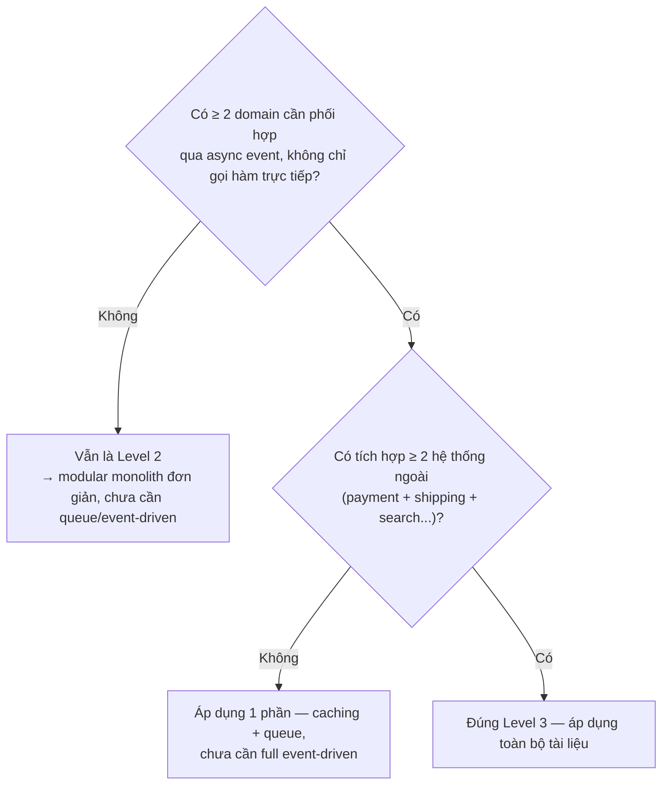
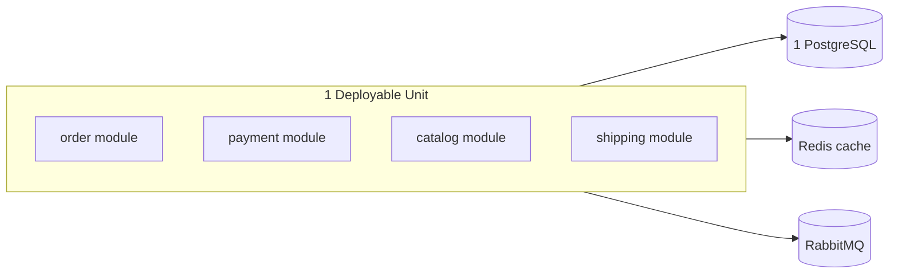
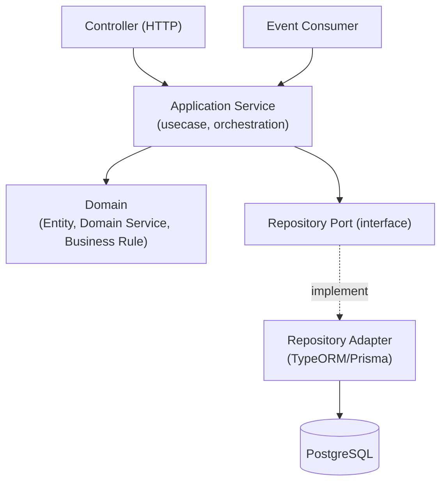
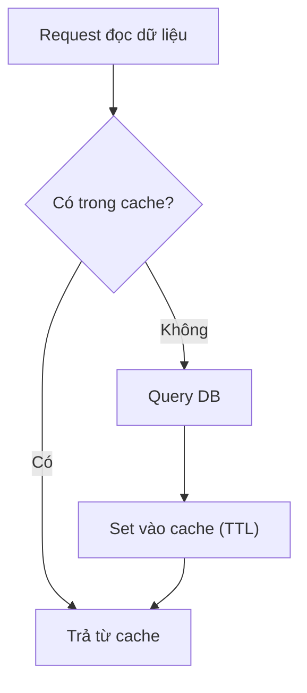
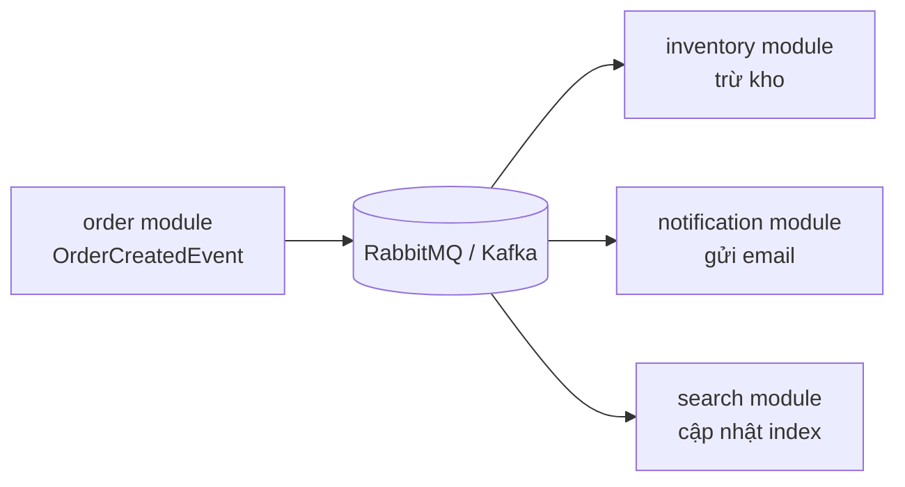
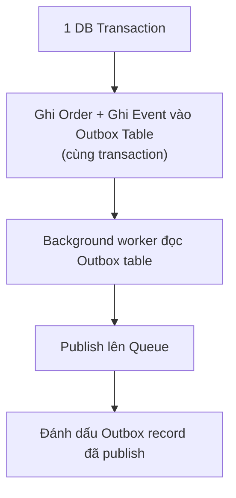
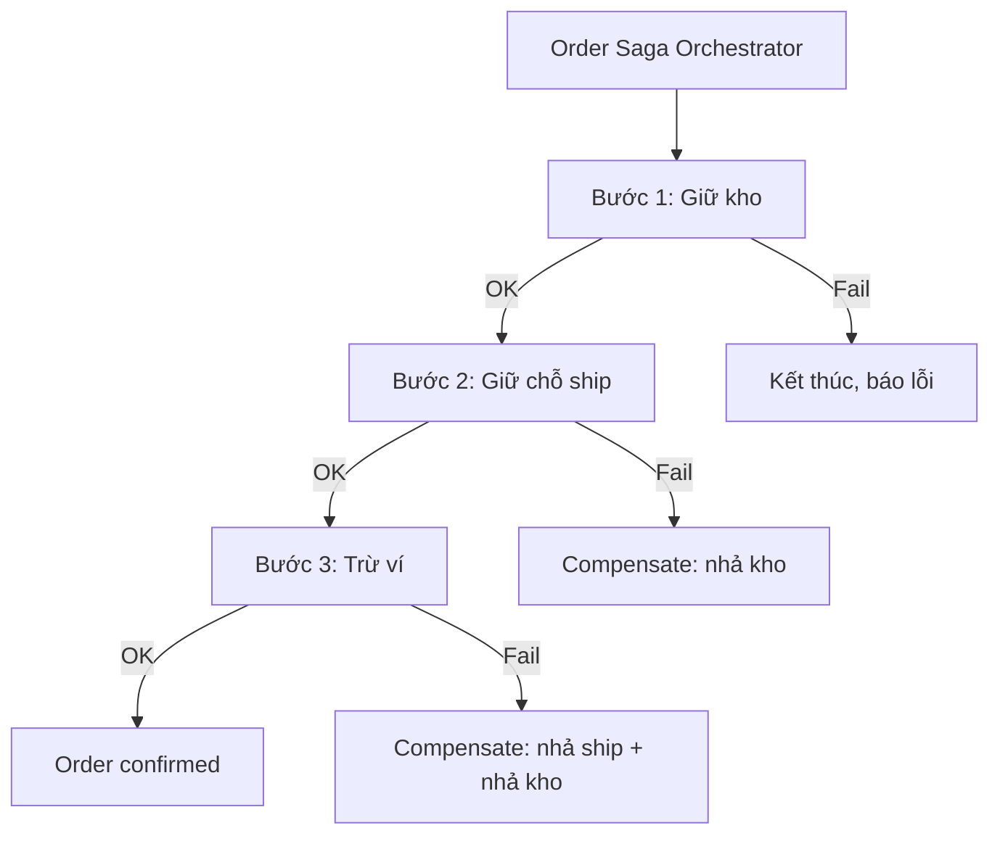
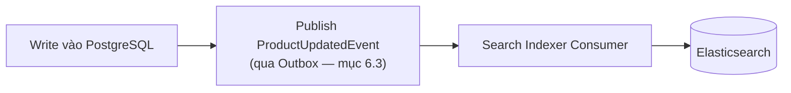
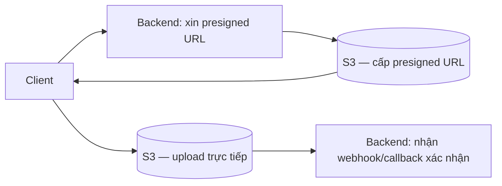

# Backend Architecture Guide — Level 3: Business Platform (NestJS)

**Version:** v1.0 · **Tài liệu độc lập** — không cần đọc thêm tài liệu nào khác để áp dụng.

## Khi nào dùng tài liệu này

Nhiều domain liên kết chặt chẽ (multi-module platform), business logic phức tạp với nhiều rule chồng nhau, workflow dài nhiều bước async, bắt buộc có caching/queue/event-driven, tích hợp nhiều hệ thống ngoài (payment, shipping, search, notification), data consistency khó (eventual consistency xuất hiện), cần scale từng phần hệ thống độc lập. Ví dụ: marketplace, e-commerce (coupon/inventory/payment/shipping), food delivery, logistics tracking, booking platform lớn. Thường 8-20+ domain module.

**Gate check:**



Nếu hệ thống chưa cần queue/cache/search engine, business logic vẫn xử lý được trong 1 transaction đồng bộ — dùng kiến trúc nhỏ hơn (modular monolith đơn giản), áp toàn bộ tài liệu này sẽ là over-engineering.

---

## 1. Triết lý

| Nguyên tắc | Ý nghĩa |
|---|---|
| **Kiến trúc phục vụ thay đổi, không phục vụ đẹp** | Mọi rule phải trả lời: "bỏ rule này, cái gì đau khi hệ thống lớn lên?" |
| **Không over-engineering** | Microservices/event-driven chỉ khi thực sự cần scale độc lập từng phần — không tách vì "nghe hay" |
| **Optimize for maintenance** | Code đọc/sửa nhiều lần hơn viết |
| **Prefer boring solution** | PostgreSQL + Redis + RabbitMQ đã đủ cho phần lớn Level 3 — không cần Kafka nếu chưa có nhu cầu throughput/replay thực sự lớn |
| **Make illegal state impossible** | Domain model + type system chặn trạng thái sai ở compile-time, không chỉ dựa vào validate runtime |
| **Explicit > Implicit** | Dependency, side-effect (đặc biệt async event) phải tường minh — event handler ẩn dễ gây "hành động ma" khó trace |

Ngưỡng số lượng trong tài liệu là heuristic tham khảo, không phải luật cứng.

## 2. Kiến trúc tổng thể — Modular Monolith (mặc định), không phải Microservices ngay

### 2.1 Vì sao Modular Monolith là điểm khởi đầu đúng cho Level 3

Microservices giải quyết vấn đề **tổ chức team** (nhiều team độc lập deploy) và **scale không đều** (1 phần hệ thống cần scale riêng) — không phải vấn đề "code sạch hơn". Level 3 (8-20 domain, thường 1 team hoặc vài team nhỏ) hiếm khi cần trả chi phí vận hành microservices (network latency, distributed transaction, observability phức tạp) ngay từ đầu.



Ranh giới module trong Modular Monolith chính là ranh giới tách microservice sau này nếu thực sự cần — nếu module boundary sạch từ đầu (mục 4), tách ra là vấn đề hạ tầng, không phải viết lại logic.

### 2.2 Hexagonal Architecture (Ports & Adapters) trong từng module



- **Domain** không phụ thuộc NestJS, không phụ thuộc ORM — chỉ TypeScript thuần + business rule.
- **Application Service** orchestrate usecase, gọi domain + repository port, không chứa business rule chi tiết (rule thuộc domain).
- **Adapter** (infrastructure) implement port — đổi TypeORM sang Prisma không đụng application/domain.

## 3. Cấu trúc thư mục

```
src/
├── modules/
│   └── order/
│       ├── domain/
│       │   ├── entities/order.entity.ts          → domain entity thuần, KHÔNG phải TypeORM entity
│       │   ├── value-objects/order-status.vo.ts
│       │   └── order.domain-service.ts            → business rule cần nhiều entity phối hợp
│       ├── application/
│       │   ├── commands/create-order.command.ts
│       │   ├── commands/create-order.handler.ts     → 1 handler = 1 hành động nghiệp vụ
│       │   ├── queries/get-order-detail.handler.ts
│       │   └── ports/order.repository.port.ts        → interface
│       ├── infrastructure/
│       │   ├── persistence/order.orm-entity.ts        → TypeORM entity riêng, map sang domain entity
│       │   ├── persistence/order.repository.ts         → implement port
│       │   └── messaging/order-created.publisher.ts
│       ├── interface/
│       │   ├── http/order.controller.ts
│       │   ├── http/dto/create-order.dto.ts
│       │   └── events/order-events.consumer.ts
│       └── order.module.ts
├── shared/
│   ├── cache/redis.service.ts
│   ├── queue/queue.module.ts
│   ├── observability/{logger, tracing}.service.ts
│   └── outbox/outbox.service.ts                       → xem mục 7.3
└── main.ts
```

**Rule dependency:** `domain/` không import gì từ `infrastructure/` hay `interface/`. `application/` gọi `domain/` + `ports/` (interface), không tự new trực tiếp class ở `infrastructure/`.

## 4. Domain Layer

### 4.1 Domain Entity ≠ ORM Entity

```typescript
// domain/entities/order.entity.ts — thuần TypeScript, không decorator TypeORM
export class Order {
  private constructor(
    private readonly id: string,
    private status: OrderStatus,
    private readonly items: OrderItem[],
  ) {}

  static create(items: OrderItem[]): Order {
    if (items.length === 0) throw new EmptyOrderError();
    return new Order(generateId(), OrderStatus.PENDING, items);
  }

  confirm(): void {
    if (!this.status.canTransitionTo(OrderStatus.CONFIRMED)) {
      throw new InvalidOrderTransitionError(this.status, OrderStatus.CONFIRMED);
    }
    this.status = OrderStatus.CONFIRMED;
  }
}
```

Tách riêng `infrastructure/persistence/order.orm-entity.ts` (có decorator `@Entity`, `@Column` của TypeORM) — mapper 2 chiều giữa domain entity và ORM entity nằm ở repository adapter. Lý do tách: business rule (`confirm()`) không nên phụ thuộc chi tiết ORM, và domain test được mà không cần database thật.

### 4.2 Application Service — CQRS nhẹ (Command/Query tách riêng)

```typescript
// application/commands/create-order.handler.ts
@CommandHandler(CreateOrderCommand)
export class CreateOrderHandler implements ICommandHandler<CreateOrderCommand> {
  constructor(
    @Inject('OrderRepositoryPort') private readonly repo: OrderRepositoryPort,
    private readonly outbox: OutboxService,
  ) {}

  async execute(command: CreateOrderCommand): Promise<string> {
    const order = Order.create(command.items);
    await this.repo.save(order);
    await this.outbox.publish(new OrderCreatedEvent(order.id)); // mục 7.3
    return order.id;
  }
}
```

Dùng `@nestjs/cqrs` cho tách Command (ghi) / Query (đọc) khi 1 module có nhiều usecase phức tạp — không bắt buộc cho module đơn giản, chỉ áp khi thực sự có nhiều luồng ghi phức tạp cần orchestration rõ ràng.

## 5. Caching (Redis)

### 5.1 Cache-Aside Pattern — mặc định



```typescript
async getProduct(id: string): Promise<Product> {
  const cached = await this.redis.get(`product:${id}`);
  if (cached) return JSON.parse(cached);

  const product = await this.repo.findById(id);
  await this.redis.set(`product:${id}`, JSON.stringify(product), 'EX', 300);
  return product;
}
```

### 5.2 Cache Invalidation — rule cứng

Mọi command làm thay đổi dữ liệu đã cache **bắt buộc** xoá/cập nhật cache tương ứng trong cùng transaction logic (không chỉ chờ TTL hết hạn) — TTL là lưới an toàn cuối cùng, không phải cơ chế invalidation chính. Đặt logic invalidate ngay trong repository adapter (nơi duy nhất biết key cache liên quan), không rải rác ở nhiều command handler.

### 5.3 Khi nào KHÔNG cache

Dữ liệu thay đổi liên tục theo từng request (số dư ví thời gian thực, tồn kho sát giới hạn) — cache dễ gây đọc sai lệch nghiêm trọng hơn lợi ích giảm tải. Đánh giá theo mức độ chấp nhận được của "stale data" cho từng loại dữ liệu cụ thể, không cache mặc định mọi thứ.

## 6. Message Queue & Event-Driven Architecture

### 6.1 Domain Event — khi nào cần

Khi 1 hành động ở module A cần kích hoạt hệ quả ở module B mà **không cần đợi kết quả ngay lập tức** (gửi email xác nhận, cập nhật search index, trừ kho), dùng domain event thay vì gọi trực tiếp service của module B — giữ module boundary lỏng (loose coupling), module B thay đổi không ảnh hưởng module A.



### 6.2 RabbitMQ vs Kafka — chọn theo nhu cầu thật

| Tiêu chí | RabbitMQ | Kafka |
|---|---|---|
| Nhu cầu | Task queue, event thông thường, throughput vừa phải | Event sourcing, replay lịch sử event, throughput rất cao |
| Vận hành | Đơn giản hơn, đủ cho phần lớn Level 3 | Phức tạp hơn, cần lý do cụ thể (audit trail dài hạn, nhiều consumer group độc lập cần replay) |

Baseline khuyến nghị: **RabbitMQ mặc định cho Level 3**, chỉ chuyển Kafka khi có nhu cầu cụ thể không đáp ứng được bởi RabbitMQ (không chọn Kafka "vì công ty lớn hay dùng Kafka").

### 6.3 Outbox Pattern — đảm bảo event không mất khi service crash giữa chừng



Nếu chỉ ghi DB rồi publish event ngay sau đó (2 thao tác riêng biệt), service crash giữa 2 bước làm mất event vĩnh viễn (DB đã ghi, event chưa publish) — dữ liệu module khác không bao giờ đồng bộ. Outbox pattern ghi event vào **cùng transaction DB** với dữ liệu nghiệp vụ, background worker riêng đọc bảng outbox rồi publish — đảm bảo "at-least-once delivery" mà không phụ thuộc 2-phase commit phức tạp giữa DB và message broker.

### 6.4 Idempotent Consumer — bắt buộc cho mọi event handler

Message queue đảm bảo "at-least-once", không phải "exactly-once" — consumer có thể nhận cùng 1 event nhiều lần. Mọi event handler phải idempotent (kiểm tra đã xử lý event này chưa qua `eventId` trước khi thực thi side-effect), không giả định event chỉ đến đúng 1 lần.

## 7. Data Consistency — Saga Pattern

### 7.1 Vấn đề: transaction xuyên nhiều module/service

Khi 1 luồng nghiệp vụ cần nhiều bước ở nhiều module (đặt hàng: trừ kho → giữ chỗ ship → trừ ví → tạo order), không thể dùng 1 DB transaction ACID xuyên suốt nếu các module có thể tách service riêng sau này (mục 2.1) — cần chiến lược quản lý consistency khác: Saga.

### 7.2 Saga Orchestration (khuyến nghị mặc định cho Level 3)



1 orchestrator (application service) điều phối tuần tự, có bước compensate (hành động bù trừ) rõ ràng cho mỗi bước nếu bước sau thất bại — không để consistency logic rải rác ở nhiều nơi qua choreography event thuần (nhiều event lắng nghe chéo nhau) khi luồng có ≤ 5-6 bước, vì orchestration dễ trace và debug hơn nhiều so với choreography ở quy mô Level 3.

### 7.3 Idempotency Key cho mọi bước Saga

Mỗi bước saga gửi kèm `idempotencyKey` riêng — nếu orchestrator retry 1 bước do timeout, service đích không thực hiện trùng lần 2.

## 8. Tích hợp Hệ thống Ngoài (Payment, Shipping, Search, Notification)

### 8.1 Anti-Corruption Layer — Adapter Pattern

```typescript
// infrastructure/payment/payment-gateway.port.ts
export interface PaymentGatewayPort {
  charge(amount: Money, method: PaymentMethod): Promise<PaymentResult>;
}

// infrastructure/payment/stripe-payment.adapter.ts
@Injectable()
export class StripePaymentAdapter implements PaymentGatewayPort {
  async charge(amount: Money, method: PaymentMethod): Promise<PaymentResult> {
    // Normalize response/error code của Stripe thành PaymentResult chung
  }
}
```

Domain/application chỉ biết `PaymentGatewayPort`, không biết đang dùng Stripe hay VNPay — đổi payment provider chỉ đổi adapter, không đụng business logic.

### 8.2 Circuit Breaker cho hệ thống ngoài không ổn định

Hệ thống ngoài (shipping provider, payment gateway) có thể chậm/down — dùng circuit breaker (package `opossum` hoặc tự implement) để tránh 1 dependency ngoài chậm làm nghẽn toàn bộ request pool của service. Sau N lần lỗi liên tiếp, circuit "mở" — fail nhanh thay vì chờ timeout dài, tự động thử lại sau khoảng nghỉ.

### 8.3 Timeout & Retry rõ ràng

Mọi call ra ngoài có timeout tường minh (không dùng default vô hạn của HTTP client), retry có giới hạn số lần + backoff, không retry vô điều kiện cho lỗi không nên retry (vd lỗi validate 4xx không retry, lỗi 5xx/timeout mới retry).

## 9. Search Engine (Elasticsearch)

### 9.1 Elasticsearch không phải Source of Truth

PostgreSQL luôn là nguồn sự thật (write model). Elasticsearch chỉ là read model tối ưu cho tìm kiếm/filter phức tạp — đồng bộ qua domain event (mục 6.1), không ghi trực tiếp 2 nơi cùng lúc từ application service.



### 9.2 Xử lý lệch dữ liệu tạm thời (eventual consistency)

Có độ trễ giữa ghi PostgreSQL và cập nhật Elasticsearch (thường vài trăm ms tới vài giây) — chấp nhận được cho tìm kiếm/filter, **không dùng Elasticsearch cho dữ liệu cần chính xác tuyệt đối tức thời** (vd số lượng tồn kho hiển thị lúc checkout phải query PostgreSQL trực tiếp, không lấy từ ES).

## 10. Object Storage (S3)

### 10.1 Presigned URL — không để file đi qua backend nếu không cần

Với upload file lớn (ảnh, video, tài liệu), client upload thẳng lên S3 qua presigned URL do backend cấp, không upload qua backend rồi backend forward lên S3 — giảm tải băng thông/CPU backend không cần thiết.



### 10.2 Validate sau khi upload, không tin tưởng mù quáng

Backend luôn validate file đã upload (loại file, kích thước, virus scan nếu cần) sau khi nhận callback — không tin client đã gửi đúng loại file như cam kết ở bước xin presigned URL.

## 11. API Layer

### 11.1 Chuẩn response & error format

Format response nhất quán toàn hệ thống (`{ data, meta }` cho success, `{ error: { code, message } }` cho lỗi) — NestJS Exception Filter toàn cục xử lý, không để mỗi controller tự format lỗi khác nhau.

### 11.2 Validation qua DTO

`class-validator` + `class-transformer` validate mọi input ở tầng `interface/http/dto/`, không validate rải rác trong application service — application service tin tưởng dữ liệu đã qua DTO là hợp lệ về mặt hình thức (kiểu dữ liệu, format), chỉ còn validate business rule (thuộc domain).

### 11.3 Pagination & Versioning

Pagination chuẩn hoá 1 kiểu duy nhất (`{ items, page, totalPages, hasMore }`) dùng lại cho mọi endpoint danh sách. Versioning API qua URL prefix (`/v1/`, `/v2/`) khi có breaking change, giữ version cũ chạy song song đủ lâu cho client cập nhật (đặc biệt quan trọng nếu có mobile app không update ngay).

## 12. Testing

| Layer | Loại test | Công cụ |
|---|---|---|
| `domain/` | Unit test thuần, không cần DB | Jest |
| `application/` (command/query handler) | Unit test, mock repository port | Jest + mock |
| `infrastructure/` (repository adapter) | Integration test với DB thật | Testcontainers (PostgreSQL/Redis thật trong container, không mock) |
| Saga/Event flow | Integration test toàn luồng qua queue thật | Testcontainers (RabbitMQ) |
| API | E2E test qua HTTP thật | Supertest |

Domain layer là nơi coverage cao nhất (business rule quan trọng nhất, rẻ nhất để test vì không cần I/O thật).

## 13. Observability

- **Structured logging** (JSON, không log string tự do) qua `nestjs-pino` hoặc tương đương, có `traceId` gắn xuyên suốt 1 request.
- **Distributed tracing** (OpenTelemetry) — bắt buộc khi có event-driven qua nhiều module/consumer, để trace được 1 request gốc dẫn tới chuỗi event nào, xử lý ở consumer nào, mất bao lâu.
- **Health check endpoint** (`@nestjs/terminus`) cho từng dependency (DB, Redis, Queue) — không chỉ 1 endpoint `/health` trả `ok` chung chung không kiểm tra gì thật.

## 14. Security

- AuthN qua JWT (access + refresh token), AuthZ qua Guard (`@nestjs/passport` + custom `RolesGuard`) — check quyền ở tầng `interface/http/`, không rải rác trong application service.
- Rate limiting (`@nestjs/throttler`) cho endpoint public, đặc biệt endpoint auth (chống brute-force).
- Secret (DB credential, API key hệ thống ngoài) qua biến môi trường + secret manager (Vault/AWS Secrets Manager), không hard-code hoặc commit vào repo.

## 15. Scaling

- Stateless application server — mọi state cần chia sẻ (session, cache) nằm ở Redis, không lưu in-memory instance để scale ngang tự do.
- Queue consumer scale độc lập với API server — 1 luồng nghiệp vụ nặng (xử lý ảnh, gửi email hàng loạt) không nên chiếm resource của process phục vụ HTTP request.
- Database: đọc nhiều hơn ghi → cân nhắc read replica trước khi nghĩ tới sharding (sharding là bước phức tạp hơn nhiều, chỉ cần khi read replica không đủ).

---

## Checklist tổng hợp

```
□ domain/ có import gì từ infrastructure/ hoặc NestJS decorator không (ORM, HTTP)?
□ Command handler mới có wrap trong Outbox transaction nếu có publish event không?
□ Event consumer mới có idempotent (check eventId trước khi xử lý) không?
□ Cache mới có logic invalidate rõ ràng, không chỉ dựa vào TTL không?
□ Saga có bước compensate rõ ràng cho mọi bước có thể fail không?
□ Call ra hệ thống ngoài có timeout + retry giới hạn + circuit breaker không?
□ Elasticsearch có được dùng cho dữ liệu cần chính xác tức thời không (sai chỗ)?
□ Upload file lớn có qua presigned URL, không proxy qua backend không?
□ DTO có validate đủ input trước khi vào application service không?
□ Domain layer có test coverage cao, không cần DB thật không?
```
