# Flutter Architecture Baseline — Full Document

---

## Flutter Architecture Baseline

**Version:** v1.1
**Status:** Living document — cập nhật khi có bài học mới từ dự án thực tế

### Mục tiêu

Baseline này tồn tại để trả lời 1 câu hỏi duy nhất khi bắt đầu dự án Flutter mới: *"tổ chức code thế nào để 6 tháng sau, hoặc 1 dev khác, vẫn sửa được mà không phải đọc lại toàn bộ codebase trước"*. Nó không phải bộ luật để tuân theo tuyệt đối — là tập hợp quyết định đã cân nhắc trade-off, dùng lại được thay vì phải nghĩ lại từ đầu mỗi dự án.

Baseline **không** nhằm mục đích: chứng minh "cách làm đúng duy nhất", tối ưu cho vẻ đẹp code, hay áp dụng máy móc bất kể ngữ cảnh dự án. Xem [Engineering Principles](#part1) để hiểu triết lý gốc mọi rule suy ra từ đó.

### Changelog

| Version | Thay đổi |
|---|---|
| v1.1 | Thêm Part 1.1 Engineering Principles; thêm trade-off table (Part 1, Part 5); thêm Evolution/upgrade path không rewrite (Part 3); thêm Part 14 (Automation & Tooling); thêm Part 15 (Common Mistakes); làm mềm ngôn ngữ các ngưỡng số thành heuristic tham khảo |
| v1.0 | Bản đầu tiên — 13 phần: Architecture, Folder Structure, Domain, Data, Presentation, UI, Testing, Performance, Security, Observability, Scaling, ADR, Checklist |

### Sơ đồ tổng quan

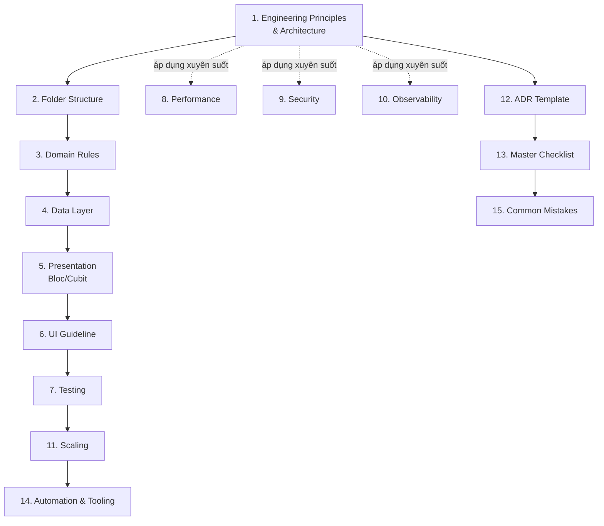

Part 1-7 đọc tuần tự (theo đúng luồng code 1 feature đi qua). Part 8-10 áp dụng ngang, không thuộc riêng layer nào. Part 11-15 dùng khi cần (scale, review, ghi quyết định).

### Thứ tự đọc khuyến nghị

| # | Tài liệu | Đọc khi nào |
|---|---|---|
| 1 | [Engineering Principles & Architecture](#part1) | Bắt buộc đọc đầu tiên — triết lý & dependency rule |
| 2 | [Folder Structure](#part2) | Khi setup project mới hoặc tạo feature mới |
| 3 | [Domain Rules](#part3) | Khi viết Entity/Usecase/Repository interface |
| 4 | [Data Layer](#part4) | Khi viết Model/Datasource/Repository impl |
| 5 | [Presentation — Bloc/Cubit](#part5) | Khi viết state management |
| 6 | [UI Guideline](#part6) | Khi viết Page/Widget |
| 7 | [Testing](#part7) | Khi viết test |
| 8 | [Performance](#part8) | Khi tối ưu, hoặc review PR |
| 9 | [Security](#part9) | Trước khi release production |
| 10 | [Observability](#part10) | Khi setup monitoring/logging |
| 11 | [Scaling](#part11) | Khi project lớn dần, nhiều dev làm song song |
| 12 | [ADR Template](#part12) | Khi cần ghi lại 1 quyết định lệch baseline |
| 13 | [Master Checklist](#part13) | Dùng khi review PR — gộp checklist từ mọi phần |
| 14 | [Automation & Tooling](#part14) | Khi setup lint/CI/pre-commit hook |
| 15 | [Common Mistakes](#part15) | Đọc nhanh 2 phút, dùng khi review code |

### Nguyên tắc phân loại nội dung

- **Architecture** = quyết định khó đảo ngược, ảnh hưởng cấu trúc toàn dự án (dependency rule, layer boundary, actor boundary).
- **Coding Convention** = quy ước dễ đổi, chỉ ảnh hưởng cách viết code trong 1 layer (naming file, copyWith, suffix). Nằm trong từng Part tương ứng, đánh dấu rõ bằng heading `### Coding Convention —`.
- **Checklist** = danh sách tick nhanh khi review, không giải thích lại lý do (lý do đã nằm trong phần nội dung).

### Về các ngưỡng số lượng trong tài liệu

Mọi con số cụ thể (số dòng, số file, số tham số, số feature...) xuất hiện xuyên suốt tài liệu là **heuristic tham khảo để hỗ trợ ra quyết định nhanh, không phải luật đúng-sai tuyệt đối**. Quan trọng hơn con số là mức độ phức tạp thực tế và khả năng đọc hiểu của code. Khi một ngưỡng và thực tế dự án mâu thuẫn, ưu tiên đánh giá theo ngữ cảnh, không áp dụng máy móc — xem thêm [Engineering Principles](#part1).

### Ví dụ xuyên suốt

Part 3–7 dùng chung 1 ví dụ: feature **`Product`** (Tier 3 đầy đủ) — để người đọc thấy được luồng dữ liệu đi trọn từ API đến UI đến test qua từng phần, thay vì code rời rạc không nối được với nhau.


---

<a id="part1"></a>

## Part 1 — Engineering Principles & Architecture

> Đây là ADR-000: quyết định kiến trúc nền, hiếm khi đổi. Không chứa coding convention (xem Part 2-6 cho naming/file structure).

### 1.1 Engineering Principles

Đây là "linh hồn" của toàn bộ tài liệu — mọi rule ở 15 Part sau đều phải suy ra được từ 6 nguyên tắc dưới đây. Nếu 1 rule cụ thể mâu thuẫn với nguyên tắc gốc, nguyên tắc gốc thắng.

| Nguyên tắc | Ý nghĩa |
|---|---|
| **Architecture phục vụ thay đổi, không phục vụ đẹp** | Mục tiêu là giảm chi phí sửa đổi trong tương lai, không phải để codebase "trông chuẩn" hay thoả mãn gu thẩm mỹ cá nhân. |
| **Không over-engineering** | Không thêm abstraction/layer cho vấn đề chưa xảy ra. Giải quyết vấn đề hiện tại, để lại chỗ mở rộng — không xây trước cho tương lai chưa chắc tới. |
| **Optimize for maintenance, không phải cho tốc độ viết ban đầu** | Code được đọc và sửa nhiều lần hơn số lần được viết. Chọn phương án dễ maintain hơn phương án viết nhanh hơn. |
| **Prefer boring solution** | Chọn công nghệ/pattern đã được kiểm chứng rộng rãi thay vì mới nhất/hay nhất trên giấy. Ít bất ngờ hơn quan trọng hơn ít code hơn. |
| **Make illegal state impossible** | Thiết kế type/state sao cho trạng thái sai không thể tồn tại được về mặt compile-time, thay vì dựa vào runtime check hoặc kỷ luật của dev. |
| **Explicit > Implicit** | Dependency, luồng dữ liệu, side-effect phải nhìn thấy được qua code (constructor, tham số, return type) — không dựa vào "quy ước ngầm" mà dev mới không biết. |

Ngưỡng số lượng xuất hiện xuyên suốt tài liệu này (số dòng, số file, số tham số...) là **heuristic tham khảo để hỗ trợ đánh giá, không phải luật cứng đúng-sai**. Khi một con số và thực tế code mâu thuẫn, ưu tiên đánh giá theo mức độ phức tạp và khả năng đọc hiểu thực tế, không áp dụng máy móc.

### 1.2 Phạm vi áp dụng

Baseline này dành cho app: có gọi network, có luồng nghiệp vụ thực (không chỉ CRUD), dự kiến sống lâu dài hoặc có nhiều hơn 1 dev, cần test logic độc lập UI.

Dự án không có các đặc điểm trên → dùng kiến trúc nhẹ hơn (xem Part 11.4) — đây cũng là áp dụng trực tiếp nguyên tắc "không over-engineering" ở mục 1.1.

### 1.3 Mô hình 3 lớp

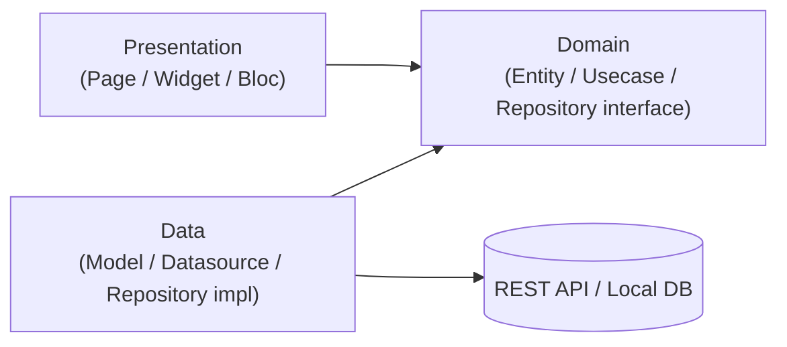

Domain là trung tâm — cả Presentation lẫn Data đều phụ thuộc vào Domain, Domain không phụ thuộc ngược lại bất kỳ ai.

### 1.4 Dependency Rule — bất biến, không ngoại lệ

- `domain/` không phụ thuộc Flutter SDK, không phụ thuộc `data/` hay `presentation/`.
- `data/` implement interface do `domain/` định nghĩa.
- `presentation/` chỉ gọi `domain/usecases/`, không bao giờ import `data/`.

Lý do bất biến: đây là điều kiện duy nhất giúp domain logic test được mà không cần mock UI/network thật, và cho phép đổi nguồn dữ liệu (REST → GraphQL, Isar → Hive) mà không đụng domain/presentation. Đây là ứng dụng trực tiếp của "Explicit > Implicit" (mục 1.1) — chiều phụ thuộc luôn tường minh qua import, không dựa vào kỷ luật dev.

### 1.5 Feature-First — không Layer-First

Tổ chức thư mục theo `features/tên_nghiệp_vụ/`, không theo `models/`, `blocs/`, `screens/` dùng chung toàn app.

Lý do: layer-first buộc dev mở nhiều thư mục xa nhau để hiểu 1 luồng nghiệp vụ, và khiến việc tách feature thành module riêng gần như bất khả thi. Feature-first cho phép 1 feature = 1 đơn vị xoá/tách/giao được trọn vẹn.

#### Trade-off: Feature-First vs các cách tổ chức khác

| Pattern | Khi dùng | Không dùng |
|---|---|---|
| **Feature-First** (baseline chọn) | App có ≥ 5-10 luồng nghiệp vụ độc lập, nhiều dev làm song song, cần khả năng tách module/package sau này | App cực nhỏ (1-2 màn hình), 1 dev, không có ý định scale — overhead tổ chức thư mục không đáng |
| **Layer-First** (`models/`, `blocs/`, `screens/` dùng chung) | Prototype rất nhỏ, ưu tiên viết nhanh, không quan tâm maintain dài hạn | Bất kỳ dự án nào dự kiến sống > vài tháng — chi phí điều hướng tăng theo cấp số nhân khi số màn hình tăng |
| **Layer-First trong từng Feature (Clean Architecture)** (baseline chọn, kết hợp Feature-First) | Cần cô lập business logic để test, cần khả năng đổi nguồn dữ liệu | Feature siêu đơn giản không có business rule (xem Tier 0-2, Part 3.4) |

### 1.6 Ba khu vực gốc — vai trò

| Khu vực | Vai trò | Không được chứa |
|---|---|---|
| `core/` | Hạ tầng kỹ thuật dùng chung (DI, network, error, storage) | UI, business rule |
| `features/` | Nghiệp vụ, mỗi feature đủ 3 lớp | Thứ dùng chung nhiều feature không liên quan |
| `shared/` | UI + utils tái sử dụng | Gọi API, business rule |

Rule kiểm tra `core/` vs feature: nếu xoá 1 feature, phần trong `core/` liên quan phải vẫn có ý nghĩa — nếu không, nó thuộc về feature, không phải `core/`.

### 1.7 Module boundary khi app đa actor

Nếu app phục vụ nhiều loại người dùng khác biệt về nghiệp vụ (buyer/seller, admin/user...), tách `features/<actor>/` ngay từ đầu. Không import chéo giữa 2 actor. Entity trùng tên nhưng khác field/nghiệp vụ → chấp nhận duplicate có chủ đích, không gộp rồi optional hoá field.

Chi tiết cấu trúc thư mục cụ thể → xem **Part 2**.

---

### Review Checklist — Architecture

```
□ File trong presentation/ có import bất cứ gì từ data/ không?
□ File trong domain/ có import Flutter SDK hoặc package UI không?
□ core/ có chứa thứ chỉ 1 feature dùng không?
□ Có import chéo giữa 2 actor không?
□ Feature mới có tuân theo feature-first, không lẫn vào layer-first?
□ Có abstraction/layer nào được thêm cho vấn đề chưa thực sự xảy ra không? (over-engineering check)
```


---

<a id="part2"></a>

## Part 2 — Folder Structure

> Template copy trực tiếp khi khởi tạo dự án hoặc feature mới. Không giải thích lý do (đã có ở Part 1) — đây là phần "làm theo", không phải "hiểu tại sao".

### 2.1 Cây thư mục gốc

```
lib/
├── core/           → DI, network, error, storage, logger, database, security
├── features/       → nghiệp vụ, mỗi feature 1 thư mục con (xem 2.3)
├── shared/         → UI + utils tái sử dụng (xem Part 6)
├── env/            → entry point theo môi trường, chỉ cần nếu multi-flavor
├── l10n/           → đa ngôn ngữ, chỉ cần nếu có
├── app.dart
└── bootstrap.dart  → khởi tạo DI, error handling toàn cục, runApp
```

### 2.2 `core/` đầy đủ

```
core/
├── config/app_config.dart
├── constants/app_constants.dart
├── database/schemas/*_schema.dart        → chỉ cần nếu có local persistence, *.g.dart không sửa tay
├── di/injection.dart                     → chỉ gọi initXxxDependencies() của từng feature
├── error/
│   ├── exceptions.dart
│   ├── failures.dart
│   ├── exception_mapper.dart
│   └── failure_messages.dart
├── logger/app_logger.dart
├── network/
│   ├── interceptors/{auth,error,log}_interceptor.dart
│   ├── dio_client.dart
│   ├── api_response_parser.dart
│   └── token_refresh_service.dart        → chỉ cần nếu có auth + refresh token
├── storage/secure_storage.dart
├── usecase/usecase.dart                  → base class UseCase<T, Params>
└── entities/                             → chỉ cần nếu có entity dùng chung ≥ 2 actor
```

### 2.3 Template 1 feature (Tier 3 đầy đủ) — `sample_feature/`

```
features/sample_feature/
├── data/
│   ├── datasources/
│   │   ├── sample_feature_remote_data_source.dart
│   │   └── sample_feature_local_data_source.dart   → chỉ cần nếu có cache/offline
│   ├── models/sample_feature_model.dart
│   ├── repositories/sample_feature_repository_impl.dart
│   └── utils/                                       → optional
├── domain/
│   ├── entities/sample_feature_entity.dart
│   ├── repositories/sample_feature_repository.dart
│   ├── usecases/
│   │   ├── get_sample_feature_usecase.dart
│   │   └── update_sample_feature_usecase.dart
│   └── utils/                                       → optional
├── injection_container.dart               → export initSampleFeatureDependencies(GetIt sl)
└── presentation/
    ├── bloc/
    │   ├── sample_feature_bloc.dart
    │   ├── sample_feature_event.dart
    │   └── sample_feature_state.dart
    ├── pages/sample_feature_page.dart
    ├── widgets/                            → tách subfolder khi số file riêng cho 1 page bắt đầu khó điều hướng (tham khảo: khoảng ≥ 6 file)
    └── utils/                              → optional
```

### 2.4 `shared/` đầy đủ

```
shared/
├── bloc/{theme, locale}/                  → chỉ global state, xem Part 5
├── extensions/context_extensions.dart
├── routing/{app_router, go_router_refresh_stream}.dart
├── theme/
│   ├── tokens/                            → chỉ cần nếu responsive đa kích thước
│   └── {app_colors, app_spacing, app_radius, app_text_styles, app_theme}.dart
├── utils/form_validators.dart
└── widgets/{buttons, cards, feedback, inputs, loaders}/   → chia theo chức năng, không theo feature
```

### 2.5 Feature đa actor (nếu áp dụng — xem Part 1.7)

```
features/
├── actor_a/
│   └── sample_feature/   → prefix tên file/class theo actor_a
└── actor_b/
    └── sample_feature/   → prefix tên file/class theo actor_b
```

### 2.6 Rule copy template

1. Copy nguyên khối `sample_feature/`, đổi tên, giữ đủ 3 lớp — chỉ bớt theo Tier (Part 3.4) khi có lý do ghi lại được.
2. Viết `injection_container.dart` theo dependency thật, gọi từ `core/di/injection.dart`.
3. `widgets/` giữ phẳng cho tới khi chạm ngưỡng 6 file riêng cho 1 page (Part 6).

---

### Review Checklist — Folder Structure

```
□ Feature mới có đủ 3 lớp (trừ khi có lý do lược layer ghi lại được)?
□ injection_container.dart đã tách riêng, chưa đăng ký trực tiếp vào core/di/injection.dart?
□ models/ (số nhiều) và _data_source.dart (có gạch dưới đầy đủ) — không lệch style giữa các feature?
□ widgets/ có tách subfolder đúng lúc (tham khảo ~6 file), không tách sớm/muộn theo cảm tính?
```


---

<a id="part3"></a>

## Part 3 — Domain Rules

### 3.1 Entity — data holder thuần, không biết về JSON

Entity immutable, không có `fromJson`, không phụ thuộc network/DB. Business rule (validate, tính toán) thuộc `domain/usecases/`, không nhét vào method của entity — trừ derived getter đơn giản, thuần suy ra từ field có sẵn, không async:

```dart
// Chấp nhận được — derived getter thuần
bool get isExpired => expiresAt.isBefore(DateTime.now());
```

### 3.2 Usecase = 1 hành động nghiệp vụ

Mỗi usecase là 1 class, 1 method `call()` (functor pattern), tên verb-phrase. Không gộp nhiều hành động vào 1 class kiểu `ManageProductUseCase`.

**Params object** khi usecase có ≥ 2 tham số — không dùng positional params rời, vì thêm tham số sau này sẽ phá signature mọi lời gọi hiện có.

### 3.3 Repository interface — ranh giới duy nhất tới nguồn dữ liệu thật

`domain/repositories/*.dart` chỉ là abstract interface. Repository impl (ở `data/`) quyết định cache-first/network-first/retry — usecase và bloc không biết dữ liệu đến từ đâu.

### 3.4 Quy tắc lược layer (Tier)

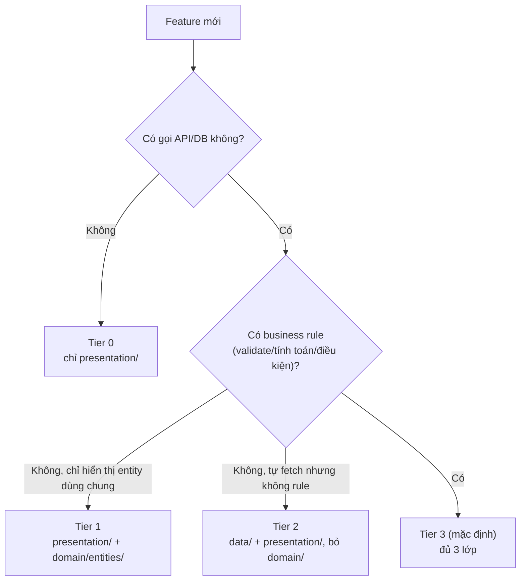

**Tier 3 là mặc định.** Chỉ hạ Tier khi có lý do ghi lại được (comment/ADR ngắn) — không phải vì "feature nhỏ nên chắc không cần domain".

#### Evolution — nâng Tier không rewrite

Feature bắt đầu ở Tier thấp rồi nghiệp vụ phát triển thêm là chuyện bình thường, không phải sai lầm ban đầu. Nâng Tier là **thêm dần**, không phải viết lại:

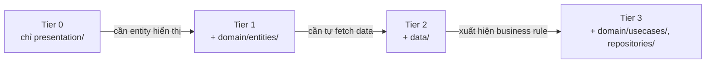

Cách nâng cụ thể, không đụng code đang chạy:

- **Tier 0 → Tier 1**: thêm `domain/entities/`, đổi widget đang nhận `Map`/primitive rời rạc sang nhận 1 entity — refactor cục bộ trong feature, không ảnh hưởng feature khác.
- **Tier 1 → Tier 2**: thêm `data/datasources/` + `data/repositories/`, widget/bloc đổi từ nhận entity qua constructor sang tự gọi repository — vẫn giữ nguyên entity đã có ở bước trước.
- **Tier 2 → Tier 3**: đây là bước quan trọng nhất — không xoá `data/repositories/xxx_repository_impl.dart` đã có, chỉ **thêm** `domain/repositories/xxx_repository.dart` (interface) rồi cho impl hiện tại `implements` interface đó, thêm `domain/usecases/` gọi qua interface. Bloc đổi từ gọi thẳng repository sang gọi usecase — đây là chỗ duy nhất bloc bị đụng tới, phần data giữ nguyên 100%.

Rule: nếu 1 lần nâng Tier buộc phải xoá/viết lại code đang chạy tốt (không phải chỉ thêm file mới + đổi lại chỗ gọi), có thể Tier ban đầu đã bị chọn sai ngay từ đầu — ghi lại thành bài học trong ADR (Part 12), không lặp lại lần sau.

### 3.5 Composite Entity & Value Object

- Entity con **không** giữ reference ngược về entity cha (`OrderItem` không có field `order`) — tránh vòng phụ thuộc khi serialize/so sánh.
- Value Object (vd `Money`, `PhoneNumber`) chỉ dùng khi rule validate/format lặp lại ở ≥ 3 nơi — không bọc mọi field, đó là over-engineering.

#### Coding Convention — Domain layer

| Thành phần | Convention |
|---|---|
| Entity | Chọn 1 style toàn dự án: suffix `_entity.dart` hoặc tên trần (`product.dart`) — không trộn |
| Repository interface | `*_repository.dart` |
| Usecase | `*_usecase.dart`, verb-first (`get_product_detail_usecase.dart`) |
| Params object | `XxxParams`, `extends Equatable` |

---

### Ví dụ hoàn chỉnh — Feature `Product` (phần Domain)

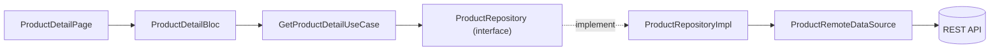

```dart
// domain/entities/product.dart
class Product extends Equatable {
  final String id;
  final String name;
  final double price;
  final List<String> imageUrls;

  const Product({required this.id, required this.name, required this.price, required this.imageUrls});

  @override
  List<Object?> get props => [id, name, price, imageUrls];
}

// domain/repositories/product_repository.dart
abstract class ProductRepository {
  Future<Either<Failure, Product>> getProductDetail(GetProductDetailParams params);
}

// domain/usecases/get_product_detail_usecase.dart
class GetProductDetailParams extends Equatable {
  final String productId;
  const GetProductDetailParams({required this.productId});
  @override
  List<Object?> get props => [productId];
}

class GetProductDetailUseCase implements UseCase<Product, GetProductDetailParams> {
  final ProductRepository repository;
  GetProductDetailUseCase(this.repository);

  @override
  Future<Either<Failure, Product>> call(GetProductDetailParams params) =>
      repository.getProductDetail(params);
}
```

Phần Data (`ProductRepositoryImpl`, `ProductRemoteDataSource`) → xem **Part 4**. Phần Bloc → **Part 5**. Phần Page → **Part 6**.

---

### Review Checklist — Domain

```
□ Entity có method fromJson không? (nếu có → Model đội lốt Entity, sai chỗ)
□ Usecase có > 1 hành động nghiệp vụ trong 1 class không?
□ Usecase có ≥ 2 tham số nhưng chưa gom thành Params object không?
□ Feature này đang ở Tier nào — có lý do ghi lại cho việc lược layer không?
□ Entity con có giữ reference ngược về entity cha không?
```


---

<a id="part4"></a>

## Part 4 — Data Layer

### 4.1 Luồng chuyển đổi dữ liệu (1 chiều, bất biến)

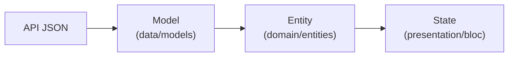

`presentation/` không bao giờ cầm `Model`, chỉ cầm `Entity`. Nếu 1 bloc import từ `data/models/` → vi phạm dependency rule, sửa ngay.

| Khái niệm | Vai trò | Đặc điểm |
|---|---|---|
| **Model (DTO)** | Ánh xạ JSON/DB row ↔ object Dart | Có `fromJson`/`toJson`, null-safety lỏng hơn, có `toEntity()` |
| **Entity** | Object nghiệp vụ thuần | Immutable, không biết gì về network/DB (xem Part 3) |

### 4.2 Repository impl — nơi quyết định chiến lược lấy dữ liệu

Repository impl quyết định cache-first/network-first/retry/merge local+remote. Đây là điểm duy nhất để đổi chiến lược cache mà không đụng usecase/bloc.

### 4.3 Pagination — chuẩn hoá 1 lần

```dart
class Paginated<T> extends Equatable {
  final List<T> items;
  final int page;
  final int totalPages;
  final bool hasMore;

  const Paginated({required this.items, required this.page, required this.totalPages, required this.hasMore});

  @override
  List<Object?> get props => [items, page, totalPages, hasMore];
}
```

Feature cần field đặc thù (cursor-based) → tạo `PaginatedXxx` riêng, giữ tên field cốt lõi (`items`, `hasMore`) nhất quán.

### 4.4 Error Handling — chuẩn 2 tầng

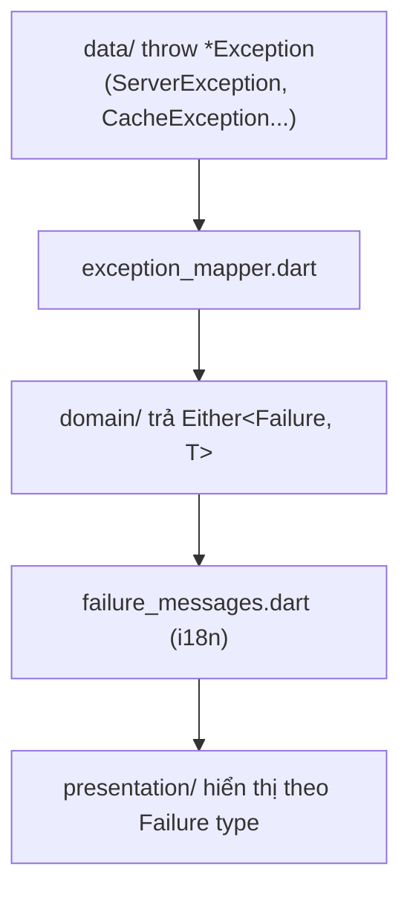

- Mọi usecase kế thừa `UseCase<T, Params>`, trả `Future<Either<Failure, T>>` — không throw thẳng ra ngoài.
- Thêm 1 Exception type mới **luôn đi kèm** nhánh mapping trong cùng PR — không rơi vào `Failure.unknown()` mặc định nếu là lỗi dự đoán trước được.
- `presentation/` không hiển thị message kỹ thuật thô cho người dùng cuối.

### 4.5 Network Layer

- 1 HTTP client duy nhất (Dio khuyến nghị), cấu hình ở `core/network/`.
- Interceptor dùng chung toàn app (auth, refresh token, logging) ở `core/network/interceptors/`. Interceptor riêng 1 API hẹp → đặt trong `data/datasources/` của feature đó.
- Refresh-token cần cơ chế queue request trong lúc refresh, tránh gọi refresh song song nhiều lần.

### 4.6 Local Persistence

- 1 giải pháp local DB duy nhất toàn dự án (Isar/Hive/Drift/sqflite).
- Local DB chỉ truy cập qua `data/datasources/*_local_data_source.dart` — không query trực tiếp từ repository hay usecase.
- File generated (`*.g.dart`) không sửa tay.

#### Coding Convention — Data layer

| Thành phần | Convention |
|---|---|
| Model | Luôn suffix `_model.dart` |
| Repository impl | `*_repository_impl.dart` |
| Datasource | `*_remote_data_source.dart` / `*_local_data_source.dart` — gạch dưới đầy đủ, không viết tắt `datasource` liền |
| copyWith/Equatable | Viết tay đủ cho dự án < 15-20 entity/state; dùng `freezed` nếu lớn hơn hoặc nhiều dev — chốt 1 cách cho toàn dự án |

---

### Ví dụ hoàn chỉnh — Feature `Product` (phần Data, nối tiếp Part 3)

```dart
// data/models/product_model.dart
class ProductModel {
  final String id;
  final String name;
  final double price;
  final List<String>? imageUrls;

  ProductModel({required this.id, required this.name, required this.price, this.imageUrls});

  factory ProductModel.fromJson(Map<String, dynamic> json) => ProductModel(
        id: json['id'] as String,
        name: json['name'] as String,
        price: (json['price'] as num).toDouble(),
        imageUrls: (json['image_urls'] as List?)?.map((e) => e as String).toList(),
      );

  Product toEntity() => Product(
        id: id,
        name: name,
        price: price,
        imageUrls: imageUrls ?? const [],
      );
}

// data/datasources/product_remote_data_source.dart
abstract class ProductRemoteDataSource {
  Future<ProductModel> getProductDetail(String productId);
}

class ProductRemoteDataSourceImpl implements ProductRemoteDataSource {
  final Dio dio;
  ProductRemoteDataSourceImpl(this.dio);

  @override
  Future<ProductModel> getProductDetail(String productId) async {
    final response = await dio.get('/products/$productId');
    return ProductModel.fromJson(response.data);
  }
}

// data/repositories/product_repository_impl.dart
class ProductRepositoryImpl implements ProductRepository {
  final ProductRemoteDataSource remote;
  ProductRepositoryImpl(this.remote);

  @override
  Future<Either<Failure, Product>> getProductDetail(GetProductDetailParams params) async {
    try {
      final model = await remote.getProductDetail(params.productId);
      return Right(model.toEntity());
    } on DioException catch (e) {
      return Left(mapExceptionToFailure(e));
    }
  }
}
```

Phần Bloc dùng `GetProductDetailUseCase(ProductRepositoryImpl(...))` → xem **Part 5**.

---

### Review Checklist — Data Layer

```
□ Model có bị presentation/ import trực tiếp không?
□ Repository impl có logic cache/retry rõ ràng, không rải rác ở usecase?
□ Exception mới có mapping tương ứng trong exception_mapper.dart chưa?
□ Datasource có gọi network/DB trực tiếp ngoài data/datasources/ không?
□ File .g.dart có bị sửa tay không?
```


---

<a id="part5"></a>

## Part 5 — Presentation: Bloc/Cubit

### 5.1 Lựa chọn nền tảng: BLoC/Cubit

Baseline mặc định dùng `flutter_bloc`: tách rõ Event → State, dễ test (`bloc_test`), ép luồng dữ liệu 1 chiều. Đây là lựa chọn có đánh đổi (boilerplate cao hơn Riverpod), chốt để nhất quán giữa các dự án dùng baseline này — không phải "luôn tốt nhất tuyệt đối".

### 5.2 Bloc hay Cubit?

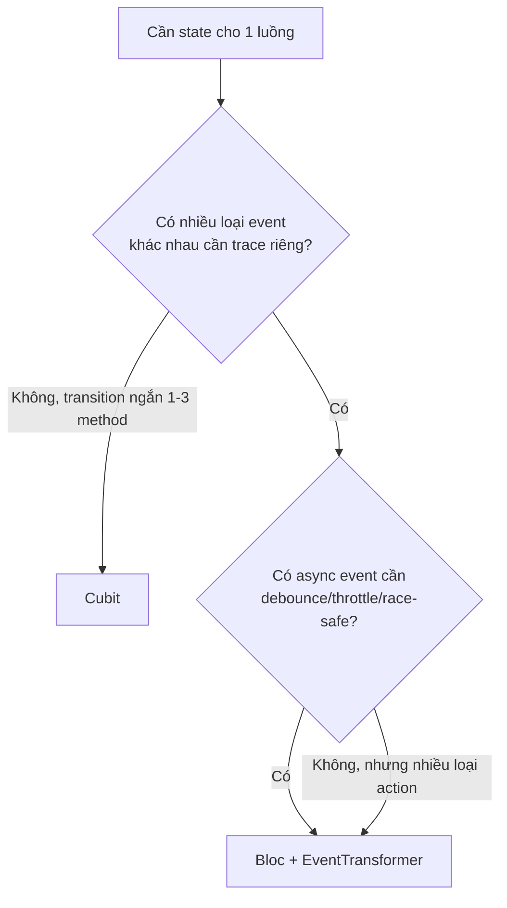

Không dùng Bloc "cho chắc" khi Cubit đủ — thừa boilerplate, giảm khả năng đọc.

#### Trade-off: các lựa chọn state management

Bảng dưới không phải hướng dẫn dùng cái nào — chỉ để hiểu tại sao baseline chọn Bloc, và khi nào lựa chọn khác hợp lý hơn cho dự án cụ thể.

| Pattern | Khi dùng | Không dùng |
|---|---|---|
| **Bloc/Cubit** (baseline chọn) | Team cần convention nhất quán giữa nhiều dự án, cần test state transition rõ ràng, ưu tiên explicit hơn tốc độ viết | Team rất nhỏ (1-2 người), ưu tiên tốc độ prototype hơn structure, ngại boilerplate |
| **Riverpod** | Cần dependency injection tích hợp sẵn trong state (không cần GetIt riêng), thích compile-safe provider, team quen functional style | Team đã quen Bloc, không muốn học lại ecosystem mới; cần ổn định API lâu dài (Riverpod từng có breaking change lớn giữa major version) |
| **Provider** | App rất nhỏ, state đơn giản, muốn học phí thấp nhất | App có nhiều async event phức tạp cần trace — dễ leak logic vào widget qua `setState`-style |
| **Redux** | Team đã có kinh nghiệm Redux từ web (React), cần single global store nghiêm ngặt | Hầu hết app Flutter thuần — boilerplate cao hơn Bloc mà lợi ích tương đương |
| **MVVM (không dùng Bloc)** | Team quen pattern MVVM từ native (iOS/Android), muốn ViewModel là `ChangeNotifier` thuần | Cần trace theo Event → State rõ ràng như Bloc cung cấp sẵn |

### 5.3 Cấu trúc file chuẩn

```
presentation/bloc/
├── xxx_bloc.dart      → Bloc: chứa toàn bộ on<Event> handler
├── xxx_event.dart      → chỉ Bloc có
└── xxx_state.dart
```

Cubit chỉ 2 file (`xxx_cubit.dart`, `xxx_state.dart`).

### 5.4 Thiết kế State — 2 pattern

**Pattern A — Sealed state (nhiều class con):** dùng cho luồng tuần tự, ít bước (auth, checkout step).

**Pattern B — Single state + enum status (mặc định cho list/detail):**

```dart
enum LoadStatus { initial, loading, loaded, error }

class ProductDetailState extends Equatable {
  final LoadStatus status;
  final Product? product;
  final Failure? failure;

  const ProductDetailState({this.status = LoadStatus.initial, this.product, this.failure});

  ProductDetailState copyWith({LoadStatus? status, Product? product, Failure? failure}) =>
      ProductDetailState(status: status ?? this.status, product: product ?? this.product, failure: failure);

  @override
  List<Object?> get props => [status, product, failure];
}
```

Pattern B giữ nguyên dữ liệu cũ khi loading lại (pull-to-refresh không flash về empty) — **mặc định cho mọi trang list/detail có refresh/pagination**.

### 5.5 Async safety

- Không `emit()` sau `await` dài mà không kiểm tra bloc đã đóng.
- Event bắn liên tục nhanh → dùng `EventTransformer` qua package `bloc_concurrency`:
  - `restartable()` — huỷ request cũ (search-as-you-type)
  - `droppable()` — chống double-submit
  - `sequential()` (mặc định) — thứ tự quan trọng (thao tác giỏ hàng)

### 5.6 Side-effect một lần (navigation, snackbar)

Không dùng field boolean sống mãi trong State để trigger — dễ bị trigger lại khi widget rebuild. Dùng `BlocListener` với `listenWhen` so sánh state trước/sau, hoặc side-channel Stream riêng ngoài `state` chính.

### 5.7 Global state vs Feature state

- Global (`shared/bloc/`): sống suốt vòng đời app, không gắn phiên đăng nhập (theme, locale). Nếu biến mất khi logout → không phải global.
- Cross-feature communication: qua repository/stream ở `core/`, không bloc-to-bloc gọi trực tiếp constructor của nhau.

### 5.8 Giới hạn compose usecase trong 1 Bloc

1 Bloc được gọi nhiều usecase nếu cùng 1 luồng nghiệp vụ mạch lạc. Khi số usecase không liên quan trực tiếp đến nhau bắt đầu nhiều (tham khảo: khoảng 6-8) và bloc khó nắm được toàn bộ trách nhiệm cùng lúc → tách thêm bloc/cubit con.

#### Coding Convention — Presentation layer

| Thành phần | Convention |
|---|---|
| Bloc/Cubit | `*_bloc.dart` / `*_cubit.dart`, tiền tố theo feature, không đặt tên chung chung |
| Event | Đặt theo hành động (`ProductDetailRequested`), không theo state đích (`...SetLoaded`) |
| Bloc | Không giữ `BuildContext`, không import `flutter/material.dart` trừ khi thật cần |

---

### Ví dụ hoàn chỉnh — Feature `Product` (phần Bloc, nối Part 3-4)

```dart
// presentation/bloc/product_detail_event.dart
sealed class ProductDetailEvent {}
class ProductDetailRequested extends ProductDetailEvent {
  final String productId;
  ProductDetailRequested(this.productId);
}

// presentation/bloc/product_detail_bloc.dart
class ProductDetailBloc extends Bloc<ProductDetailEvent, ProductDetailState> {
  final GetProductDetailUseCase getProductDetail;

  ProductDetailBloc(this.getProductDetail) : super(const ProductDetailState()) {
    on<ProductDetailRequested>(_onRequested, transformer: restartable());
  }

  Future<void> _onRequested(ProductDetailRequested event, Emitter<ProductDetailState> emit) async {
    emit(state.copyWith(status: LoadStatus.loading));
    final result = await getProductDetail(GetProductDetailParams(productId: event.productId));
    result.fold(
      (failure) => emit(state.copyWith(status: LoadStatus.error, failure: failure)),
      (product) => emit(state.copyWith(status: LoadStatus.loaded, product: product)),
    );
  }
}
```

Phần Page dùng bloc này → xem **Part 6**.

---

### Review Checklist — Presentation

```
□ Bloc có gọi thẳng datasource/repository impl thay vì usecase không?
□ State đơn giản (toggle, theme) có đang dùng Bloc thay vì Cubit không?
□ Có field boolean trong State dùng để trigger navigation/snackbar 1 lần không?
□ Event có bắn liên tục nhanh nhưng chưa có EventTransformer không?
□ Bloc có giữ BuildContext hoặc reference tới Widget không?
```


---

<a id="part6"></a>

## Part 6 — UI Guideline

### 6.1 Widget này đặt đâu? — Decision Tree

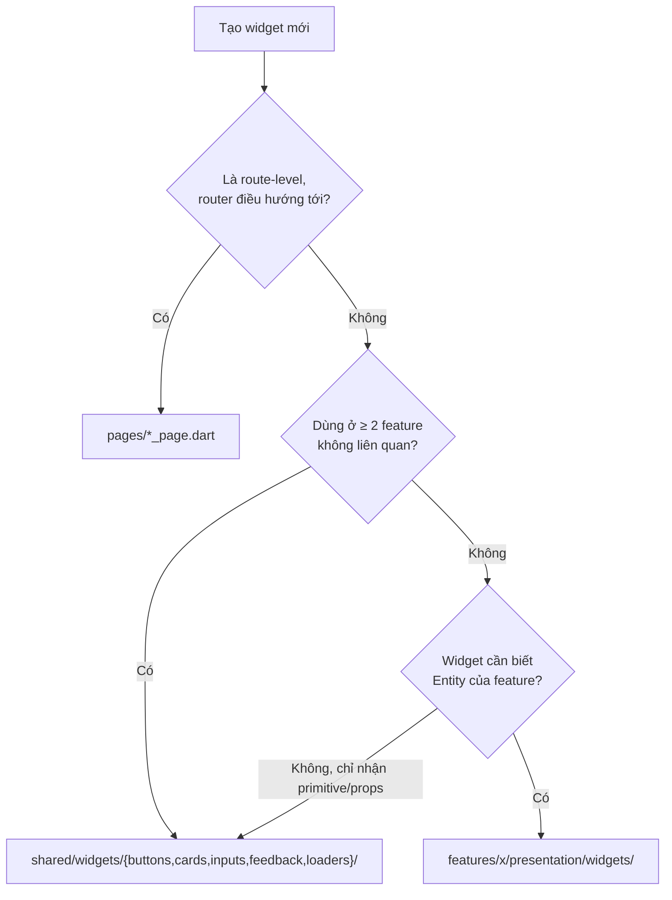

Rule: nếu 1 widget đang ở `shared/` nhưng chỉ 1 feature dùng → chuyển xuống feature đó. `shared/widgets/` chia theo nhóm chức năng, không theo tên feature.

### 6.2 Page là "wiring layer"

Page chỉ làm 3 việc: lấy bloc qua DI, bố cục widget con qua `BlocBuilder`/`BlocConsumer`, xử lý side-effect qua `BlocListener`. Logic hiển thị phức tạp tách ra widget con/helper riêng — không viết trong `build()`. Page dài dần và khó nắm hết trách nhiệm trong 1 lần đọc (tham khảo: khoảng 150-200 dòng trở lên) là dấu hiệu đang gánh quá nhiều trách nhiệm — không phải mốc cứng để đếm dòng máy móc.

### 6.3 Widget không tự fetch data

Widget không tự gọi usecase, không tự đăng ký GetIt. Dữ liệu chảy từ bloc → xuống qua constructor. Ngoại lệ: widget tự quản lý cubit riêng cho sub-flow biệt lập (vd `AddToCartCubit` trong `AddToCartBottomSheet`), nhưng cubit đó vẫn lấy usecase qua DI chuẩn.

### 6.4 Tách UI-state khỏi Entity

Field UI-only (`isSelected`, `isExpanded`) sống trong `StatefulWidget`/Cubit cục bộ, không nhét vào Entity truyền vào. Truyền `bool isSelected` riêng, không sửa entity gốc.

### 6.5 4 trạng thái bắt buộc cho page có gọi dữ liệu

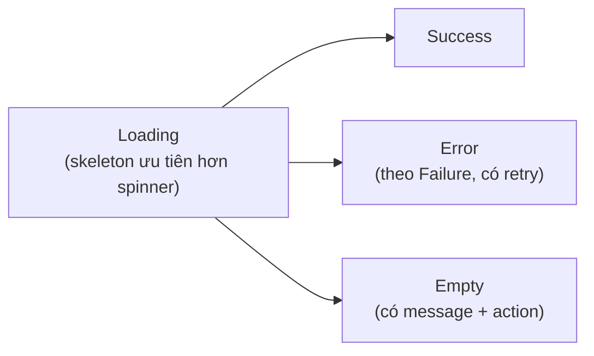

Đây là "Definition of Done" của 1 page, không phải nice-to-have.

### 6.6 Design Token — không hard-code

Mọi màu/spacing/radius/text style lấy từ `shared/theme/`. Responsive đa kích thước → token có biến thể theo breakpoint (`tokens/mobile_tokens.dart`, `tablet_tokens.dart`), không viết `if (width > 600)` rải rác.

### 6.7 Reusable widget — API design

- Không tham số bắt buộc phụ thuộc business logic 1 feature cụ thể (không nhận thẳng `Product` entity — nhận `title`, `imageUrl`, `price` dạng primitive, hoặc callback/builder).
- Ưu tiên expose callback (`onTap`) thay vì widget tự chứa side-effect.
- Số tham số nhiều dần khiến chỗ gọi khó đọc (tham khảo: khoảng 8-10 trở lên) → tách nhỏ hoặc dùng object cấu hình (`XxxConfig`).

### 6.8 Performance & Form & Accessibility — rule tối thiểu

- `const` constructor cho widget tĩnh, `ListView.builder` cho list > 20 item, `Key` cho item reorder được (chi tiết → Part 8).
- Validate logic ở `shared/utils/form_validators.dart` (pure function), form > 3 field dùng Bloc/Cubit riêng.
- Text qua l10n, icon-only button có `Semantics`/tooltip.

Tách subfolder `widgets/` khi số file riêng cho 1 page bắt đầu khó điều hướng (tham khảo: khoảng ≥ 6 file).

---

### Ví dụ hoàn chỉnh — Feature `Product` (phần Page, nối Part 3-5)

```dart
// presentation/pages/product_detail_page.dart
class ProductDetailPage extends StatelessWidget {
  final String productId;
  const ProductDetailPage({super.key, required this.productId});

  @override
  Widget build(BuildContext context) {
    return BlocProvider(
      create: (_) => getIt<ProductDetailBloc>()..add(ProductDetailRequested(productId)),
      child: Scaffold(
        body: BlocBuilder<ProductDetailBloc, ProductDetailState>(
          builder: (context, state) => switch (state.status) {
            LoadStatus.initial || LoadStatus.loading => const ProductDetailSkeleton(),
            LoadStatus.error => ErrorStateView(failure: state.failure!, onRetry: () =>
                context.read<ProductDetailBloc>().add(ProductDetailRequested(productId))),
            LoadStatus.loaded => ProductDetailContent(product: state.product!),
          },
        ),
      ),
    );
  }
}
```

Page chỉ wiring — mọi logic tính toán hiển thị (giá sau giảm, format ảnh) nằm trong `ProductDetailContent` hoặc `presentation/utils/`, không viết trong `build()` ở trên.

---

### Review Checklist — UI

```
□ Page có tự fetch data hoặc chứa logic tính toán trong build() không?
□ Page đã xử lý đủ 4 trạng thái loading/empty/error/success chưa?
□ Widget có hard-code màu/spacing thay vì dùng design token không?
□ Shared widget có nhận thẳng Entity của 1 feature làm tham số không?
□ Page có dài tới mức khó nắm hết trách nhiệm trong 1 lần đọc, chưa được tách widget con không?
```


---

<a id="part7"></a>

## Part 7 — Testing

### 7.1 Testing pyramid theo layer

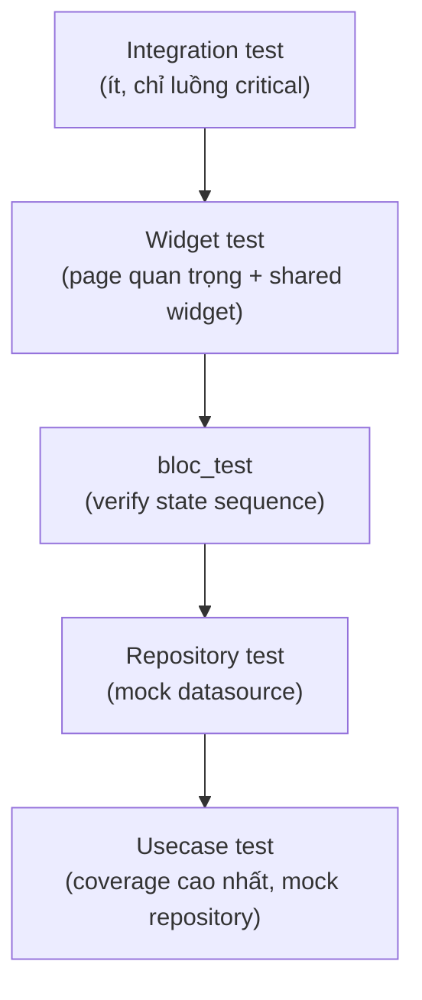

Đáy pyramid (usecase) nhiều test nhất, dễ viết nhất, chạy nhanh nhất. Đỉnh (integration) ít nhất, tốn nhất.

### 7.2 Test theo từng layer

| Layer | Loại test | Mock |
|---|---|---|
| `domain/usecases/` | Unit test, coverage ≥ 80-90% | Mock repository interface |
| `data/repositories/` | Unit test | Mock datasource, verify mapping Exception → Failure |
| `presentation/bloc/` | `bloc_test`, verify state sequence | Mock usecase |
| Page quan trọng (checkout, payment) | Widget test | Mock bloc |
| `shared/widgets/` | Widget test theo props (empty/error/variant) | Không cần mock |
| Luồng end-to-end quan trọng | Integration test | — |

### 7.3 Ví dụ `bloc_test` (nối feature `Product` từ Part 3-6)

```dart
blocTest<ProductDetailBloc, ProductDetailState>(
  'emits [loading, loaded] when GetProductDetailUseCase succeeds',
  build: () {
    when(() => mockGetProductDetail(any()))
        .thenAnswer((_) async => Right(tProduct));
    return ProductDetailBloc(mockGetProductDetail);
  },
  act: (bloc) => bloc.add(ProductDetailRequested('p1')),
  expect: () => [
    const ProductDetailState(status: LoadStatus.loading),
    ProductDetailState(status: LoadStatus.loaded, product: tProduct),
  ],
);
```

### 7.4 Rule cứng

Domain layer không có test = domain layer chưa thực sự phục vụ mục đích cô lập business logic, chỉ là cấu trúc thư mục cho đủ hình thức. Coverage domain thấp là tín hiệu chặn merge, không phải "làm sau".

---

### Review Checklist — Testing

```
□ Usecase mới có test không?
□ Repository impl có test verify Exception → Failure mapping không?
□ Bloc mới có bloc_test cho ít nhất happy-path + error-path không?
□ Page critical (payment, checkout) có widget test không?
```


---

<a id="part8"></a>

## Part 8 — Performance

### 8.1 Rebuild scope — chỉ rebuild phần thực sự đổi

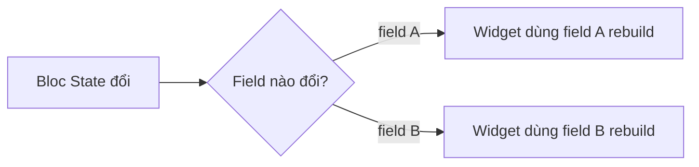

- Dùng `BlocSelector<Bloc, State, T>` hoặc `context.select<Cubit, T>((s) => s.field)` để widget chỉ rebuild khi đúng field nó dùng thay đổi — không dùng `BlocBuilder` bao trọn cả page nếu chỉ 1 phần nhỏ cần cập nhật.
- `const` constructor bắt buộc cho mọi widget tĩnh không phụ thuộc state — bật lint `prefer_const_constructors`.

### 8.2 List & rebuild

- List > 20 item luôn `ListView.builder`/`GridView.builder`, không `ListView(children: [...])` build sẵn toàn bộ.
- `Key` (thường `ValueKey`) cho item trong list reorder/insert/remove động — tránh Flutter build nhầm widget khi danh sách đổi thứ tự.
- Pagination/lazy loading: infinite scroll dùng `ScrollController` lắng nghe gần cuối danh sách để trigger load thêm — không tự động load toàn bộ dữ liệu 1 lần nếu danh sách có thể lớn (> 100 item).

### 8.3 Memoization

Tránh gọi lại hàm nặng (format, tính toán, sort) trong `build()` mỗi lần rebuild. Cache kết quả bằng field trong State (tính 1 lần khi data đổi, không tính lại mỗi lần widget rebuild vì lý do khác), hoặc `late final` cho giá trị tính 1 lần trong đời widget.

### 8.4 Isolate cho compute nặng

Xử lý nặng (parse JSON lớn, encode/decode ảnh, tính toán phức tạp trên nhiều item) chạy trong `compute()` hoặc `Isolate.run()` riêng, không chạy trên main isolate làm giật UI. Ngưỡng cân nhắc: bất kỳ thao tác đồng bộ nào ước tính > 16ms (1 frame ở 60fps).

### 8.5 Image cache & loading

- Ảnh network luôn qua `cached_network_image` (hoặc tương đương) kèm placeholder — không `Image.network` trực tiếp không cache trong list dài.
- Resize ảnh phía server/CDN theo kích thước hiển thị thực tế, không tải ảnh full-size rồi resize ở client.

### 8.6 Cold start

- DI: nếu `initXxxDependencies` gọi tuần tự quá nhiều làm cold-start chậm, lazy-init theo actor/theo route thay vì init toàn bộ ở `bootstrap.dart`.
- Tránh gọi network ở `main()`/`bootstrap.dart` trước khi UI đầu tiên render — hiển thị splash/skeleton trước, fetch sau khi frame đầu đã vẽ.

---

### Review Checklist — Performance

```
□ Widget list có dùng ListView.builder cho list dài không?
□ Có Key cho item trong list có thể reorder không?
□ BlocBuilder có bao trọn page thay vì dùng BlocSelector cho phần nhỏ không?
□ Có compute nặng chạy trên main isolate không?
□ Ảnh network có qua cache + placeholder không?
□ const constructor có dùng đủ cho widget tĩnh không?
```


---

<a id="part9"></a>

## Part 9 — Security

> Chương bắt buộc trước khi release production, thường bị bỏ qua ở giai đoạn MVP — nhưng chi phí thêm vào sau khi đã ship cao hơn nhiều so với làm đúng từ đầu.

### 9.1 Token & Secret storage

- Access token/refresh token **không bao giờ** lưu ở `SharedPreferences` (plaintext) — dùng `flutter_secure_storage` (Keychain trên iOS, Keystore trên Android).
- API key/secret không hard-code trong source — dùng `--dart-define` hoặc file `.env` không commit, đọc qua `core/config/app_config.dart`.
- Không log token/password/PII ra console hay file log kể cả ở môi trường dev (dễ quên xoá trước khi merge) — xem thêm Part 10 (Observability) về log level.

### 9.2 Network security

- HTTPS bắt buộc, không cho phép fallback HTTP ở production build.
- Certificate Pinning cho API nhạy cảm (thanh toán, tài khoản) — dùng `dio`'s `HttpClientAdapter` custom hoặc package hỗ trợ pinning, tránh MITM qua proxy giả mạo.
- Không tắt SSL verification "tạm thời để debug" rồi quên bật lại — kiểm tra bằng lint/CI trước khi build release.

### 9.3 Root / Jailbreak Detection

Với app xử lý thanh toán hoặc dữ liệu nhạy cảm, cân nhắc detect thiết bị root/jailbreak (package như `flutter_jailbreak_detection` hoặc tương đương) và giới hạn tính năng nhạy cảm (không chặn hoàn toàn app trừ khi có lý do compliance cụ thể — chặn cứng gây trải nghiệm xấu cho nhiều người dùng hợp lệ có thiết bị đã root vì lý do khác).

### 9.4 Obfuscation & Anti-tampering

- Build release luôn kèm `--obfuscate --split-debug-info=<path>` để làm khó reverse-engineer, lưu debug symbol riêng để đọc crash log sau này.
- Tamper detection (kiểm tra checksum app, phát hiện code injection/hooking framework như Frida) — chỉ cần thiết cho app tài chính/thanh toán có yêu cầu compliance cụ thể, không phải baseline bắt buộc cho mọi app.

### 9.5 Local data

- Dữ liệu nhạy cảm trong local DB (Isar/Hive) cần encryption-at-rest nếu chứa PII/thông tin tài chính — hầu hết giải pháp local DB hỗ trợ sẵn (Isar encryption, Hive với `HiveAesCipher`).
- Cache ảnh/file tạm chứa thông tin nhạy cảm (ảnh CCCD, hoá đơn) cần xoá sau khi dùng xong, không để tồn tại vô thời hạn trong cache thư mục app.

### 9.6 Input validation phía client không thay thế validation phía server

Validate ở client (Part 6.8 Form) chỉ để trải nghiệm người dùng tốt hơn — server luôn phải validate lại độc lập, không tin dữ liệu client gửi lên dù đã validate ở app.

---

### Review Checklist — Security

```
□ Token có lưu ở SharedPreferences (plaintext) thay vì secure storage không?
□ Có log token/password/PII ra console không?
□ Build release có --obfuscate --split-debug-info không?
□ API nhạy cảm (payment) có certificate pinning không?
□ Local DB chứa PII có encryption-at-rest không?
```


---

<a id="part10"></a>

## Part 10 — Observability

> Sản phẩm production cần biết app đang chạy thế nào trong tay người dùng thật, không chỉ trong lúc dev local.

### 10.1 Crash Reporting

- Bắt buộc có 1 công cụ crash reporting (Firebase Crashlytics hoặc Sentry) từ bản release đầu tiên, không đợi có bug report từ user mới thêm.
- `FlutterError.onError` và `PlatformDispatcher.instance.onError` đều phải forward về crash reporting tool trong `bootstrap.dart` — nhiều app chỉ bắt lỗi Flutter mà bỏ sót lỗi native/platform.
- Gắn `userId`/`sessionId` (không gắn PII như email/phone trực tiếp) vào crash report để trace theo user khi cần debug, nhưng tuân theo Part 9 (không log PII).

### 10.2 Structured Logging

`core/logger/app_logger.dart` phân cấp rõ level, không dùng `print()` rải rác trong code:

| Level | Dùng khi |
|---|---|
| `debug` | Chi tiết dev-only, tắt hoàn toàn ở release build |
| `info` | Sự kiện nghiệp vụ bình thường (login thành công, đặt hàng thành công) |
| `warning` | Bất thường nhưng không crash (API trả chậm, fallback được kích hoạt) |
| `error` | Lỗi cần biết nhưng app vẫn chạy tiếp (request thất bại, đã retry) |

Log không chứa token/password/PII (xem Part 9.1).

### 10.3 Analytics

- Định nghĩa 1 bộ event tracking chuẩn (naming convention `snake_case`, verb-object: `product_viewed`, `checkout_completed`) thay vì mỗi feature tự đặt tên khác nhau.
- Tracking đặt ở `core/analytics/analytics_service.dart`, gọi từ usecase hoặc bloc listener — không rải `analytics.log(...)` trực tiếp trong widget `build()`.

### 10.4 Performance Monitoring

- Firebase Performance Monitoring hoặc Sentry Performance để trace thời gian: cold start, network request, custom trace cho luồng nghiệp vụ quan trọng (checkout, upload ảnh).
- Custom trace nên bọc quanh usecase hoặc datasource call, không bọc quanh toàn bộ page (quá thô, không biết chính xác chỗ chậm).

### 10.5 Feature Flag

- Dùng remote config (Firebase Remote Config hoặc tương đương) cho: bật/tắt tính năng chưa ổn định ở production, A/B test, kill-switch khẩn cấp khi phát hiện bug nghiêm trọng sau release mà không cần chờ release bản vá.
- Feature flag đọc qua 1 lớp trung gian (`core/services/feature_flag_service.dart`), không gọi trực tiếp SDK remote config rải rác trong nhiều feature — để dễ đổi provider sau này.

---

### Review Checklist — Observability

```
□ Có print() thay vì dùng app_logger không?
□ Crash reporting có bắt cả lỗi native (PlatformDispatcher) không chỉ lỗi Flutter không?
□ Event analytics mới có theo đúng naming convention chung không?
□ Custom performance trace có bọc đúng chỗ (usecase/datasource) không bọc cả page không?
```


---

<a id="part11"></a>

## Part 11 — Scaling

### 11.1 Single-package → Multi-package

Khi build time/thời gian mở IDE bắt đầu là vấn đề thật trong thực tế hàng ngày của team (thường rơi vào khoảng vài chục feature hoặc dăm bảy dev làm song song trở lên — không phải mốc đếm chính xác), cân nhắc tách `core/`, `shared/`, và nhóm feature lớn thành Dart/Flutter package riêng, dùng `melos` quản lý monorepo. Boundary actor (Part 1.7) là ranh giới tự nhiên để tách package — nếu đã tuân thủ "không import chéo giữa actor" từ đầu, việc tách gần như không cần refactor logic.

### 11.2 1 app → nhiều app cùng codebase

Nếu 2 actor cần build thành 2 app riêng (khác tên, icon, store listing): dùng Flutter flavors (`env/` + `--flavor`), mỗi flavor chỉ import module actor tương ứng + `core/` + `shared/`. Đây là cấu hình build, không phải refactor kiến trúc, nếu actor boundary đã tách rõ từ đầu.

### 11.3 Khi DI/routing tập trung bắt đầu chậm

- DI: cân nhắc lazy-init theo actor/theo route thay vì init toàn bộ ở `bootstrap.dart`.
- Routing: tách route definition theo feature (`feature_x_routes.dart`), file trung tâm chỉ gộp list lại.

### 11.4 Khi nào KHÔNG cần toàn bộ baseline này

Dự án nhỏ thật sự (MVP, prototype, < 10 màn hình, tuổi thọ dự kiến < 3 tháng, 1 dev) — Clean Architecture đầy đủ là overhead không cần thiết. Dùng cấu trúc rút gọn: Tier 1-2 (Part 3.4) cho toàn bộ feature, bỏ DI-per-feature (Part 2), nhưng **giữ 2 rule rẻ và luôn đáng làm ngay cả ở dự án nhỏ**:

- Dependency rule (Part 1.4)
- Error 2 tầng (Part 4.4)

Lý do giữ 2 rule này: rẻ để áp dụng từ đầu, đắt để thêm vào sau nếu dự án đó bất ngờ sống lâu hơn dự kiến — điều rất hay xảy ra với MVP.

---

### Review Checklist — Scaling

```
□ Actor boundary có sạch (không import chéo) để sẵn sàng tách package sau này không?
□ DI có bottleneck cold-start chưa đến mức cần lazy-init không?
□ Dự án nhỏ có đang áp full baseline gây overhead không cần thiết không?
```


---

<a id="part12"></a>

## Part 12 — Architecture Decision Record (ADR) Template

> Dùng khi cần ghi lại 1 quyết định lệch khỏi baseline, hoặc 1 quyết định quan trọng riêng của dự án (chọn state management khác, chọn lược layer cho 1 feature cụ thể, chọn actor boundary...). Mỗi ADR là 1 file riêng trong `docs/adr/ADR-XXX-ten-quyet-dinh.md`.

### Template

```markdown
## ADR-XXX: <Tên quyết định ngắn gọn>

### Status
Proposed / Accepted / Deprecated / Superseded by ADR-YYY

### Context
Bối cảnh dẫn tới việc cần quyết định. Không giải thích giải pháp ở đây, chỉ mô tả tình huống/ràng buộc.

### Problem
Câu hỏi cụ thể cần trả lời. 1-2 câu, dạng có thể trả lời được.

### Options Considered
| Option | Ưu điểm | Nhược điểm |
|---|---|---|
| A | ... | ... |
| B | ... | ... |

### Decision
Chọn option nào, 1 câu.

### Trade-off
Cái gì đánh đổi khi chọn option này (không có quyết định nào miễn phí — nếu không viết được trade-off, có thể chưa suy nghĩ đủ kỹ).

### Consequences
Ảnh hưởng cụ thể tới codebase: file/thư mục nào bị tác động, rule nào cần cập nhật theo, ai cần biết quyết định này.
```

### Ví dụ điền sẵn — ADR-001

```markdown
## ADR-001: Tách features/ theo actor (user/seller) trong cùng codebase

### Status
Accepted

### Context
App phục vụ 2 nhóm người dùng khác biệt hoàn toàn về nghiệp vụ: buyer (mua hàng) và seller (quản lý shop). Cả 2 dùng chung hạ tầng (auth, network, design system) nhưng luồng nghiệp vụ không giao nhau.

### Problem
Tổ chức `features/` như thế nào để tránh 2 nhóm nghiệp vụ giẫm chân nhau khi codebase lớn dần, mà vẫn tận dụng được hạ tầng dùng chung?

### Options Considered
| Option | Ưu điểm | Nhược điểm |
|---|---|---|
| Gộp chung `features/`, không phân biệt actor | Đơn giản ban đầu | Dễ nhầm lẫn nghiệp vụ, khó tách app sau này |
| Tách 2 repo riêng từ đầu | Ranh giới rõ tuyệt đối | Trùng lặp hạ tầng, khó đồng bộ design system, overhead quản lý 2 repo cho team nhỏ |
| Tách `features/<actor>/` trong 1 codebase (chọn) | Ranh giới rõ, dùng chung hạ tầng, dễ tách package/app sau này nếu cần | Cần kỷ luật không import chéo actor |

### Decision
Tách `features/user/` và `features/seller/`, dùng chung `core/` và `shared/`.

### Trade-off
Đánh đổi lấy 1 rule cứng phải tuân thủ nghiêm: không import chéo giữa 2 actor. Nếu vi phạm, lợi ích của quyết định này mất hết.

### Consequences
- Mọi feature mới phải xác định actor trước khi tạo (xem Part 1.7, Part 2.5).
- Naming convention: prefix `seller_` cho mọi file/class thuộc `features/seller/`.
- Nếu sau này cần tách 2 app riêng, actor boundary này là điểm tách tự nhiên (xem Part 11.2).
```

---

### Review Checklist — ADR

```
□ ADR có mục Trade-off không (nếu không có trade-off, khả năng quyết định chưa được cân nhắc kỹ)?
□ Context có mô tả tình huống thay vì nhảy thẳng vào giải pháp không?
□ Consequences có chỉ rõ ai/file nào bị ảnh hưởng không?
□ Status có được cập nhật khi quyết định thay đổi (Deprecated/Superseded) không?
```


---

<a id="part13"></a>

## Part 13 — Master Checklist (Review PR)

> Gộp toàn bộ checklist từ Part 1-12. Dùng khi review PR — không giải thích lại lý do, chỉ tick nhanh. Lý do chi tiết → xem lại Part tương ứng.

### Architecture (Part 1)

```
□ presentation/ không import gì từ data/
□ domain/ không import Flutter SDK / UI package
□ core/ không chứa thứ chỉ 1 feature dùng
□ Không import chéo giữa 2 actor
```

### Folder Structure (Part 2)

```
□ Feature mới đủ 3 lớp (trừ khi có lý do lược layer ghi lại được)
□ injection_container.dart tách riêng cho feature, không đăng ký trực tiếp vào core/di
□ models/ (số nhiều), _data_source.dart (gạch dưới đầy đủ) — nhất quán toàn dự án
```

### Domain (Part 3)

```
□ Entity không có fromJson
□ Usecase chỉ 1 hành động nghiệp vụ; ≥ 2 tham số đã gom Params object
□ Tier của feature có lý do ghi lại nếu không phải Tier 3
□ Entity con không giữ reference ngược entity cha
```

### Data Layer (Part 4)

```
□ Model không bị presentation/ import trực tiếp
□ Exception mới có mapping trong exception_mapper.dart
□ Local DB chỉ truy cập qua *_local_data_source.dart
□ File .g.dart không bị sửa tay
```

### Presentation (Part 5)

```
□ Bloc không gọi thẳng datasource/repository impl
□ State đơn giản dùng Cubit, không dùng Bloc "cho chắc"
□ Không dùng field boolean trong State để trigger side-effect 1 lần
□ Event bắn liên tục nhanh đã có EventTransformer phù hợp
□ Bloc không giữ BuildContext
```

### UI (Part 6)

```
□ Page không tự fetch data / không chứa logic trong build()
□ Đủ 4 trạng thái: loading / empty / error / success
□ Không hard-code màu/spacing — dùng design token
□ Shared widget không nhận thẳng Entity của 1 feature cụ thể
□ Page không vượt ~200 dòng chưa được tách widget con
```

### Testing (Part 7)

```
□ Usecase mới có test
□ Repository impl có test verify Exception → Failure
□ Bloc mới có bloc_test cho happy-path + error-path
```

### Performance (Part 8)

```
□ List dài dùng ListView.builder + Key hợp lý
□ BlocSelector/context.select dùng đúng chỗ, không BlocBuilder bao trọn page
□ Compute nặng không chạy trên main isolate
□ Ảnh network có cache + placeholder
```

### Security (Part 9)

```
□ Token không lưu SharedPreferences plaintext
□ Không log token/password/PII
□ Build release có --obfuscate --split-debug-info
```

### Observability (Part 10)

```
□ Không dùng print() thay vì app_logger
□ Event analytics theo đúng naming convention chung
```

### Scaling (Part 11)

```
□ Actor boundary sạch, sẵn sàng tách package nếu cần sau này
```

### ADR (Part 12)

```
□ Quyết định lệch baseline có ADR ghi lại kèm Trade-off
```

### Automation (Part 14)

```
□ Lint cấm print(), bật prefer_const_constructors ở mức error
□ Pre-commit hook chặn vi phạm format/lint trước khi commit
□ CI có coverage gate cho domain/usecases/
```

---

### Cách dùng gợi ý

- **Reviewer**: paste checklist tương ứng vào comment PR, tick trực tiếp — không cần đọc lại toàn bộ 12 Part mỗi lần review.
- **Author**: tự chạy qua checklist trước khi mở PR, giảm số vòng review qua lại.
- **Team lead**: định kỳ (hàng quý) rà lại xem checklist có mục nào liên tục bị vi phạm — đó là tín hiệu cần lint rule tự động thay vì trông chờ con người nhớ.


---

<a id="part14"></a>

## Part 14 — Automation & Tooling

> Baseline chỉ có giá trị nếu được enforce tự động — trông chờ con người nhớ hết mọi rule khi review PR là không bền vững. Đây là bước tiếp theo sau khi đã có baseline: biến rule thành công cụ.

### 14.1 Rule → Công cụ enforce

| Rule | Công cụ | Ghi chú |
|---|---|---|
| `presentation/` không import `data/` | Custom lint (`custom_lint` + rule tự viết) hoặc `import_lint` package | Nếu chưa có công cụ, đưa vào checklist review bắt buộc — không bỏ qua chỉ vì chưa tự động hoá được |
| `const` constructor cho widget tĩnh | `prefer_const_constructors`, `prefer_const_literals_to_create_immutables` (lint mặc định trong `flutter_lints`) | Bật ở mức `error`, không chỉ `warning`, để CI fail khi vi phạm |
| Cấm `print()` | Lint rule `avoid_print` | Bắt buộc dùng `app_logger` (Part 10) thay thế |
| Page/file quá dài | `file_length` (custom lint) hoặc review bằng mắt | Đây là heuristic (Part 1.1), không nên chặn cứng bằng CI — cảnh báo, không fail build |
| Format code nhất quán | `dart format` trong pre-commit hook | Chạy tự động, không tranh cãi trong review |
| Tạo boilerplate feature mới đúng cấu trúc (Part 2) | `mason` (brick template) | Tạo brick `feature_brick` sinh sẵn `data/domain/presentation` + `injection_container.dart` theo đúng template Part 2.3 |
| Quản lý monorepo nhiều package (Part 11) | `melos` | Chạy test/analyze/format đồng loạt across package khi đã tách multi-package |
| Chạy lint/test/format trước khi commit | `lefthook` (hoặc `husky`-style git hook) | Chặn commit vi phạm ngay tại máy dev, không đợi tới CI mới phát hiện |
| Review PR tự động theo rule custom | `danger` (Dangerfile) | Vd: cảnh báo PR không có test cho `usecases/` mới, cảnh báo PR thêm Exception nhưng thiếu mapping ở `exception_mapper.dart` |
| Khởi tạo project mới đúng chuẩn Flutter + lint sẵn | `very_good_cli` (`very_good create`) | Có sẵn `very_good_analysis` (lint set nghiêm hơn `flutter_lints` mặc định) |

### 14.2 CI pipeline tối thiểu

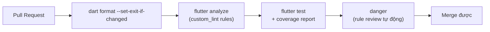

Mọi bước fail → PR không merge được. Không có bước nào optional nếu đã setup — "chạy khi rảnh" tương đương "không chạy".

### 14.3 Coverage gate

Set ngưỡng coverage tối thiểu cho `domain/usecases/` trong CI (vd `lcov` + `genhtml`, fail nếu coverage domain giảm so với baseline trước đó) — biến rule "domain phải có test" (Part 7.4) từ lời nhắc thành điều kiện merge cứng.

### 14.4 Khi nào KHÔNG cần full bộ automation này

Dự án 1-2 dev, giai đoạn MVP (xem Part 11.4) — setup `lefthook` + `dart format` + lint mặc định là đủ. `mason`/`melos`/`danger` chỉ đáng setup khi team đủ lớn để lợi ích tự động hoá vượt chi phí duy trì pipeline.

---

### Review Checklist — Automation

```
□ Lint có cấm print() chưa?
□ prefer_const_constructors có bật ở mức error chưa?
□ Pre-commit hook (lefthook) có chặn commit vi phạm format/lint chưa?
□ CI có coverage gate cho domain/usecases/ chưa?
□ Tạo feature mới có dùng template/brick thay vì copy-paste tay dễ sai không?
```


---

<a id="part15"></a>

## Part 15 — Common Mistakes (Không làm)

> Đọc nhanh trong 2 phút. Mỗi mục là 1 vi phạm hay gặp trong thực tế, kèm link tới Part giải thích chi tiết lý do.

### 15.1 Vi phạm dependency & layer

```
✗ Repository gọi Repository khác trực tiếp
  → Nếu 2 repository cần phối hợp, logic đó thuộc usecase (compose ở domain), không phải repository gọi chéo repository (Part 3.3)

✗ Bloc gọi Bloc khác trực tiếp qua constructor
  → Giao tiếp cross-feature qua repository/stream ở core/, không bloc-to-bloc (Part 5.7)

✗ Entity có fromJson/toJson
  → Đó là Model đội lốt Entity, sai chỗ (Part 3.1, Part 4.1)

✗ Widget tự gọi API / tự đăng ký GetIt
  → Dữ liệu luôn chảy từ bloc xuống qua constructor (Part 6.3)

✗ Shared widget nhận thẳng Entity của 1 feature cụ thể
  → Làm nó thực chất không còn "shared", chỉ là feature widget đặt sai chỗ (Part 6.7)

✗ Bloc giữ BuildContext hoặc reference tới Widget
  → Bloc là pure Dart class, navigation/dialog xử lý ở page qua BlocListener (Part 5.7)
```

### 15.2 Vi phạm state & side-effect

```
✗ Dùng field boolean trong State để trigger navigation/snackbar 1 lần
  → Dễ bị trigger lại khi widget rebuild (xoay màn hình, hot reload) — dùng BlocListener + listenWhen (Part 5.6)

✗ emit() sau await dài mà không kiểm tra bloc đã đóng
  → Crash "emit after close" — kiểm tra isClosed hoặc dùng EventTransformer đúng cách (Part 5.5)

✗ Dùng Bloc cho state cực đơn giản (toggle, theme)
  → Thừa boilerplate không cần thiết, Cubit là đủ (Part 5.2)
```

### 15.3 Global Singleton lạm dụng

```
✗ Biến global mutable (không qua DI) để chia sẻ state giữa các phần code
  → Không test được, không rõ ai đang sửa state đó lúc nào — mọi shared state phải đi qua GetIt hoặc global bloc có kiểm soát (Part 1.4, Part 5.7)

✗ Singleton service tự new instance thay vì đăng ký qua injection_container
  → Mất khả năng mock trong test, mất khả năng thay đổi implementation sau này (Part 2.6)
```

### 15.4 Vi phạm error handling & data

```
✗ Exception rơi tự do lên presentation/ (catch (e) chung chung hiển thị message kỹ thuật thô)
  → Luôn qua Failure + failure_messages thân thiện (Part 4.4)

✗ Thêm Exception type mới nhưng quên mapping trong exception_mapper.dart
  → Rơi vào Failure.unknown() dù lỗi hoàn toàn dự đoán trước được (Part 4.4)

✗ Local DB bị query trực tiếp từ repository hoặc usecase
  → Chỉ được truy cập qua *_local_data_source.dart (Part 4.6)
```

### 15.5 Vi phạm UI

```
✗ Page chỉ code happy-path, bỏ qua loading/empty/error
  → Đây là Definition of Done, không phải nice-to-have (Part 6.5)

✗ Hard-code màu/spacing/text trực tiếp trong widget
  → Luôn qua design token + l10n (Part 6.6)

✗ List dài dùng ListView(children: [...]) build sẵn toàn bộ thay vì .builder
  → Tốn bộ nhớ, chậm khi list lớn (Part 8.2)
```

---

### Cách dùng phần này

Đây không phải checklist để tick — là danh sách "nhận diện nhanh" khi đọc code review, giúp phát hiện vi phạm mà không cần nhớ hết chi tiết lý do ở từng Part. Thấy pattern nào ở đây trong PR → dừng lại, đọc Part tương ứng trước khi approve.


---

