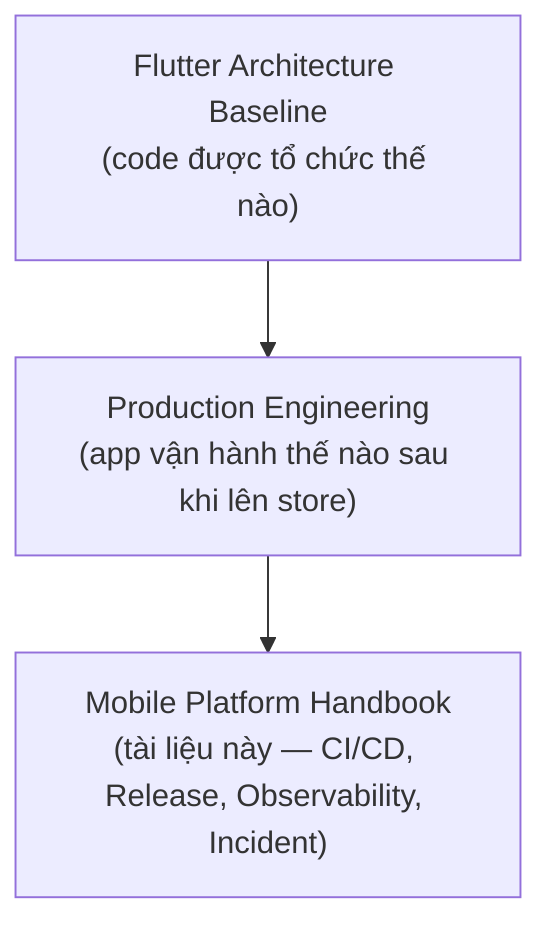
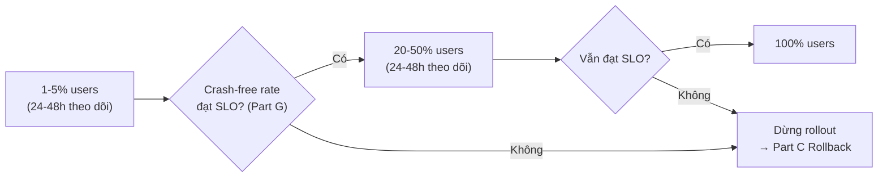
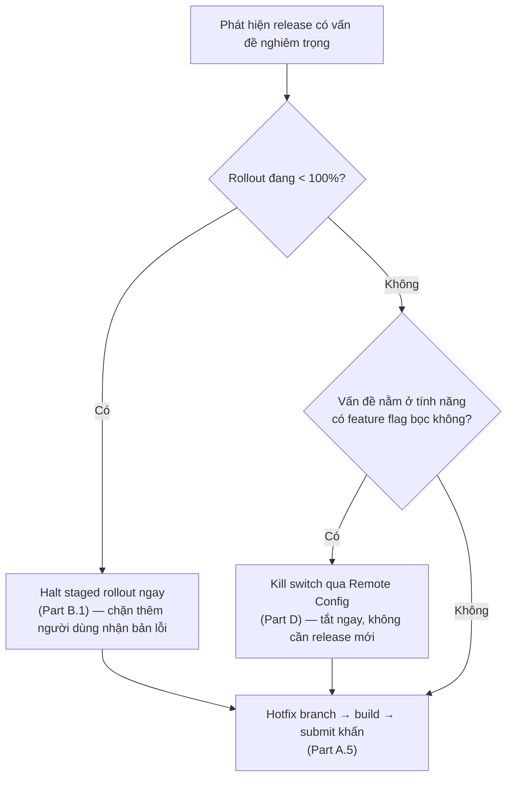
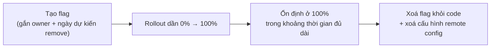
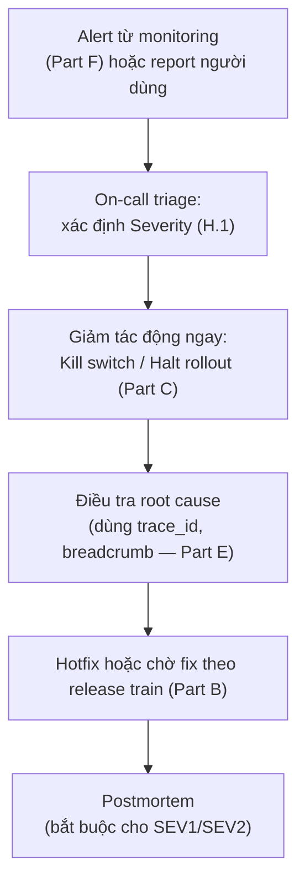

# Mobile Platform Handbook — Production Engineering

**Version:** v1.0
**Status:** Living document
**Quan hệ với tài liệu khác:**



Architecture Baseline trả lời *"code tổ chức thế nào để dễ sửa"*. Handbook này trả lời câu hỏi khác: **"app đang chạy trong tay hàng nghìn người dùng thật, làm sao biết nó đang ổn hay không, và khi nó không ổn thì làm gì"**. Đây là lớp vận hành (Ops/SRE áp dụng cho mobile), nằm phía sau code đã chạy đúng — không thay thế Architecture Baseline, mà là điều kiện để dự án được coi là "production-ready" thay vì chỉ "code sạch".

## Mục lục

| Part | Nội dung | Đọc khi nào |
|---|---|---|
| A | [Mobile CI/CD](#part-a) | Setup pipeline build/deploy |
| B | [Release Strategy](#part-b) | Trước mỗi lần release |
| C | [Rollback](#part-c) | Khi release có vấn đề |
| D | [Feature Flags nâng cao](#part-d) | Khi flag system phức tạp dần |
| E | [Observability nâng cao](#part-e) | Khi cần debug production sâu hơn log/crash cơ bản |
| F | [Monitoring & Metrics](#part-f) | Setup dashboard theo dõi sức khoẻ app |
| G | [SLO](#part-g) | Định nghĩa "app ổn" nghĩa là gì, bằng số |
| H | [Incident Response](#part-h) | Khi có sự cố production |
| I | [Checklist tổng hợp](#part-i) | Trước mỗi release lớn |

---

<a id="part-a"></a>

## Part A — Mobile CI/CD

### A.1 Khác biệt với CI/CD backend

CI/CD mobile có 2 ràng buộc mà backend không có: **build tốn thời gian** (build native Android/iOS có thể mất 10-30 phút) và **deploy không tức thời** (App Store review có thể mất 1-3 ngày, Play Store vài giờ). Pipeline phải thiết kế quanh 2 ràng buộc này, không copy nguyên pipeline backend.

### A.2 Pipeline chuẩn

```mermaid
flowchart LR
    PR["Pull Request"] --> CI["CI: format + analyze + test"]
    CI --> Merge["Merge vào main/develop"]
    Merge --> Nightly["Build nightly<br/>(internal testing track)"]
    Nightly --> QA["QA thủ công / automation<br/>trên nightly build"]
    QA --> RC["Tag Release Candidate"]
    RC --> Beta["Build beta<br/>(TestFlight / Play Internal Testing)"]
    Beta --> Approve["Product/QA approve"]
    Approve --> Store["Submit Store<br/>(staged rollout — xem Part B)"]
```



### A.3 Công cụ khuyến nghị

| Nhu cầu | Công cụ |
|---|---|
| CI chạy test/lint | GitHub Actions / GitLab CI / Codemagic |
| Build & sign tự động | `fastlane` (match cho iOS signing, gradle signing config cho Android) |
| Phân phối build nội bộ | Firebase App Distribution, TestFlight, Play Internal Testing |
| Quản lý version code tự động | `fastlane` increment build number theo CI run number, không tăng tay |
| Symbol upload cho crash reporting | Tự động upload dSYM (iOS) / mapping.txt (Android ProGuard/R8) trong bước build — thiếu bước này crash log ở Part E vô nghĩa |

### A.4 Versioning — quy ước bắt buộc

- Semantic versioning cho version hiển thị người dùng (`1.4.2`), build number tăng đơn điệu tự động theo CI (không phụ thuộc dev tự tay sửa `pubspec.yaml`).
- Build number **không bao giờ** giảm hoặc trùng giữa 2 lần submit — cả Play Store lẫn App Store từ chối build number đã dùng.
- Tag git theo version (`v1.4.2`) tại đúng commit được release, để trace ngược lại chính xác code nào đang chạy production khi có bug report.

### A.5 Branching model tối thiểu

Trunk-based development (mọi người merge thẳng vào `main`/`develop` sau khi qua CI) phù hợp hơn long-lived feature branch cho mobile, vì merge conflict trên file generated (`.g.dart`, `pubspec.lock`) rất tốn thời gian nếu branch sống lâu. Release branch (`release/1.4.x`) chỉ tách ra tại thời điểm cắt Release Candidate, chỉ nhận cherry-pick fix khẩn, không nhận feature mới.

---

## Review Checklist — CI/CD

```
□ Build number có tự động tăng theo CI, không phụ thuộc dev sửa tay không?
□ Symbol/mapping file có tự động upload cho crash reporting mỗi lần build release không?
□ Signing key có được quản lý qua fastlane match/tương đương, không lưu rải rác máy cá nhân không?
□ Release branch có nhận feature mới ngoài cherry-pick fix khẩn không?
```

---

<a id="part-b"></a>

## Part B — Release Strategy

### B.1 Staged Rollout — mặc định cho mọi release, không phải tuỳ chọn

Không release 100% ngay lập tức. Cả Play Store (staged rollout %) và App Store (phased release qua 7 ngày) đều hỗ trợ sẵn — dùng luôn, không tự implement lại.



### B.2 Ngưỡng dừng rollout (tham khảo, điều chỉnh theo mức độ rủi ro thực tế của release)

| Chỉ số | Ngưỡng cảnh báo | Hành động |
|---|---|---|
| Crash-free rate giảm so với baseline | > 0.5-1% tuyệt đối | Dừng rollout, điều tra ngay |
| ANR rate (Android) tăng | > 0.47% (ngưỡng Google Play Console cảnh báo) | Dừng rollout |
| Tỉ lệ lỗi API tăng đột biến sau khi bản mới bắt đầu gọi | Tăng rõ rệt so với baseline trước release | Kiểm tra tương thích API version cũ/mới trước khi tiếp tục |

### B.3 Release Train — nhịp release cố định

Cân nhắc release theo lịch cố định (vd 2 tuần/lần) thay vì release ngay khi feature xong — cho phép batch nhiều thay đổi nhỏ, giảm số lần rollout/theo dõi, dễ lập kế hoạch QA. Hotfix khẩn vẫn đi ngoài train qua release branch (Part A.5).

### B.4 Coordinate với backend khi có breaking API change

App cũ vẫn còn người dùng nhiều ngày/tuần sau khi bản mới release (staged rollout + người dùng không update ngay). Backend phải hỗ trợ **song song ít nhất 2 version API** trong giai đoạn chuyển tiếp — không bao giờ deploy backend breaking change cùng lúc với app release mà không có version support chồng lấn.

---

## Review Checklist — Release Strategy

```
□ Release có bắt đầu ở % nhỏ trước khi lên 100% không?
□ Có ngưỡng dừng rollout được định nghĩa trước, không phải quyết định tuỳ hứng lúc xảy ra sự cố không?
□ Nếu có breaking API change, backend có support song song version cũ trong giai đoạn chuyển tiếp không?
```

---

<a id="part-c"></a>

## Part C — Rollback

### C.1 Mobile không rollback được như server

Khi phát hiện bản mới có bug nghiêm trọng, không thể "revert binary" đã cài trên máy người dùng như revert 1 deployment server. Có 3 chiến lược thực tế, dùng kết hợp:



### C.2 Force-update — công cụ cuối cùng, dùng thận trọng

Nếu bug nghiêm trọng tới mức không thể chờ user tự update (vd lỗi bảo mật, app crash 100% khi mở), dùng cơ chế force-update: server trả về flag `minimum_supported_version`, app kiểm tra ở màn hình splash, chặn sử dụng nếu version hiện tại thấp hơn, hiển thị màn hình bắt buộc update. Cơ chế này phải được xây **trước khi cần dùng** — không thể thêm force-update vào chính bản đang lỗi (vì user không nhận được bản đó).

### C.3 Server-side mitigation trong lúc chờ app mới rollout

Nhiều bug client có thể giảm tác động từ phía server mà không cần chờ app mới: tắt 1 endpoint gây crash, trả về response rỗng an toàn thay vì dữ liệu gây lỗi parse, tăng validate phía server để chặn input gây crash client. Đây thường là phản ứng nhanh nhất khi kill switch (C.1) không bao phủ được vấn đề.

---

## Review Checklist — Rollback

```
□ Có cơ chế force-update đã build sẵn từ trước (không phải build lúc cần)?
□ Feature mới rủi ro cao có được bọc trong feature flag để kill switch được không, thay vì hardcode?
□ Runbook rollback có ghi rõ ai có quyền halt staged rollout, làm ở đâu (Play Console/App Store Connect)?
```

---

<a id="part-d"></a>

## Part D — Feature Flags nâng cao

### D.1 Vượt ra ngoài on/off đơn giản

Baseline cơ bản (đã có ở Architecture Baseline Part 10.5) chỉ nói bật/tắt. Ở mức production nâng cao, feature flag cần thêm:

| Khả năng | Mục đích |
|---|---|
| **Percentage rollout** | Bật cho X% người dùng ngẫu nhiên, không phải all-or-nothing |
| **Targeting rule** | Bật theo điều kiện (user segment, region, app version, platform) |
| **Kill switch riêng biệt khỏi feature toggle thường** | Flag dành riêng cho tình huống khẩn cấp, có quy trình review nhẹ hơn (không cần duyệt sản phẩm, chỉ cần on-call engineer) |
| **Flag dependency** | Flag B chỉ có ý nghĩa khi flag A đang bật — tránh state không hợp lệ (áp dụng "Make illegal state impossible" từ Architecture Baseline Part 1.1) |

### D.2 Flag lifecycle — vòng đời bắt buộc có điểm kết thúc



Mọi flag tạo ra phải có **owner** và **ngày dự kiến dọn dẹp** ghi ngay lúc tạo — flag sống mãi trong code là nợ kỹ thuật (rẽ nhánh code không bao giờ được xoá, review PR sau này phải đọc thêm điều kiện flag không còn ý nghĩa).

### D.3 Rule: flag cũ tồn đọng là smell cần review định kỳ

Định kỳ (hàng quý) rà soát danh sách flag đang có: flag đã ở 100% ổn định > vài tháng mà chưa dọn dẹp code → ưu tiên dọn ngay khi có touch tới file liên quan, không cần đợi sprint riêng.

### D.4 Coding convention

Flag key đặt tên `snake_case`, mô tả rõ mục đích (`checkout_new_payment_flow`, không đặt tên mơ hồ như `test_flag_1`). Đọc flag qua `core/services/feature_flag_service.dart` (đã quy định ở Architecture Baseline Part 10.5), không gọi trực tiếp SDK remote config rải rác.

---

## Review Checklist — Feature Flags

```
□ Flag mới có owner + ngày dự kiến remove được ghi lại không?
□ Có flag nào đã 100% ổn định lâu nhưng chưa dọn code chưa?
□ Kill switch có tách biệt khỏi feature toggle thường, quy trình bật đơn giản hơn không?
□ Flag dependency (B phụ thuộc A) có được kiểm tra tránh state không hợp lệ không?
```

---

<a id="part-e"></a>

## Part E — Observability nâng cao

> Nối tiếp Architecture Baseline Part 10 (crash reporting, log level, analytics cơ bản) — phần này đi sâu hơn cho việc debug production thực chiến.

### E.1 Correlation ID xuyên suốt client → backend

Mỗi request từ app gắn 1 `request_id`/`trace_id` sinh ở client (interceptor network, xem Architecture Baseline Part 4.5), gửi qua header, backend log lại cùng ID đó. Khi debug 1 bug report cụ thể, tra theo `trace_id` để thấy được toàn bộ hành trình request từ app tới backend tới database — không phải đoán dựa vào timestamp gần đúng.

### E.2 Session Replay / Breadcrumb

Trước khi crash xảy ra, crash report cần đủ ngữ cảnh: breadcrumb (chuỗi hành động gần nhất — mở màn hình nào, bấm nút gì, gọi API nào) gắn kèm crash report tự động qua SDK (Sentry/Crashlytics đều hỗ trợ). Không log toàn bộ breadcrumb chứa PII (theo Architecture Baseline Part 9.1) — chỉ log tên màn hình/hành động, không log nội dung nhập.

### E.3 Log Sampling — không log 100% ở scale lớn

Khi app có lượng người dùng lớn, log toàn bộ event ở mức `info` cho mọi user tốn chi phí lưu trữ/băng thông không cần thiết. Sampling rule hợp lý:

| Loại | Sampling |
|---|---|
| `error` | 100% — không bao giờ sample lỗi |
| `warning` | 100% hoặc sample cao (> 50%) |
| `info` (event nghiệp vụ bình thường) | Sample theo % tuỳ traffic, đủ để phân tích xu hướng không cần log từng user |
| `debug` | Chỉ bật cho internal build, tắt hoàn toàn ở production |

### E.4 Symbolication — điều kiện để crash log đọc được

Crash log native chỉ là địa chỉ bộ nhớ nếu thiếu symbol file (dSYM/mapping.txt, xem Part A.3). Rule cứng: build release thiếu bước upload symbol = crash reporting production vô dụng, dù đã tích hợp SDK đúng. Kiểm tra bước này trong CI pipeline (Part A), không phải nhớ làm tay.

### E.5 User Feedback Loop — kênh song song với crash tự động

Không phải mọi vấn đề trở thành crash (vd UI đơ, hành vi sai nhưng không exception). Có kênh feedback trong app (in-app report bug, liên kết tới support) đi kèm tự động gắn context (`app version`, `device model`, `userId`) để giảm thời gian qua lại hỏi thông tin.

---

## Review Checklist — Observability nâng cao

```
□ Request từ app có trace_id để trace xuyên suốt sang backend không?
□ Crash report có breadcrumb đủ ngữ cảnh, không chứa PII không?
□ Build release có upload symbol/mapping file trong CI không?
□ Log info có sampling ở scale lớn, không log 100% mọi user không?
```

---

<a id="part-f"></a>

## Part F — Monitoring & Metrics

### F.1 Golden Signals cho Mobile

Không copy nguyên "4 golden signals" của backend (latency, traffic, error, saturation) — mobile cần bộ chỉ số riêng:

| Metric | Ý nghĩa | Nguồn dữ liệu |
|---|---|---|
| **Crash-free users rate** | % người dùng không gặp crash trong khoảng thời gian | Crashlytics/Sentry |
| **ANR rate** (Android) | % session gặp Application Not Responding | Play Console Vitals |
| **Cold start time (p50/p95)** | Thời gian từ tap icon tới màn hình đầu tương tác được | Firebase Performance / custom trace |
| **API error rate** | % request lỗi (4xx/5xx/timeout) theo version app | Backend log + client trace_id |
| **Adoption rate** | % người dùng đã update lên version mới nhất sau N ngày | Store console + analytics |
| **App size** | Kích thước bundle/APK/IPA | CI build report |

### F.2 Dashboard tối thiểu cho mỗi release

Ngay sau khi bắt đầu staged rollout (Part B), dashboard cần hiển thị theo thời gian thực, so sánh version mới vs version ngay trước đó: crash-free rate, ANR rate, API error rate. Đây là input trực tiếp cho quyết định "tiếp tục rollout hay halt" (Part B.2).

### F.3 Metric theo dimension, không chỉ số tổng

Số tổng dễ che giấu vấn đề cục bộ — luôn có khả năng breakdown theo: `app version`, `platform (iOS/Android)`, `OS version`, `device tier` (thiết bị cấu hình thấp thường crash/ANR nhiều hơn không đại diện cho toàn bộ user base). Bug chỉ xảy ra trên 1 dòng máy cụ thể dễ bị pha loãng mất nếu chỉ nhìn số trung bình toàn app.

---

## Review Checklist — Monitoring & Metrics

```
□ Dashboard release có breakdown theo app version, không chỉ số tổng toàn app không?
□ Cold start time có được đo bằng trace thực tế, không chỉ ước lượng cảm tính không?
□ Metric có breakdown theo device tier để phát hiện vấn đề cục bộ không?
```

---

<a id="part-g"></a>

## Part G — SLO (Service Level Objective)

### G.1 SLO là gì trong ngữ cảnh mobile

SLO là cam kết bằng số cho "app ổn" nghĩa là gì — không có SLO, "app đang ổn" là ý kiến chủ quan mỗi người 1 kiểu. SLO mobile khác backend: không đo uptime (app không "down" theo nghĩa server down), đo trải nghiệm người dùng thực tế.

### G.2 Ví dụ SLO cho app thương mại điện tử (điều chỉnh theo ngữ cảnh thực tế của từng app)

| SLO | Mục tiêu | Đo bằng |
|---|---|---|
| Crash-free users | ≥ 99.5% theo rolling 7 ngày | Crashlytics |
| Cold start p95 | < 2.5s | Firebase Performance |
| Checkout success rate | ≥ 98% (loại trừ lỗi do người dùng, vd thẻ không đủ tiền) | Custom trace bọc quanh usecase checkout |
| API error rate (mobile-facing endpoints) | < 1% theo rolling 24h | Backend log theo `client=mobile` |

### G.3 Error Budget

Nếu SLO crash-free là 99.5%, error budget là 0.5% — đây là "ngân sách được phép sai" trong 1 chu kỳ. Khi error budget gần cạn (vd đã dùng 80% error budget trong tháng), team ưu tiên fix ổn định thay vì ship feature mới — đây là cơ chế ra quyết định khách quan thay vì tranh luận cảm tính "ổn định hay tốc độ".

### G.4 SLO không phải mục tiêu 100%

100% không phải mục tiêu hợp lý (chi phí đạt 99.99% cao hơn rất nhiều lợi ích thực tế so với 99.5% cho hầu hết app không phải hạ tầng tài chính/y tế). Chọn SLO đủ cao để trải nghiệm tốt, đủ thấp để không tốn nguồn lực vô ích để đuổi theo phần trăm cuối cùng.

---

## Review Checklist — SLO

```
□ SLO có được viết thành số cụ thể, không phải mô tả mơ hồ "app phải ổn định" không?
□ Có cơ chế theo dõi error budget theo chu kỳ (tuần/tháng) không?
□ Khi error budget gần cạn, có quy trình ưu tiên ổn định hơn feature mới không?
```

---

<a id="part-h"></a>

## Part H — Incident Response

### H.1 Severity Level

| Level | Định nghĩa | Ví dụ | Thời gian phản ứng mục tiêu |
|---|---|---|---|
| **SEV1** | App không dùng được cho phần lớn người dùng, hoặc mất dữ liệu/bảo mật | App crash ngay khi mở với version mới nhất, lộ dữ liệu thanh toán | Ngay lập tức, mọi kênh alert |
| **SEV2** | 1 luồng nghiệp vụ quan trọng hỏng, có workaround | Checkout lỗi nhưng vẫn đặt hàng qua kênh khác được | < 1h |
| **SEV3** | Ảnh hưởng nhỏ, không chặn luồng chính | UI lỗi hiển thị 1 màn hình phụ | Trong ngày làm việc |

### H.2 Quy trình phản ứng



### H.3 Runbook template

```markdown
# Runbook: <Tên sự cố dạng chung, vd "Crash rate tăng đột biến sau release">

## Triệu chứng nhận biết
Chỉ số nào bất thường, ngưỡng nào (tham chiếu Part F/G).

## Bước kiểm tra đầu tiên
1. Xác nhận qua dashboard — có đúng thật hay false alarm từ monitoring.
2. Xác định phạm vi ảnh hưởng (version nào, platform nào, % người dùng).

## Hành động giảm tác động ngay (không chờ root cause)
- Halt rollout nếu đang < 100% (Part B).
- Kill switch nếu tính năng có flag bọc (Part D).

## Escalation
Khi nào cần gọi thêm ai (backend on-call, product owner, security team).
```

### H.4 Postmortem — blameless, tập trung vào hệ thống

Postmortem viết sau mọi SEV1/SEV2, không nhằm mục đích quy trách nhiệm cá nhân — tìm điểm hệ thống có thể cải thiện (thiếu SLO cảnh báo sớm hơn? thiếu feature flag bọc? CI thiếu bước nào?). Kết quả postmortem là action item cụ thể, có owner, có deadline — không phải "rút kinh nghiệm" chung chung.

### H.5 Communication Plan cho sự cố cấp Store

Với sự cố nghiêm trọng ảnh hưởng nhiều người dùng, cần kênh thông báo ra ngoài (in-app banner, social media, support email template chuẩn bị sẵn) — chuẩn bị trước khi cần dùng, không soạn lúc đang khủng hoảng.

---

## Review Checklist — Incident Response

```
□ Có bảng Severity Level được định nghĩa trước, dùng chung toàn team không?
□ Runbook cho các sự cố hay gặp có tồn tại trước khi cần, không viết lúc đang xảy ra không?
□ Postmortem có bắt buộc cho SEV1/SEV2, có action item cụ thể kèm owner không?
□ Communication template cho sự cố lớn có chuẩn bị sẵn không?
```

---

<a id="part-i"></a>

## Part I — Checklist tổng hợp trước Release lớn

```
Trước khi cắt Release Candidate (Part A)
□ Symbol/mapping upload đã cấu hình trong CI (Part A.3, E.4)
□ Build number tăng tự động, đã tag git đúng commit (Part A.4)

Trước khi submit Store
□ Kế hoạch staged rollout đã xác định % và mốc thời gian theo dõi (Part B.1)
□ Ngưỡng dừng rollout đã thống nhất trước, không quyết định lúc đang xảy ra (Part B.2)
□ Nếu có breaking API change, backend đã support song song version cũ (Part B.4)
□ Tính năng rủi ro cao đã bọc feature flag có thể kill switch (Part D.1)

Trong lúc rollout
□ Dashboard theo dõi crash-free/ANR/API error đã sẵn sàng, breakdown theo version (Part F.2)
□ On-call biết runbook halt rollout ở đâu, ai có quyền (Part C, H.3)

Sau khi 100% rollout
□ So sánh SLO thực tế vs mục tiêu đã định nghĩa (Part G.2)
□ Flag đã ổn định có được lên lịch dọn dẹp không (Part D.3)
```
