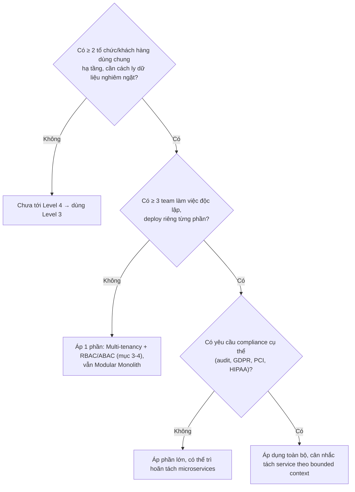
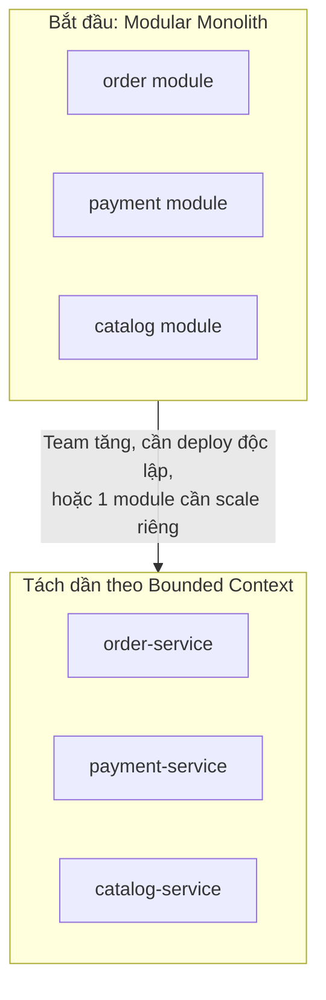
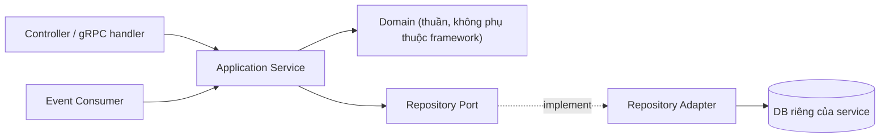
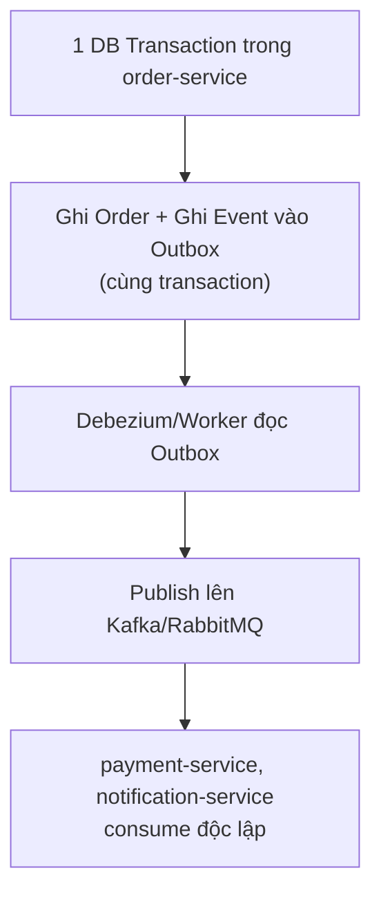
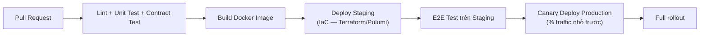

# Backend Architecture Guide — Level 4: Enterprise / Distributed Platform (NestJS)

**Version:** v1.0 · **Tài liệu độc lập** — không cần đọc thêm tài liệu nào khác để áp dụng.

## Khi nào dùng tài liệu này

Rất nhiều domain phức tạp (20+ module, có thể >100 bảng), nhiều team phát triển song song, phân quyền phức tạp (RBAC/ABAC), audit log bắt buộc (compliance), multi-tenant SaaS hoặc hệ thống nội bộ quy mô lớn, tích hợp nhiều hệ thống ngoài (ERP, legacy), high availability + fault tolerance mặc định. Ví dụ: CRM lớn, ERP, HRM enterprise, banking/fintech, healthcare quốc gia, SaaS multi-tenant.

**Gate check:**



Nếu câu trả lời đầu tiên là "Không" — dừng lại. Microservices/distributed system giải quyết vấn đề tổ chức team và scale không đều, không phải "kiến trúc đẹp hơn" — áp khi chưa cần là vi phạm trực tiếp nguyên tắc không over-engineering.

---

## 1. Triết lý

| Nguyên tắc | Ý nghĩa |
|---|---|
| Kiến trúc phục vụ thay đổi | Không phục vụ vẻ đẹp hay xu hướng công nghệ |
| Không over-engineering | Tách microservice khi thật sự cần scale/deploy độc lập, không phải mặc định |
| Prefer boring solution | PostgreSQL + Redis + RabbitMQ vẫn là nền tảng hợp lý cho phần lớn service, kể cả ở Level 4 |
| Make illegal state impossible | Đặc biệt quan trọng khi nhiều service cùng sửa 1 loại dữ liệu — domain model phải chặn được state sai |
| Explicit > Implicit | Dependency giữa service phải tường minh qua contract (API/event schema), không ngầm hiểu |

## 2. Kiến trúc tổng thể

### 2.1 Modular Monolith trước, tách Service theo Bounded Context khi cần



Ranh giới module sạch từ Level 3 (Hexagonal Architecture, domain không phụ thuộc infrastructure) chính là ranh giới tách service — nếu đã làm đúng từ đầu, tách là vấn đề hạ tầng (deploy riêng, DB riêng), không phải viết lại logic nghiệp vụ.

### 2.2 Mỗi Service — vẫn giữ Hexagonal Architecture bên trong



Domain layer không đổi dù service đứng riêng hay nằm trong monolith — nguyên tắc dependency rule (domain không phụ thuộc infrastructure) giữ nguyên xuyên suốt mọi Level.

## 3. Multi-Tenancy trên Backend

### 3.1 Chiến lược cách ly dữ liệu — chọn 1, không trộn

| Chiến lược | Khi dùng | Đánh đổi |
|---|---|---|
| **Shared DB, `tenant_id` column** | Nhiều tenant nhỏ, chi phí vận hành thấp | Rủi ro leak nếu quên filter `tenant_id`, cần enforce nghiêm ngặt |
| **Schema-per-tenant** (PostgreSQL schema riêng) | Tenant vừa, cần cách ly logic hơn nhưng chưa cần DB riêng | Migration phải chạy trên từng schema, phức tạp hơn khi tenant nhiều |
| **Database-per-tenant** | Tenant lớn, yêu cầu compliance cao (data residency, SLA riêng) | Chi phí vận hành cao nhất, connection pool phải quản lý theo tenant |

Baseline khuyến nghị: **Shared DB + `tenant_id`** làm mặc định, chỉ chuyển sang schema/database riêng khi có yêu cầu compliance cụ thể từ khách hàng lớn (data residency, cần backup/restore độc lập).

### 3.2 Enforce Tenant Isolation ở tầng thấp nhất có thể

```typescript
// Middleware/Interceptor gắn tenantId vào request context
@Injectable()
export class TenantInterceptor implements NestInterceptor {
  intercept(context: ExecutionContext, next: CallHandler) {
    const request = context.switchToHttp().getRequest();
    const tenantId = request.headers['x-tenant-id'];
    TenantContext.run(tenantId, () => next.handle());
  }
}

// Repository tự động filter theo tenant, KHÔNG để mỗi query tự nhớ thêm where
@Injectable()
export class TenantAwareRepository<T> {
  async find(criteria: FindOptions<T>) {
    const tenantId = TenantContext.current();
    return this.repo.find({ ...criteria, where: { ...criteria.where, tenantId } });
  }
}
```

Rule cứng: không tin tưởng developer luôn nhớ thêm `WHERE tenant_id = ?` ở mọi query — enforce ở tầng Repository chung (dùng `AsyncLocalStorage` cho tenant context xuyên suốt request) hoặc Row-Level Security (RLS) của PostgreSQL làm lưới an toàn cuối cùng, không chỉ dựa vào kỷ luật code review.

### 3.3 PostgreSQL Row-Level Security — lưới an toàn tầng DB

```sql
ALTER TABLE orders ENABLE ROW LEVEL SECURITY;
CREATE POLICY tenant_isolation ON orders
  USING (tenant_id = current_setting('app.current_tenant_id')::uuid);
```

RLS là lớp bảo vệ cuối cùng — dù application code có bug quên filter tenant, database vẫn chặn truy vấn chéo tenant. Không thay thế được việc enforce ở application layer (mục 3.2), chỉ bổ sung phòng thủ theo chiều sâu (defense in depth).

## 4. RBAC / ABAC

### 4.1 Permission Model — dữ liệu, không hard-code

```typescript
// Bảng permissions load động, gắn với role hoặc trực tiếp user
@Entity('role_permissions')
export class RolePermission {
  @Column() role: string;
  @Column() permission: string; // 'order.edit', 'order.view'
}
```

### 4.2 RBAC — Guard đơn giản

```typescript
@Injectable()
export class PermissionGuard implements CanActivate {
  constructor(private permissionService: PermissionService) {}
  async canActivate(context: ExecutionContext): Promise<boolean> {
    const required = this.reflector.get<string>('permission', context.getHandler());
    const { user } = context.switchToHttp().getRequest();
    return this.permissionService.hasPermission(user.role, required);
  }
}
```

### 4.3 ABAC — Policy Check khi phụ thuộc resource cụ thể

```typescript
// Không đủ nếu chỉ check role — cần biết CẢ resource
class CanEditOrderPolicy {
  canExecute(user: User, order: Order): boolean {
    if (user.role === 'admin') return true;
    if (user.role === 'staff' && order.assignedStaffId === user.id) return true;
    return false;
  }
}
```

Dùng ABAC (policy check theo resource) khi quyền phụ thuộc thuộc tính cụ thể (chỉ staff được gán mới sửa được order đó) — RBAC thuần (chỉ theo role) không đủ biểu đạt trường hợp này.

### 4.4 Permission cache, không query DB mỗi request

Permission set của user cache ở Redis (invalidate khi role/permission đổi) — check quyền là thao tác xảy ra ở mọi request, không nên query DB mỗi lần.

## 5. Audit Logging

### 5.1 Audit khác Application Log

Audit log phải non-repudiation (không thể chối bỏ), immutable (không cho sửa/xoá sau khi ghi), lưu theo yêu cầu retention pháp lý — khác hoàn toàn structured log kỹ thuật thông thường.

```typescript
@Entity('audit_logs')
export class AuditLog {
  @PrimaryGeneratedColumn('uuid') id: string;
  @Column() tenantId: string;
  @Column() userId: string;
  @Column() action: string;        // 'order.status.changed'
  @Column() resourceType: string;
  @Column() resourceId: string;
  @Column('jsonb') before: object;
  @Column('jsonb') after: object;
  @CreateDateColumn() timestamp: Date;
  // KHÔNG có updatedAt — audit log immutable, không update
}
```

### 5.2 Ghi audit qua Interceptor tập trung, không rải rác

```typescript
@Injectable()
export class AuditInterceptor implements NestInterceptor {
  intercept(context: ExecutionContext, next: CallHandler) {
    return next.handle().pipe(
      tap((result) => {
        const meta = this.reflector.get('audit', context.getHandler());
        if (meta) this.auditService.log({ action: meta.action, ...context });
      }),
    );
  }
}
// Dùng: @Audit({ action: 'order.status.changed' })
```

Decorator + Interceptor tập trung — không để mỗi service tự viết `auditService.log(...)` rải rác, dễ sót hành động cần audit.

### 5.3 Audit log lưu riêng, có thể ở store khác

Với khối lượng lớn và yêu cầu immutable/retention dài hạn, cân nhắc lưu audit log ở store riêng (append-only table, hoặc dịch vụ chuyên biệt như AWS CloudTrail-style) tách khỏi database nghiệp vụ chính — tránh audit log tăng trưởng không giới hạn ảnh hưởng performance database vận hành.

## 6. Event-Driven ở quy mô Distributed

### 6.1 Outbox Pattern — bắt buộc khi có nhiều service



Ở quy mô nhiều service độc lập, Outbox pattern (đã giới thiệu ở Level 3) trở thành **bắt buộc**, không còn optional — vì không có cách nào khác đảm bảo consistency giữa "ghi DB của service A" và "thông báo cho service B" mà không có 2-phase commit (vốn không khả thi giữa các service độc lập).

### 6.2 Saga xuyên nhiều Service — Orchestration vs Choreography

| | Orchestration | Choreography |
|---|---|---|
| Cách hoạt động | 1 orchestrator service điều phối tuần tự, gọi/lắng nghe từng service | Mỗi service tự lắng nghe event, tự quyết hành động tiếp theo, không ai điều phối trung tâm |
| Dễ trace/debug | Dễ hơn — nhìn 1 chỗ thấy toàn luồng | Khó hơn — phải lần theo chuỗi event qua nhiều service |
| Phù hợp khi | Luồng có logic phức tạp, cần thấy rõ trạng thái tổng thể (đặt hàng, thanh toán) | Luồng đơn giản, các service phản ứng độc lập, không cần biết luồng tổng (vd audit, notification) |

Khuyến nghị: **Orchestration cho luồng nghiệp vụ chính** (checkout, onboarding), **Choreography cho side-effect phụ** (gửi notification, cập nhật analytics) — không dùng thuần choreography cho luồng nghiệp vụ lõi vì rất khó debug khi có sự cố.

### 6.3 Schema Registry cho Event Contract

Với nhiều team publish/consume event độc lập, event schema (Avro/Protobuf/JSON Schema) đăng ký qua Schema Registry (Confluent Schema Registry hoặc tương đương) — thay đổi schema breaking bị chặn ở registry trước khi ảnh hưởng consumer khác, không phát hiện muộn lúc runtime.

## 7. Module Governance cho nhiều Team

### 7.1 Repository Strategy — Polyrepo vs Monorepo

| | Monorepo (nhiều service, 1 repo) | Polyrepo (mỗi service 1 repo) |
|---|---|---|
| Ưu điểm | Refactor xuyên service dễ, dùng chung tooling/CI, code review thấy toàn cảnh | Team độc lập hoàn toàn, CI/CD riêng, quyền truy cập tách biệt rõ |
| Nhược điểm | Cần tooling mạnh (Nx, Turborepo) để không bị chậm khi repo lớn | Đổi contract xuyên service khó hơn, dễ version-drift |

Khuyến nghị: Monorepo với Nx/Turborepo cho tới khi có lý do cụ thể cần polyrepo (team hoàn toàn độc lập về release cycle, yêu cầu bảo mật tách biệt quyền truy cập code).

### 7.2 API Contract Testing giữa các Service

Dùng Pact hoặc OpenAPI schema validation trong CI — service A khai báo contract mong đợi từ service B, CI service B chạy verify trước khi merge, chặn breaking change trước khi tới integration test tốn kém hơn.

### 7.3 Architecture Decision Record

Mọi quyết định khó đảo ngược (tách service mới, chọn chiến lược multi-tenant, đổi message broker) ghi ADR, review bởi đại diện team liên quan trước khi approve — không để 1 team tự quyết ảnh hưởng toàn platform.

## 8. High Availability & Fault Tolerance

### 8.1 Health Check phân biệt Liveness/Readiness

```typescript
@Controller('health')
export class HealthController {
  @Get('live')
  live() { return { status: 'ok' }; } // process còn sống

  @Get('ready')
  @HealthCheck()
  ready() {
    return this.health.check([
      () => this.db.pingCheck('database'),
      () => this.redis.pingCheck('redis'),
    ]); // sẵn sàng nhận traffic (dependency đều ok)
  }
}
```

Kubernetes (hoặc orchestrator tương đương) dùng 2 endpoint khác nhau: liveness fail → restart pod, readiness fail → tạm ngừng route traffic tới pod đó nhưng không restart — nhầm lẫn 2 khái niệm này gây restart loop không cần thiết khi dependency (DB) tạm chậm.

### 8.2 Graceful Shutdown

Service nhận `SIGTERM` phải: ngừng nhận request mới, chờ request đang xử lý hoàn tất (có timeout), đóng connection pool sạch sẽ trước khi thoát — tránh mất request đang xử lý khi deploy/scale down.

### 8.3 Circuit Breaker & Bulkhead

Circuit breaker (mục đã có ở Level 3) áp dụng cho cả gọi giữa các internal service, không chỉ hệ thống ngoài. Bulkhead pattern: giới hạn connection pool riêng cho từng dependency, tránh 1 dependency chậm làm cạn kiệt toàn bộ resource pool dùng chung cho các dependency khác.

## 9. Observability bắt buộc

- **Distributed Tracing** (OpenTelemetry + Jaeger/Tempo) bắt buộc, không optional — 1 request xuyên nhiều service không debug được nếu thiếu trace_id xuyên suốt.
- **Metrics** (Prometheus + Grafana): RED metrics (Rate, Errors, Duration) cho mọi service, USE metrics (Utilization, Saturation, Errors) cho hạ tầng (DB connection pool, queue depth).
- **Centralized Logging** (ELK/Loki): log của mọi service gom về 1 nơi, query theo `trace_id` xuyên service.
- **Alerting** gắn với SLO cụ thể (error budget), không alert theo cảm tính "thấy log lỗi là alert".

## 10. CI/CD & Infrastructure Automation



Infrastructure as Code (Terraform) cho mọi tài nguyên cloud — không tạo resource thủ công qua console, đảm bảo môi trường tái tạo được và có audit trail cho chính hạ tầng.

## 11. Testing

| Layer | Loại test |
|---|---|
| Domain | Unit test thuần |
| Application/Repository | Unit + Integration test (Testcontainers) |
| Contract giữa service | Pact/OpenAPI validation trong CI |
| Multi-tenant isolation | Test tự động verify RLS/tenant filter không leak |
| Permission (RBAC/ABAC) | Test ma trận role × resource × action |
| Chaos/Resilience | Định kỳ test circuit breaker, timeout, service down (chaos engineering nhẹ, không bắt buộc ngay từ đầu) |

---

## Checklist tổng hợp

```
□ Mọi query có tenant filter enforce ở tầng Repository/RLS, không chỉ dựa vào developer nhớ không?
□ Permission có cache, không query DB mỗi request không?
□ Hành động nhạy cảm có audit qua interceptor tập trung, immutable log không?
□ Event xuyên service có qua Outbox pattern, không publish trực tiếp sau khi ghi DB không?
□ Luồng nghiệp vụ chính có dùng Orchestration Saga, không thuần Choreography khó debug không?
□ Service có health check phân biệt liveness/readiness không?
□ Có graceful shutdown khi nhận SIGTERM không?
□ Distributed tracing có xuyên suốt được qua nhiều service không?
□ Hạ tầng có quản lý qua IaC, không tạo tay qua console không?
□ Quyết định khó đảo ngược có ADR, review từ team liên quan không?
```
