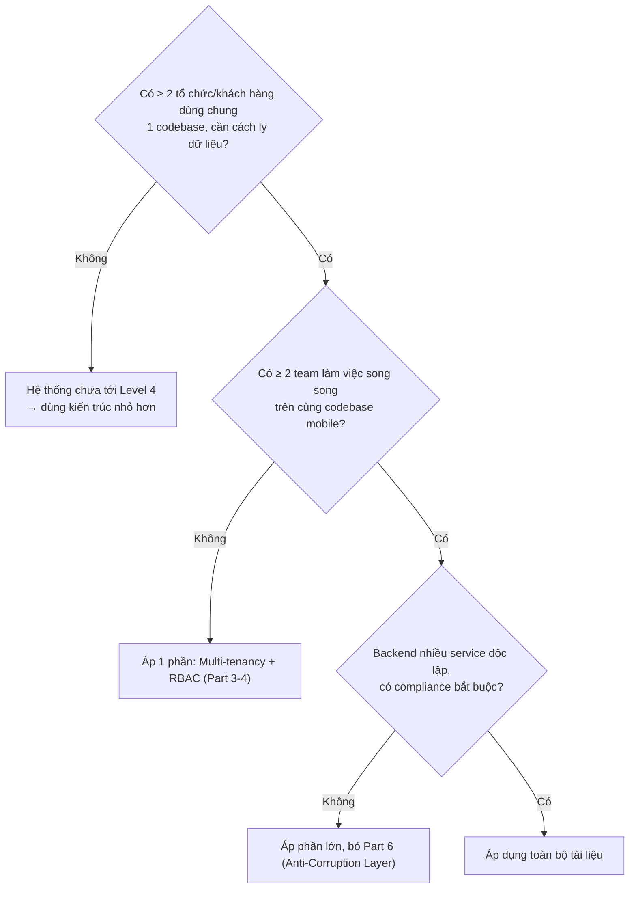
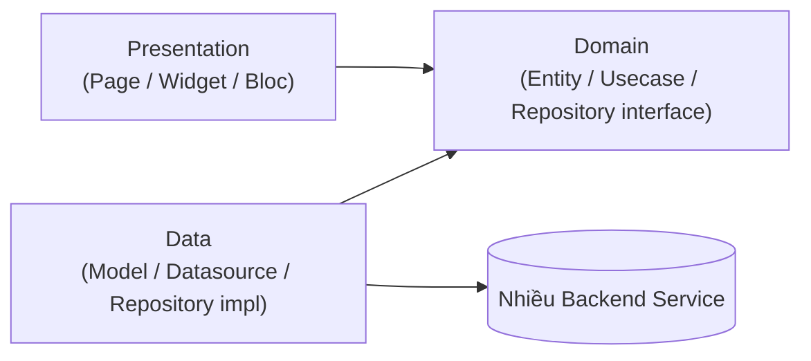
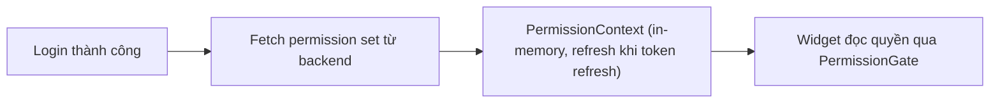
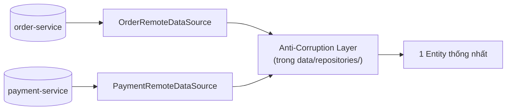
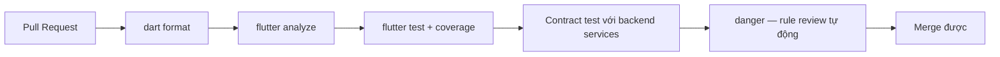

# Flutter Architecture Guide — Level 4: Enterprise / Distributed Platform

**Version:** v1.0 · **Tài liệu độc lập** — không cần đọc thêm tài liệu nào khác để áp dụng.

## Khi nào dùng tài liệu này

Hệ thống có rất nhiều domain phức tạp, nhiều team phát triển song song, phân quyền phức tạp (RBAC/ABAC), audit log bắt buộc (compliance), multi-tenant SaaS hoặc quy mô nội bộ lớn, tích hợp nhiều hệ thống ngoài (ERP, payment, legacy), yêu cầu high availability mặc định. Ví dụ: CRM lớn, ERP, HRM enterprise, banking/fintech, healthcare quốc gia, SaaS multi-tenant. Thường 20+ domain, nhiều service/bounded context, event-driven mạnh.

**Gate check trước khi dùng:**



Nếu câu trả lời đầu tiên là "Không" — dừng lại, hệ thống chưa thực sự Level 4. Áp overlay này khi chưa cần là vi phạm trực tiếp nguyên tắc "không over-engineering" ở mục 1.

---

## 1. Triết lý — Engineering Principles

| Nguyên tắc | Ý nghĩa |
|---|---|
| **Kiến trúc phục vụ thay đổi, không phục vụ đẹp** | Mục tiêu là giảm chi phí sửa đổi tương lai |
| **Không over-engineering** | Không thêm layer cho vấn đề chưa xảy ra |
| **Optimize for maintenance** | Code đọc/sửa nhiều lần hơn viết |
| **Prefer boring solution** | Công nghệ đã kiểm chứng, ít bất ngờ hơn |
| **Make illegal state impossible** | Trạng thái sai không tồn tại được ở compile-time |
| **Explicit > Implicit** | Dependency/side-effect nhìn thấy qua code, không quy ước ngầm |

Ngưỡng số lượng trong tài liệu là **heuristic tham khảo**, không phải luật cứng.

## 2. Kiến trúc nền — Clean Architecture 3 lớp + Feature-First



**Dependency Rule bất biến:** `domain/` không phụ thuộc Flutter SDK/`data/`/`presentation/`. `data/` implement interface do `domain/` định nghĩa. `presentation/` chỉ gọi `domain/usecases/`.

**Feature-First + Package-per-Domain:** ở quy mô Level 4, không chỉ tổ chức theo `features/`, mà tách hẳn thành package Dart riêng theo domain, quản lý bằng `melos` (chi tiết mục 8).

## 3. Multi-Tenancy trên Client

### 3.1 Tenant Context — nguồn sự thật duy nhất

```dart
class TenantContext {
  final String tenantId;
  final String tenantName;
  final TenantConfig config; // theming, feature flags riêng theo tenant
  const TenantContext({required this.tenantId, required this.tenantName, required this.config});
}
```

Toàn app biết đang chạy tenant nào tại mọi thời điểm qua 1 nguồn duy nhất ở `core/tenant/`. Interceptor network tự động gắn `tenantId` vào mọi request — không để từng feature tự thêm header thủ công.

### 3.2 Data Isolation — rule cứng

Không lưu dữ liệu 2 tenant lẫn lộn trong cùng bảng local DB mà không có `tenantId` làm 1 phần khoá truy vấn. Đổi tenant → clear toàn bộ cache local trước khi load tenant mới, không merge dữ liệu 2 tenant trong cùng phiên UI.

### 3.3 Theming/Config theo Tenant

Design token (màu thương hiệu, logo) load động theo `TenantConfig` thay vì hard-code — widget vẫn đọc qua cùng 1 lớp `shared/theme/`, chỉ nguồn dữ liệu đổi.

## 4. RBAC / ABAC trên Client

### 4.1 Permission là dữ liệu, tải động sau login



Không hard-code role trong app. `core/permission/permission_context.dart` là nguồn duy nhất UI đọc quyền.

### 4.2 UI Gating

```dart
PermissionGate(
  permission: 'order.edit',
  fallback: const SizedBox.shrink(),
  builder: (_) => EditOrderButton(...),
)
```

RBAC đơn giản (role cố định) → `context.select` trên `PermissionContext.hasRole()`. ABAC (phụ thuộc thuộc tính resource) → gọi usecase policy riêng (`CanEditOrderUseCase(order, user)`).

### 4.3 Rule cứng: không bao giờ chỉ check ở client

Permission check client chỉ để UX (ẩn nút) — backend luôn re-validate độc lập mọi request.

### 4.4 Permission Testing Matrix

Ma trận (role × màn hình quan trọng) verify đúng hành động hiển thị/ẩn — tổ hợp role × feature tăng nhanh, không phủ hết bằng unit test thông thường.

## 5. Audit Logging từ Client

### 5.1 Khác Observability/Analytics thông thường

Audit log phải **không thể chối bỏ** (non-repudiation), gắn `who — what — when — on what resource`, lưu theo yêu cầu retention pháp lý.

### 5.2 Hành động bắt buộc audit

| Loại hành động | Ví dụ |
|---|---|
| Thay đổi dữ liệu nhạy cảm | Sửa thông tin thanh toán, hồ sơ y tế/tài chính |
| Thay đổi quyền | Cấp/thu hồi role |
| Xem dữ liệu nhạy cảm | Admin xem hồ sơ khách hàng |
| Hành động tài chính | Duyệt/từ chối giao dịch, hoàn tiền |

### 5.3 Gửi ngay, không gộp batch

Audit event gửi ngay lập tức tới backend kèm `trace_id` (mục 9) — client giữ hàng đợi retry cục bộ nếu mất mạng, không được phép mất event khi có mạng trở lại.

Đặt ở `core/audit/audit_logger.dart` tách biệt khỏi log kỹ thuật thông thường (`app_logger.dart`) vì yêu cầu retention khác hoàn toàn.

## 6. Tích hợp Backend Distributed — Anti-Corruption Layer

### 6.1 Vấn đề

Khi mobile gọi trực tiếp nhiều microservice (order-service, payment-service...), mỗi service có format/error code riêng — để `domain/` biết hết chi tiết này là vi phạm dependency rule (mục 2).

### 6.2 Vị trí Anti-Corruption Layer



Trách nhiệm của `data/repositories/*_repository_impl.dart` — khi 1 entity cần dữ liệu từ ≥ 2 service, repository impl là nơi duy nhất hợp nhất; `usecase`/`bloc`/`domain` chỉ thấy 1 entity sạch.

### 6.3 BFF (Backend-for-Frontend)

Nếu số service mobile phải gọi trực tiếp tăng nhiều (> 5-6 cho 1 luồng), đề xuất backend team xây BFF riêng cho mobile, chuyển việc hợp nhất sang backend. Ghi thành ADR (mục 12) vì ảnh hưởng 2 phía.

### 6.4 Contract Testing

Dùng contract testing (Pact hoặc tương đương): mobile định nghĩa contract mong đợi từ mỗi service, CI backend verify trước khi merge — phát hiện breaking change trước khi tới QA.

## 7. Presentation — Bloc/Cubit

Bloc mặc định cho state phức tạp (nhiều loại event, cần trace rõ), Cubit cho state đơn giản. Pattern "single state + enum status" cho list/detail. Async safety: `restartable()`/`droppable()`/`sequential()` qua `bloc_concurrency`. Side-effect 1 lần qua `BlocListener` + `listenWhen`, không dùng field boolean trong State.

## 8. Module Governance cho nhiều Team

### 8.1 Package-per-Domain với Ownership

```
packages/
├── feature_order/        → CODEOWNERS: @team-fulfillment
├── feature_payment/      → CODEOWNERS: @team-payment
├── core_networking/      → CODEOWNERS: @team-platform
└── design_system/        → CODEOWNERS: @team-platform
```

`CODEOWNERS` bắt buộc review từ đúng team sở hữu trước khi merge.

### 8.2 Dependency Graph Enforcement

`melos` kết hợp lint rule chặn package A import package B nếu B không khai báo dependency ở `pubspec.yaml` của A — biến rule kiến trúc thành lỗi build, không phải quy ước.

### 8.3 Architecture Review Board

| Bước | Ai tham gia |
|---|---|
| Đề xuất ADR | Team đề xuất viết theo template (mục 12) |
| Review | Đại diện team liên quan comment trong PR |
| Approve | Kiến trúc sư/tech lead toàn platform ký duyệt |
| Công bố | Merge + thông báo team bị ảnh hưởng |

### 8.4 Shared Package không phải nơi vứt mọi thứ

Mọi thay đổi breaking ở shared package phải có ADR + thông báo trước, không merge trực tiếp dù chỉ 1 dòng.

## 9. Observability — Distributed

### 9.1 Trace xuyên nhiều service

`trace_id` sinh ở client, gửi qua header network, xuyên qua nhiều service (order → payment → notification) dùng chuẩn OpenTelemetry — không tự chế header riêng, để công cụ tracing (Jaeger/Grafana Tempo) dựng lại toàn bộ hành trình.

### 9.2 Structured Logging

`core/logger/app_logger.dart` phân cấp `debug/info/warning/error`, không dùng `print()`. Log không chứa PII/token.

### 9.3 Crash Reporting & Symbolication

Bắt buộc Crashlytics/Sentry từ bản release đầu. `FlutterError.onError` và `PlatformDispatcher.instance.onError` đều forward về crash tool. Build release luôn upload symbol/mapping file trong CI — thiếu bước này crash log native chỉ là địa chỉ bộ nhớ vô nghĩa.

### 9.4 Dashboard theo Tenant/Region

Breakdown theo `tenantId`/region, `app version`, `device tier` — không chỉ số tổng, 1 tenant lớn gặp sự cố dễ bị pha loãng nếu chỉ nhìn trung bình toàn hệ thống.

## 10. Security nâng cao

### 10.1 Token & Storage

Access/refresh token lưu `flutter_secure_storage` (Keychain/Keystore), không bao giờ `SharedPreferences` plaintext. Certificate pinning cho API nhạy cảm (thanh toán, tài khoản).

### 10.2 SSO / OIDC

Đăng nhập qua identity provider tổ chức (Okta, Azure AD) qua OIDC Authorization Code + PKCE — không tự implement SAML trên client.

### 10.3 MFA & Session Management

Step-up authentication (MFA lại) cho hành động nhạy cảm dù session đang hợp lệ. Token rotation ngắn hạn, remote session revocation: client lắng nghe (push/polling nhẹ) để tự logout ngay khi session bị admin thu hồi từ xa.

### 10.4 Device Management (MDM)

Kiểm tra thiết bị compliant với policy công ty trước khi truy cập dữ liệu nhạy cảm nếu chạy trên thiết bị MDM quản lý; hỗ trợ remote wipe khi thiết bị mất/nhân viên nghỉ việc.

### 10.5 Obfuscation

Build release luôn `--obfuscate --split-debug-info=<path>`.

## 11. Compliance & Data Residency

### 11.1 Data Residency

Request route đúng endpoint theo region của tenant (liên kết `TenantContext` mục 3.1 với region config) — không hard-code 1 endpoint toàn cầu nếu compliance yêu cầu dữ liệu không rời khỏi khu vực.

### 11.2 Right-to-Erasure (GDPR)

Khi tài khoản bị xoá theo yêu cầu, client xoá sạch cache local (local DB, ảnh cache, secure storage), không để lại bản sao vô thời hạn trên thiết bị.

### 11.3 Overlay theo ngành

| Ngành | Yêu cầu đặc thù |
|---|---|
| Fintech/Banking | Không cache số thẻ/CVV local dù đã mã hoá (PCI-DSS) — tokenize phía server |
| Healthcare | PHI trong local cache cần mã hoá at-rest mạnh, có thể cần audit cả hành vi xem |
| SaaS đa tổ chức thông thường | Chủ yếu cần data isolation (mục 3.2) + audit log (mục 5) |

Không áp toàn bộ checklist fintech/healthcare cho app không thuộc domain đó.

## 12. ADR — Architecture Decision Record

Mọi quyết định khó đảo ngược (BFF hay không, chọn provider SSO, boundary actor...) ghi lại theo template:

```markdown
# ADR-XXX: <Tên quyết định>
## Status
Proposed / Accepted / Deprecated
## Context
Bối cảnh dẫn tới quyết định.
## Options Considered
| Option | Ưu điểm | Nhược điểm |
## Decision
Chọn option nào.
## Trade-off
Đánh đổi khi chọn — nếu không viết được, có thể chưa cân nhắc đủ kỹ.
## Consequences
File/thư mục nào bị ảnh hưởng, ai cần biết.
```

## 13. Release Governance

### 13.1 Staged Rollout theo Tenant

Không chỉ % ngẫu nhiên toàn bộ user — cho phép cấu hình rollout riêng theo `tenantId`, vì khách hàng enterprise thường muốn tự kiểm soát thời điểm nhận bản cập nhật.

### 13.2 CI/CD tối thiểu



### 13.3 Communication cho Tenant

Thay đổi lớn ảnh hưởng workflow tenant cần kênh thông báo trước (account manager, email trước N ngày) — không chỉ release note kỹ thuật.

## 14. Testing

| Layer | Loại test | Mock |
|---|---|---|
| `domain/usecases/` | Unit test, coverage cao | Mock repository interface |
| `data/repositories/` | Unit test | Mock datasource |
| `presentation/bloc/` | `bloc_test` | Mock usecase |
| Contract test | Verify với từng backend service | Bắt buộc nếu ≥ 3 service độc lập |
| Permission matrix test | role × screen | Bắt buộc cho màn hình ≥ 3 role |
| Multi-tenant isolation test | Verify không leak data giữa 2 tenant | Bắt buộc nếu đổi tenant trong 1 phiên |

## 15. Naming Convention

| Thành phần | Convention |
|---|---|
| Entity | Suffix `_entity.dart` (khuyến nghị ở quy mô lớn để tránh trùng tên với DTO service khác) |
| Model | `*_model.dart` |
| Usecase | `*_usecase.dart`, verb-first |
| Policy (ABAC) | `Can<HànhĐộng><ĐốiTượng>UseCase` (vd `CanEditOrderUseCase`) |
| Package | `feature_<domain>`, `core_<hạ tầng>` |

---

## Checklist tổng hợp

```
□ presentation/ có import data/ trực tiếp không?
□ Mọi request có tự động gắn tenantId qua interceptor không?
□ Đổi tenant có clear sạch cache local trước khi load tenant mới không?
□ Permission có load động sau login, không hard-code role không?
□ Hành động nhạy cảm/thay đổi quyền có gửi audit event kèm trace_id không?
□ Khi 1 entity cần dữ liệu từ ≥ 2 service, có đúng 1 chỗ (repository impl) hợp nhất không?
□ Package có CODEOWNERS, dependency graph có enforce bằng công cụ không?
□ Token có lưu secure storage, build release có --obfuscate không?
□ Client có tự logout khi session bị admin revoke từ xa không?
□ Rollout có thể cấu hình riêng theo tenant khi cần không?
□ Quyết định khó đảo ngược có ADR kèm Trade-off không?
```
